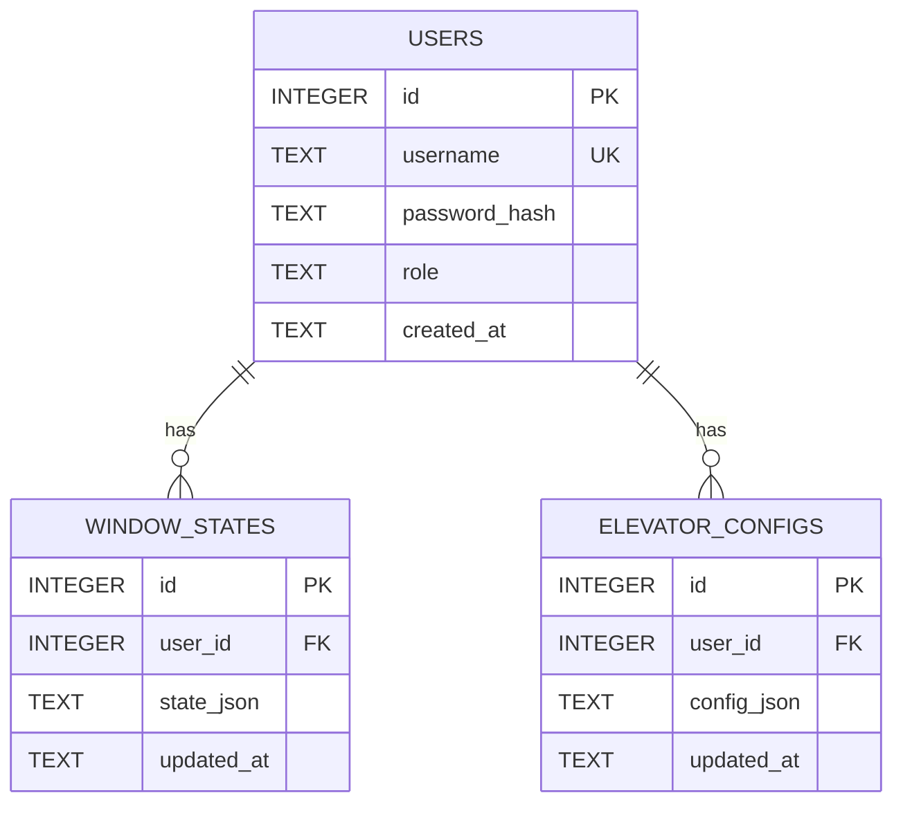
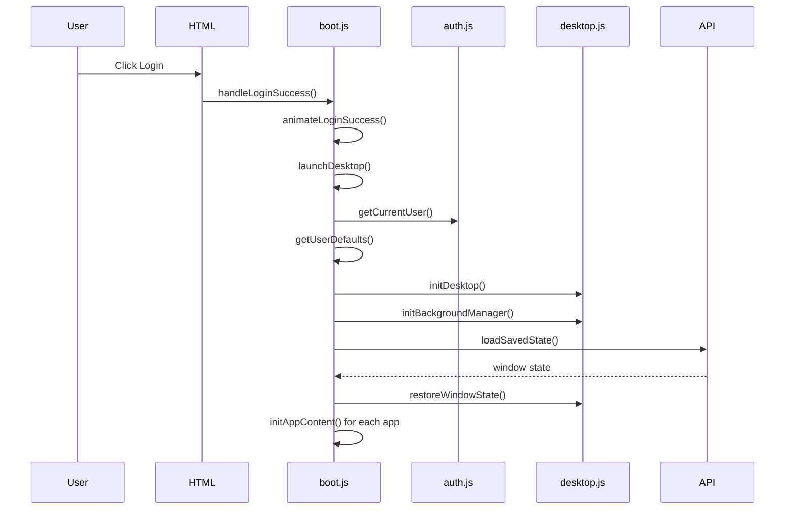
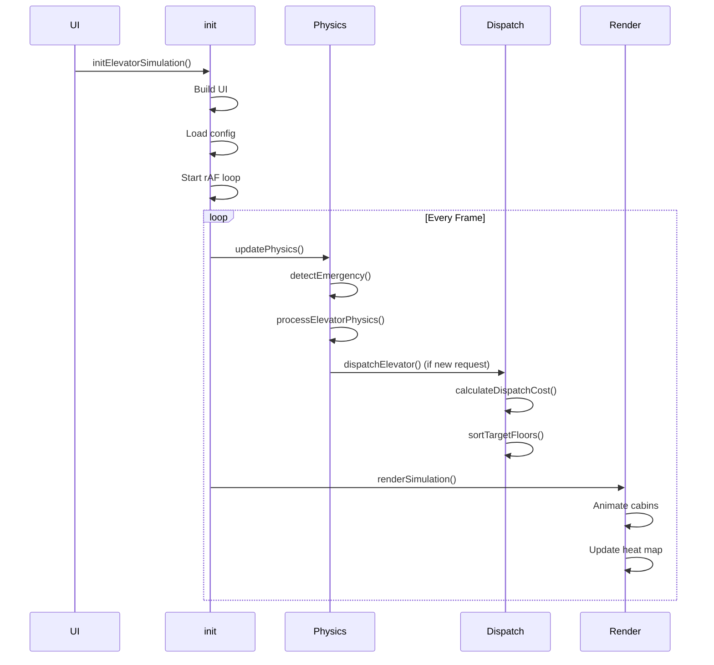
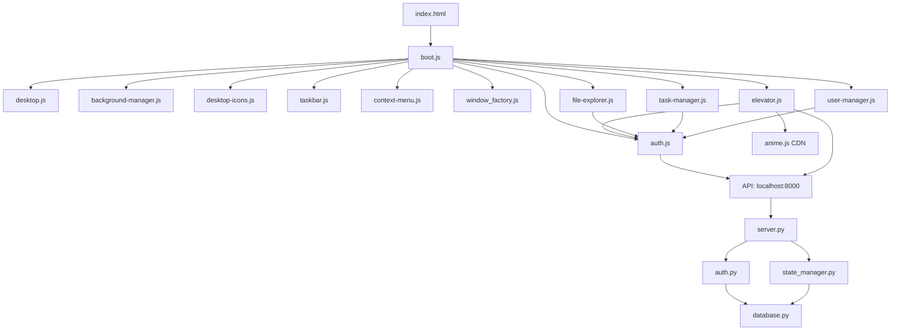
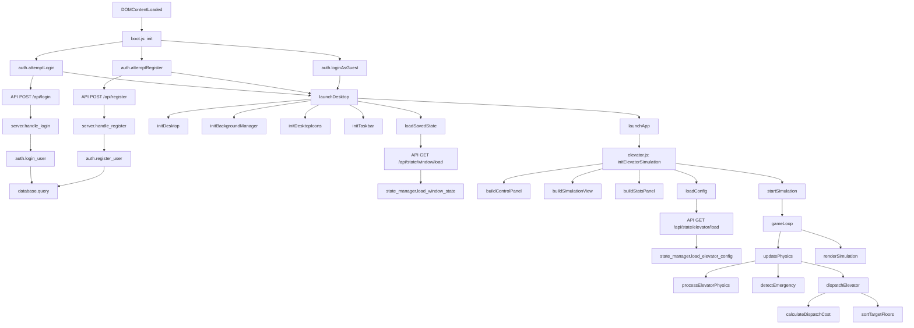

# BÁO CÁO BÀI TẬP LỚN MÔN JAVASCRIPT

---
## Thông tin cơ bản:
- Sinh viên thực hiện: Phạm Ngọc Trung Hiếu.
- MSSV: B25DCCC068.
- Lớp hành chính: D25CQCC02-B.
- Lớp tín chỉ: RIPT1302-05.
- Giảng viên hướng dẫn: Bùi Khắc Ngọc, Trần Minh Hiếu.
- Năm học: 2025 - 2026.
---
## THÔNG TIN DỰ ÁN:
| Thuộc tính | Giá trị |
|------------|----------|
| Tên dự án | Web OS and Elevator Simulation |
| Loại dự án | Bài tập lớn môn JavaScript |
| Ngôn ngữ chính | JavaScript |
| Backend | Python |
| Database | SQLite |
| Frontend | HTML5, CSS, JavaScript |
| Môi trường chạy | Web Browser |
| Phiên bản | 1.0 |
---

## LỜI MỞ ĐẦU

Trong bối cảnh các hệ thống phần mềm hiện đại ngày càng chú trọng đến khả năng tương tác trực quan, mô phỏng thời gian thực và trải nghiệm người dùng, việc xây dựng các ứng dụng web không còn giới hạn ở các trang thông tin tĩnh mà đã mở rộng sang các hệ thống có độ phức tạp cao, mô phỏng được nhiều bài toán thực tế. Một trong những ví dụ tiêu biểu là bài toán điều phối thang máy trong các tòa nhà nhiều tầng, nơi cần kết hợp giữa thuật toán lập lịch, mô phỏng vật lý và giao diện người dùng trực quan.
Đồ án này xây dựng một hệ thống Web OS (Web-based Operating System) kết hợp mô phỏng thang máy thời gian thực. Hệ thống không chỉ cung cấp môi trường desktop mô phỏng trên trình duyệt với các chức năng quản lý cửa sổ, xác thực người dùng và lưu trữ trạng thái, mà còn tích hợp mô hình thang máy có khả năng vận hành theo các thuật toán điều phối, xử lý yêu cầu tầng, phát hiện lỗi và thống kê hoạt động.
Trong quá trình thực hiện, nhóm tập trung nghiên cứu và áp dụng các kiến thức về JavaScript hiện đại, kiến trúc phần mềm mô-đun, quản lý trạng thái ứng dụng, mô phỏng động học cơ bản, thiết kế giao diện tương tác và xây dựng backend hỗ trợ lưu trữ dữ liệu. Bên cạnh việc hoàn thành các chức năng cốt lõi, đồ án còn đề xuất một số hướng mở rộng như Adaptive Scheduling, Dynamic Zoning và cải tiến mô hình chuyển động nhằm nâng cao hiệu quả điều phối trong các tình huống lưu lượng phức tạp.
Thông qua đồ án này, nhóm mong muốn vận dụng các kiến thức đã học vào một bài toán thực tế có tính tổng hợp cao, đồng thời rèn luyện kỹ năng phân tích, thiết kế, triển khai và đánh giá một hệ thống phần mềm hoàn chỉnh.

## 1. TỔNG QUAN DỰ ÁN

### 1.1 Mục đích dự án

Dự án này là một **Mô phỏng hệ điều hành và triển khai trên Web (Web OS)**. Dự án xây dựng một môi trường Web OS đơn giản trên nền tảng trình duyệt, trong đó ứng dụng trung tâm là mô phỏng hệ thống thang máy. Hệ thống được sử dụng để nghiên cứu và minh họa các thuật toán phân phối thang máy, mô phỏng chuyển động vật lý và quản lý trạng thái ứng dụng trên nền web.

### 1.2 Vấn đề

Dự án giải quyết một số thách thức kỹ thuật:
- **Mô phỏng chuyển động thang máy** dựa trên mô hình động học đơn giản.
- **Thuật toán phân phối** dựa trên hàm chi phí kết hợp nhiều tiêu chí.
- **Lưu trữ trạng thái** qua các phiên cho cả người dùng xác thực và khách.
- **Thiết kế UI phản hồi** thích ứng với các kích thước khung nhìn khác nhau.
- **Kiến trúc mô-đun** hỗ trợ nhiều ứng dụng trong môi trường desktop.

### 1.3 Mục tiêu dự án

1. Cung cấp mô phỏng thang máy có thể tương tác và sát thực tế nhất có thể.
2. Thể hiện các thuật toán ứng dụng trong thang máy với tham số có thể cấu hình sao cho sát thực tế nhất.
3. Triển khai cơ chế phát hiện và phục hồi lỗi.
4. Hỗ trợ nhiều vai trò người dùng (admin, user, guest) với quyền khác nhau.
5. Bật lưu trữ trạng thái qua các phiên.
6. Tạo khung Web OS có thể mở rộng cho các ứng dụng bổ sung trong phạm vi ứng dụng web chạy trên trình duyệt.

### 1.4 Danh Sách các chức năng nổi bật

**Tính năng mô phỏng thang máy:**
- Mô phỏng vật lý thời gian thực.
- Thuật toán phân phối với tính điểm đa tiêu chí.
- Phát hiện lỗi (quá tải, kẹt) và phục hồi thủ công.
- Các tham số có thể tùy chỉnh giúp đa dạng hóa mô phỏng.

**Tính năng Web OS:**
- Môi trường desktop với quản lý cửa sổ.
- Thanh tác vụ với điều khiển ngủ/đăng xuất/tắt.
- Xác thực người dùng (đăng nhập/đăng ký/truy cập khách).
- Lưu trữ trạng thái (localStorage + server).
- Nhiều ứng dụng (File Explorer, Task Manager, User Manager).
- Quản lý nền với chế độ ngủ.

### 1.5 Phạm vi và Giả định

**Phạm vi:**
- Phạm vi mô phỏng thang máy: Hệ thống tập trung vào mô phỏng logic điều khiển và giao diện người dùng của thang máy. Các yếu tố cơ khí chuyên sâu như động cơ, cáp kéo, đối trọng và hệ thống điều khiển công nghiệp không nằm trong phạm vi.
- Phạm vi Web OS: Hệ thống tập trung vào mô phỏng giao diện và các tính năng cơ bản của 1 hệ điều hành. Các tính năng chuyên sâu và phức tạp chi tiết hơn không nằm trong phạm vi. Các app khác còn lại trong hệ điều hành là 1 bản sao gần như hoàn chỉnh song do các hạn chế không mong muốn nên vẫn sẽ có thiếu sót.

**Giả định:**
- Mỗi thang máy phục vụ tất cả tầng.
- Các tầng có chiều cao bằng nhau.
- Thời gian mở cửa cố định.
- Trọng lượng hành khách tuân theo phân phối chuẩn.

---

# 2. NỀN TẢNG LÝ THUYẾT

---

## 2.1 Mô hình Dispatcher-Scheduler

### Phân tách trách nhiệm

**Module 1 — Dispatcher** (`selectBestElevator`):
- Đầu vào: một yêu cầu tầng mới
- Đầu ra: thang máy được gán

**Module 2 — LOOK Scheduler** (`sortTargetsLOOK`):
- Đầu vào: danh sách mục tiêu hiện tại của một thang máy
- Đầu ra: thứ tự phục vụ được sắp xếp theo LOOK

Luồng xử lý:

```
Request
  └─► Dispatcher (Cost Function + ETA)
          └─► Elevator assigned
                  └─► LOOK Scheduler
                          └─► Ordered stop list
```

---

### Thuật toán LOOK Scheduler

LOOK là biến thể của SCAN: thang di chuyển theo một hướng, phục vụ tất cả yêu cầu đến điểm cuối cùng theo hướng đó, sau đó đảo chiều — không đi đến tầng biên nếu không có yêu cầu.

**Quy trình sắp xếp:**

```
Nếu hướng = LÊN:
    ahead  = sort_asc  { f ∈ targets | f ≥ current }
    behind = sort_asc  { f ∈ targets | f < current }
    result = ahead + behind

Nếu hướng = XUỐNG:
    ahead  = sort_desc { f ∈ targets | f ≤ current }
    behind = sort_desc { f ∈ targets | f > current }
    result = ahead + behind
```

**Độ phức tạp:**

| | Độ phức tạp |
|---|---|
| Phân phối (Dispatcher) | $O(E \times T)$ |
| Sắp xếp LOOK | $O(T \log T)$ mỗi thang |
| Không gian | $O(E \times T)$ |

với $E$ = số thang, $T$ = số mục tiêu hiện tại.

---

### Hàm Chi Phí Chuẩn Hóa với ETA

#### Thay Distance bằng ETA

Thay vì dùng khoảng cách tầng thuần túy, hàm chi phí sử dụng **ETA (Estimated Time of Arrival)** — thời gian ước tính thực tế để thang đến tầng yêu cầu, kể cả dừng tại các tầng trung gian:

$$\text{ETA}(e, r) = t_{\text{travel}}(e \to r) + n_{\text{stops}} \cdot t_{\text{door}}$$

Trong đó $n_{\text{stops}}$ là số tầng dừng trên đường đi. $t_{\text{travel}}$ được tính từ mô hình động học (xem §2.2):

$$t_{\text{travel}}(d) \approx \begin{cases} 2\sqrt{\dfrac{d}{a_{max}}} & \text{nếu } d \leq \dfrac{v_{max}^2}{a_{max}} \\[8pt] \dfrac{v_{max}}{a_{max}} + \dfrac{d}{v_{max}} & \text{ngược lại} \end{cases}$$

#### Chuẩn hóa thành phần chi phí

Tất cả thành phần được chuẩn hóa về $[0, 1]$ trước khi kết hợp, tránh vấn đề đơn vị không đồng nhất:

$$\hat{x} = \frac{x - x_{min}}{x_{max} - x_{min}}$$

Trong đó $x_{min}, x_{max}$ được xác định từ giới hạn cấu hình của hệ thống.

#### Hàm chi phí tổng quát

$$\text{Cost}(e, r) = \sum_{i=1}^{6} w_i \cdot c_i(e, r), \quad \sum_{i=1}^{6} w_i = 1,\ w_i \geq 0$$

| $i$ | Thành phần $c_i$ | Mô tả | $w_i$ mặc định |
|---|---|---|---|
| 1 | $\hat{\text{ETA}}$ | Thời gian ước tính đến tầng yêu cầu | 0.40 |
| 2 | $\hat{L}$ | Tỷ lệ tải hiện tại của thang | 0.20 |
| 3 | $\hat{Z}$ | Khoảng cách ngoài vùng (Soft Zone) | 0.15 |
| 4 | $\hat{S}$ | Hướng không phù hợp với yêu cầu | 0.15 |
| 5 | $-\hat{B}_{wait}$ | Thưởng yêu cầu đã chờ lâu (trừ vào cost) | 0.05 |
| 6 | $-\hat{B}_{traffic}$ | Thưởng phù hợp với chế độ lưu lượng | 0.05 |

Trọng số $w_i$ được điều chỉnh thực nghiệm thông qua thử nghiệm nhiều cấu hình khác nhau nhằm đạt cân bằng giữa thời gian chờ và mức sử dụng thang máy.

#### Soft Zone

Thay vì phạt nhị phân (trong/ngoài vùng), penalty vùng tỷ lệ với mức độ vi phạm:

$$Z(e, r) = \frac{\max\!\bigl(0,\ |F_r - c_e| - R_e\bigr)}{F_{total}}$$

Trong đó $c_e$ là trung tâm vùng của thang (tính từ phân vùng tĩnh hoặc động), $R_e$ là nửa kích thước vùng. Kết quả đã nằm trong $[0, 1]$ nên không cần chuẩn hóa thêm.

#### Wait Bonus — Aging (Chống Starvation)

$$B_{wait}(r) = \min\!\left(k \cdot t_{wait}(r),\ B_{max}\right)$$

Trong đó $t_{wait}(r)$ là thời gian yêu cầu $r$ đã chờ. $B_{max} = 1$ (sau chuẩn hóa) giới hạn trên để tránh bonus vô hạn chi phối toàn bộ hàm chi phí.

---

## 2.2 Mô Phỏng Vật Lý

### Tích phân Semi-Implicit Euler

Thay vì Euler tường minh:

```
// Euler tường minh — kém ổn định
p += v * dt
v += a * dt
```

Dùng **Semi-Implicit Euler** (cập nhật vận tốc trước, dùng vận tốc mới để cập nhật vị trí):

$$v_{n+1} = v_n + a_n \cdot \Delta t$$
$$p_{n+1} = p_n + v_{n+1} \cdot \Delta t$$

Sai số tích lũy giảm và hệ thống có ổn định số tốt hơn, giảm sai số tích lũy trong mô phỏng thời gian thực.

---

### Mô hình Jerk (Giới hạn thay đổi gia tốc)

Mô hình trước thay đổi gia tốc tức thời ($a \leftarrow \pm a_{max}$), không phản ánh thực tế. Thêm **jerk** $j = da/dt$ như biến trạng thái thứ ba:

$$a_{n+1} = \text{clamp}\!\left(a_n + j_{\text{cmd}} \cdot \Delta t,\ -a_{max},\ a_{max}\right)$$
$$v_{n+1} = \text{clamp}\!\left(v_n + a_{n+1} \cdot \Delta t,\ -v_{max},\ v_{max}\right)$$
$$p_{n+1} = p_n + v_{n+1} \cdot \Delta t$$

**Biên dạng jerk theo giai đoạn chuyển động:**

| Giai đoạn | $j_{\text{cmd}}$ |
|---|---|
| Bắt đầu tăng tốc | $+j_{max}$ |
| Tăng tốc đều (a = $a_{max}$) | $0$ |
| Kết thúc tăng tốc | $-j_{max}$ |
| Bắt đầu giảm tốc | $-j_{max}$ |
| Giảm tốc đều (a = $-a_{max}$) | $0$ |
| Kết thúc giảm tốc | $+j_{max}$ |

**Khoảng cách phanh** với jerk:

$$d_{brake} \approx \frac{v^2}{2a_{max}} + \frac{v \cdot a_{max}}{2 j_{max}}$$

Đây là công thức gần đúng. Số hạng thứ hai là phần bổ sung do thời gian chuyển tiếp jerk. Điều kiện kích hoạt phanh cần dùng công thức này thay cho công thức đơn giản $v^2/(2a)$.

**Thời gian di chuyển** (công thức giải tích thay cho tích phân từng frame khi cần ước tính ETA):

$$t(d) \approx \begin{cases} 2\sqrt{\dfrac{d}{a_{max}}} & \text{nếu } d \leq \dfrac{v_{max}^2}{a_{max}} \\[8pt] \dfrac{v_{max}}{a_{max}} + \dfrac{d}{v_{max}} & \text{ngược lại} \end{cases}$$

Đây là công thức xấp xỉ dùng trong Dispatcher để tính ETA mà không cần chạy mô phỏng.

**Độ phức tạp:** $O(1)$ thời gian và không gian mỗi thang mỗi frame.

---

## 2.3 Phân Phối Trọng Lượng Gaussian Cắt Cụt

### Vấn đề với clamp

Khi lấy mẫu Gaussian rồi `clamp` vào $[w_{min}, w_{max}]$, xác suất tại hai đầu biên tăng đột biến thành khối điểm — không còn là phân phối Gaussian. Dùng **rejection sampling** để giữ đúng phân phối:

```
repeat:
    u1, u2 ~ Uniform(0, 1]
    z = sqrt(-2 · ln(u1)) · cos(2π · u2)    // Box-Muller
    w = μ + z · σ
until w ∈ [w_min, w_max]
return w
```

Phân phối kết quả là Gaussian điều kiện — **Truncated Gaussian**:

$$f(w) = \frac{\phi\!\left(\frac{w - \mu}{\sigma}\right)}{\sigma \left[\Phi\!\left(\frac{w_{max} - \mu}{\sigma}\right) - \Phi\!\left(\frac{w_{min} - \mu}{\sigma}\right)\right]}, \quad w \in [w_{min}, w_{max}]$$

Trong đó $\phi$ là PDF và $\Phi$ là CDF của phân phối chuẩn tắc $\mathcal{N}(0,1)$.

**Số lần lặp trung bình** của rejection sampling với các tham số dưới đây là $\approx 1.1$ (vì phần bị cắt rất nhỏ), không ảnh hưởng đáng kể đến hiệu năng.

### Tham số

| Tham số | Giá trị mặc định | Ghi chú |
|---|---|---|
| $\mu$ | $70\ \text{kg}$ | Có thể hiệu chỉnh theo nhân khẩu học |
| $\sigma$ | $12\ \text{kg}$ | Có thể hiệu chỉnh |
| $w_{min}$ | $50\ \text{kg}$ | |
| $w_{max}$ | $130\ \text{kg}$ | |

---

## 2.4 Adaptive Scheduling

Thay vì dùng trọng số cố định, hệ thống điều chỉnh $w_i$ và hành vi điều phối theo trạng thái vận hành hiện tại. Không thay đổi cấu trúc LOOK hay Cost Function — chỉ điều chỉnh tham số.

### Hệ số tải (Load Factor)

$$\Lambda = \frac{N_{pending}}{E}$$

Trong đó $N_{pending}$ là số yêu cầu đang chờ, $E$ là số thang.

Trọng số được điều chỉnh mượt theo $\Lambda$ qua hàm sigmoid, tránh ngưỡng cứng (if/else):

$$w_i(\Lambda) = w_i^{(0)} + \Delta w_i \cdot \sigma\!\bigl(\beta(\Lambda - \Lambda_0)\bigr)$$

$$\sigma(x) = \frac{1}{1 + e^{-x}}$$

Trong đó $\Lambda_0$ là ngưỡng tải trung tâm, $\beta$ kiểm soát độ dốc chuyển tiếp. Các tham số này được lựa chọn thực nghiệm.

Ví dụ điều chỉnh điển hình:

| Trọng số | $\Lambda$ thấp | $\Lambda$ cao |
|---|---|---|
| $w_1$ (ETA) | 0.50 | 0.30 |
| $w_3$ (Zone) | 0.10 | 0.25 |
| $w_4$ (Direction) | 0.10 | 0.20 |

### Phát hiện lưu lượng (Traffic Detection)

Hệ thống theo dõi tỷ lệ yêu cầu trong cửa sổ thời gian trượt $[t - T_w, t]$ (chỉ xét hall-call):

$$r_{up}(t) = \frac{N_{up}}{N_{up} + N_{down}}, \quad r_{down}(t) = 1 - r_{up}(t)$$

Ba chế độ vận hành:

| Chế độ | Điều kiện | Điều chỉnh |
|---|---|---|
| **UP PEAK** | $r_{up} > \theta_u$ | Giảm $w_4$ cho hướng lên; tăng $w_6$ |
| **DOWN PEAK** | $r_{down} > \theta_d$ | Tương tự cho hướng xuống |
| **NORMAL** | Còn lại | Trọng số cân bằng mặc định |

$\theta_u, \theta_d$ là ngưỡng cấu hình (giá trị khởi đầu: 0.70).

### Định vị thang rảnh (Idle Positioning)

Khi thang rảnh trong $T_{idle}$ giây, thang di chuyển về tầng có xác suất gọi cao nhất:

$$f^* = \arg\max_{f \in [1, F]} \hat{\lambda}_f$$

Trong đó $\hat{\lambda}_f$ là tần suất yêu cầu ước tính tại tầng $f$, tính bằng cửa sổ trượt có trọng số hàm mũ:

$$\hat{\lambda}_f(t) = (1 - \alpha)\,\hat{\lambda}_f(t - \Delta t) + \alpha \cdot \mathbb{1}[\text{request at } f \text{ in } \Delta t]$$

$\alpha \in (0, 1)$ là hệ số làm mượt (decay rate).

### Hàm chi phí đầy đủ sau Adaptive Scheduling

$$\boxed{\text{Cost}(e, r) = w_1(\Lambda)\cdot\hat{\text{ETA}} + w_2(\Lambda)\cdot\hat{L} + w_3(\Lambda)\cdot\hat{Z} + w_4(\Lambda)\cdot\hat{S} - w_5\cdot\hat{B}_{wait} - w_6(\text{mode})\cdot\hat{B}_{traffic}}$$

---

## 2.5 Phân Vùng Động (Dynamic Zoning)

### Hạn chế của phân vùng tĩnh

Phân vùng đều theo tầng giả định lưu lượng đồng nhất. Khi lưu lượng lệch (ví dụ: tầng thấp đông hơn), một thang bị quá tải trong khi thang khác rảnh.

### Phân vùng theo lưu lượng

Mỗi $T_{rebalance}$ giây, hệ thống cập nhật biên giới vùng dựa trên $\hat{\lambda}_f$.

**Mục tiêu:** Chia $F$ tầng thành $E$ vùng sao cho tổng lưu lượng ước tính mỗi vùng xấp xỉ bằng nhau:

$$\sum_{f \in \text{zone}_i} \hat{\lambda}_f \approx \frac{1}{E} \sum_{f=1}^{F} \hat{\lambda}_f \quad \forall\, i = 1, \ldots, E$$

**Thuật toán:**

```
1. Tính tích lũy lưu lượng:
       C[f] = Σ λ̂_k,  k = 1..f

2. Ngưỡng lưu lượng mỗi vùng:
       τ_i = (i / E) · C[F],   i = 1..E

3. Tìm biên vùng:
       boundary_i = min { f : C[f] ≥ τ_i }

4. Cập nhật zone_min[i], zone_max[i] cho mỗi thang
```

**Độ phức tạp:** $O(F)$ mỗi lần cập nhật, chạy định kỳ không ảnh hưởng đến hiệu năng real-time.

### So sánh phân vùng tĩnh và động

| | Tĩnh | Động |
|---|---|---|
| Biên giới vùng | Cố định | Cập nhật mỗi $T_{rebalance}$ |
| Giả định | Lưu lượng đồng nhất | Không yêu cầu |
| Tham số thêm | Không | $T_{rebalance}$, $\alpha$ (decay) |
| Triển khai | Đơn giản | Trung bình |
| Hiệu quả khi lưu lượng lệch | Thấp | Cao hơn |

Cơ chế Soft Zone (§2.1) vẫn giữ nguyên — biên giới động chỉ dịch chuyển tâm và bán kính vùng, không thay đổi cách tính penalty.

### Hysteresis (Chống Zone Thrashing)

Để tránh biên giới vùng nhảy liên tục (zone thrashing), hệ thống chỉ cập nhật vùng khi sự thay đổi biên giới vượt ngưỡng:

$$|\Delta \text{boundary}| > 2 \quad \text{hoặc} \quad \Delta \text{Load} > 15\%$$

Điều này đảm bảo tính ổn định của phân vùng.

---

### Giới hạn mô hình

Mô phỏng hiện tại có các giới hạn sau:

- Không mô phỏng đối trọng (counterweight)
- Không mô phỏng động cơ điện và hệ thống điều khiển động cơ
- Không mô phỏng cáp kéo và ma sát
- ETA là giá trị xấp xỉ, không tính chính xác tất cả các yếu tố thực tế
- Adaptive Scheduling dựa trên heuristic, không sử dụng machine learning
- Mô hình Jerk chưa triển khai đầy đủ S-Curve Motion Profile 7 pha chuẩn công nghiệp
- Phát hiện lưu lượng chỉ xét hall-call, không bao gồm yêu cầu nội bộ cabin
- Dynamic Zoning chưa triển khai đầy đủ cơ chế hysteresis trong code

---


## 3. CÔNG NGHỆ SỬ DỤNG

### 3.1 Ngôn Ngữ

| Ngôn Ngữ | Phiên Bản | Vai Trò |
|-----------|-----------|---------|
| JavaScript | ES6+ | Logic ứng dụng front-end, mô phỏng, UI |
| Python | 3.x | Server API backend, xác thực, quản lý trạng thái |
| HTML5 | - | Cấu trúc đánh dấu |
| CSS3 | - | Tạo kiểu và hoạt ảnh |
| SQL | SQLite 3 | Lược đồ cơ sở dữ liệu và truy vấn |

### 3.2 Frameworks & Thư Viện

| Thư Viện | Mục Đích | Vị Trí Sử Dụng | Lý Do |
|---------|---------|----------------|-------|
| anime.js | Thư viện hoạt ảnh | elevator.js (di chuyển cabin, hoạt ảnh cửa, chuyển đổi UI) | Hoạt ảnh mượt mà, hiệu suất cao với API đơn giản |
| Không có framework bên ngoài | - | Tất cả code front-end | JavaScript thuần thể hiện kỹ năng cốt lõi, giảm phụ thuộc |

### 3.3 Cơ Sở Dữ Liệu

**DBMS:** SQLite 3

**Chiến Lược Lược Đồ:**
- Tệp cơ sở dữ liệu đơn (`backend/data.db`)
- Ba bảng chính: users, window_states, elevator_configs
- Ràng buộc khóa ngoại với CASCADE delete
- Row factory cho truy cập kiểu từ điển

**Bảng:**

```sql
CREATE TABLE users (
    id INTEGER PRIMARY KEY AUTOINCREMENT,
    username TEXT UNIQUE NOT NULL,
    password_hash TEXT NOT NULL,
    role TEXT DEFAULT 'user',
    created_at TEXT DEFAULT (datetime('now', 'localtime'))
);

CREATE TABLE window_states (
    id INTEGER PRIMARY KEY AUTOINCREMENT,
    user_id INTEGER NOT NULL,
    state_json TEXT NOT NULL,
    updated_at TEXT DEFAULT (datetime('now', 'localtime')),
    FOREIGN KEY (user_id) REFERENCES users (id) ON DELETE CASCADE
);

CREATE TABLE elevator_configs (
    id INTEGER PRIMARY KEY AUTOINCREMENT,
    user_id INTEGER NOT NULL,
    config_json TEXT NOT NULL,
    updated_at TEXT DEFAULT (datetime('now', 'localtime')),
    FOREIGN KEY (user_id) REFERENCES users (id) ON DELETE CASCADE
);
```

**Lập Chỉ Mục:**
- Khóa chính được lập chỉ mục tự động bởi SQLite
- Ràng buộc UNIQUE trên username tạo chỉ mục
- Ràng buộc khóa ngoại cho toàn vẹn tham chiếu

**Ràng Buộc:**
- NOT NULL trên các trường bắt buộc
- UNIQUE trên username
- FOREIGN KEY với CASCADE delete
- Giá trị DEFAULT cho timestamps và role

**Di Chuyển:**
- Hàm di chuyển đơn giản `_migrate_add_role_column()` thêm cột role vào cơ sở dữ liệu hiện có

**Chuẩn Hóa:**
- **1NF:** ✅ Đáp ứng - Tất cả giá trị nguyên tử, không có nhóm lặp
- **2NF:** ✅ Đáp ứng - Tất cả thuộc tính không khóa phụ thuộc hoàn toàn vào khóa chính
- **3NF:** ✅ Đáp ứng - Không có phụ thuộc bắc cầu
- **BCNF:** ✅ Đáp ứng (không có phụ thuộc đa giá trị phi tầm thường)

### 3.4 Cơ Sở Hạ Tầng & Công Cụ

**Docker:** Không sử dụng (môi trường phát triển)

**CI/CD:** Không triển khai (triển khai thủ công)

**Git:** Kiểm soát phiên bản (thư mục `.git/` hiện có)

**Caching:** 
- LocalStorage cho người dùng khách
- SQLite phía server cho người dùng xác thực
- Trạng thái trong bộ nhớ trong phiên

**Logging:**
- Console logging cho front-end
- Print statements cho backend
- Hệ thống event log trong mô phỏng thang máy

**Monitoring:** Không triển khai

**Reverse Proxies:** Không sử dụng (server HTTP trực tiếp)

**Dịch Vụ Bên Ngoài:**
- CDN: anime.js từ cdnjs.cloudflare.com
- Không cho backend (server HTTP cục bộ)

---

## 4. PHÂN TÍCH & THIẾT KẾ HỆ THỐNG

### 4.1 Yêu Cầu Chức Năng

**Xác Thực:**
- Đăng ký người dùng với username/password
- Đăng nhập người dùng với xác thực thông tin đăng nhập
- Truy cập khách mà không cần xác thực
- Kiểm soát truy cập dựa trên vai trò (admin, user, guest)
- Quản lý phiên

**Mô Phỏng Thang Máy:**
- Tham số tòa nhà có thể cấu hình (tầng, thang máy, tải, tốc độ)
- Mô phỏng vật lý thời gian thực
- Tạo hành khách với trọng lượng ngẫu nhiên
- Nút gọi tầng (lên/xuống)
- Nút đích cabin
- Chuỗi hoạt động cửa
- Phát hiện lỗi (quá tải, kẹt)
- Phục hồi lỗi thủ công
- Theo dõi thống kê (thời gian chờ, số lượng phục vụ, tải mỗi thang máy)
- Lưu trữ cấu hình

**Tính Năng Web OS:**
- Môi trường desktop với icon
- Quản lý cửa sổ (tạo, di chuyển, thu nhỏ, đóng)
- Thanh tác vụ với điều khiển hệ thống
- Quản lý nền
- Chế độ ngủ
- Menu ngữ cảnh
- Nhiều ứng dụng
- Lưu trữ trạng thái qua các phiên

**Quản Lý Người Dùng (Admin):**
- Liệt kê tất cả người dùng
- Tạo người dùng mới
- Cập nhật mật khẩu người dùng
- Cập nhật vai trò người dùng
- Xóa người dùng

### 4.2 Yêu Cầu Phi Chức Năng

**Bảo Mật:**
- Băm mật khẩu (SHA-256 trong backend)
- Header CORS cho yêu cầu cross-origin
- Xác thực đầu vào trên các endpoint API
- Phòng chống SQL injection (truy vấn tham số hóa)
- Kiểm soát truy cập dựa trên vai trò
- **Hạn chế:** Không HTTPS, không token phiên, không giới hạn tốc độ

**Hiệu Suất:**
- RequestAnimationFrame cho hoạt ảnh 60fps mượt mà
- Handler resize được debounce (200ms)
- Cập nhật DOM hiệu quả (thao tác batch)
- **Hạn chế:** Không có virtual scrolling cho danh sách lớn, không có lazy loading

**Khả Năng Mở Rộng:**
- Thiết kế backend không trạng thái
- Cơ sở dữ liệu SQLite (phù hợp cho quy mô nhỏ đến trung bình)
- **Hạn chế:** Server Python đơn luồng, không có mở rộng ngang, không có pooling kết nối

**Độ Tin Cậy:**
- Xử lý lỗi với khối try-catch
- Suy giảm tinh tế (localStorage fallback)
- MutationObserver cho dọn dẹp
- **Hạn chế:** Không có logic retry cho lỗi API, không có health checks

**Khả Năng Bảo Trì:**
- Cấu trúc mô-đun ES6
- Phân tách mối quan tâm rõ ràng
- Tài liệu nội tuyến toàn diện
- **Điểm mạnh:** Code được tổ chức tốt, quy ước đặt tên nhất quán

**Sẵn Sàng:**
- Triển khai server cục bộ
- Không có dự phòng hoặc failover
- **Hạn chế:** Điểm thất bại đơn lẻ

### 4.3 Phân Tích Kiến Trúc

**Mẫu Kiến Trúc:** **Mô-đun Đơn Nhất với Front-end Phân Tầng**

Hệ thống theo **kiến trúc phân tầng** trên front-end với **backend đơn nhất**:

```
┌─────────────────────────────────────────────────────────────┐
│                     Lớp Trình Bày                           │
│  ┌──────────────┐  ┌──────────────┐  ┌──────────────┐       │
│  │   Desktop    │  │  Taskbar     │  │  Windows     │       │
│  │   Manager    │  │  Manager     │  │  Factory     │       │
│  └──────────────┘  └──────────────┘  └──────────────┘       │
└─────────────────────────────────────────────────────────────┘
                              ↓
┌─────────────────────────────────────────────────────────────┐
│                     Lớp Ứng Dụng                            │
│  ┌──────────────┐  ┌──────────────┐  ┌──────────────┐       │
│  │   Auth       │  │  App Loader  │  │  State Mgr   │       │
│  │   Module     │  │              │  │              │       │
│  └──────────────┘  └──────────────┘  └──────────────┘       │
└─────────────────────────────────────────────────────────────┘
                              ↓
┌─────────────────────────────────────────────────────────────┐
│                     Lớp Logic Kinh Doanh                    │
│  ┌──────────────┐  ┌──────────────┐  ┌──────────────┐       │
│  │   Elevator   │  │  File Exp.   │  │  Task Mgr    │       │
│  │   Simulation │  │              │  │              │       │
│  └──────────────┘  └──────────────┘  └──────────────┘       │
└─────────────────────────────────────────────────────────────┘
                              ↓
┌─────────────────────────────────────────────────────────────┐
│                    Lớp Truy Cập Dữ Liệu                     │
│  ┌──────────────┐  ┌──────────────┐  ┌──────────────┐       │
│  │  LocalStorage│  │  API Client  │  │  Event Bus   │       │
│  └──────────────┘  └──────────────┘  └──────────────┘       │
└─────────────────────────────────────────────────────────────┘
                              ↓
┌─────────────────────────────────────────────────────────────┐
│                      Backend (Python)                       │
│  ┌──────────────┐  ┌──────────────┐  ┌──────────────┐       │
│  │   HTTP       │  │   Auth       │  │   State      │       │
│  │   Server     │  │   Service    │  │   Manager    │       │
│  └──────────────┘  └──────────────┘  └──────────────┘       │
└─────────────────────────────────────────────────────────────┘
                              ↓
┌─────────────────────────────────────────────────────────────┐
│                      Database (SQLite)                      │
│  ┌──────────────┐  ┌──────────────┐  ┌──────────────┐       │
│  │    Users     │  │  Window      │  │  Elevator    │       │
│  │              │  │  States      │  │  Configs     │       │
│  └──────────────┘  └──────────────┘  └──────────────┘       │
└─────────────────────────────────────────────────────────────┘
```

**Đặc Tính Kiến Trúc:**
- **Frontend:** Mô-đun ES6 với phân tách mối quan tâm rõ ràng
- **Backend:** Server HTTP đơn giản với bảng định tuyến
- **Luồng Dữ Liệu:** Đơn hướng từ UI → Logic Kinh Doanh → API → Database
- **Quản Lý Trạng Thái:** Trạng thái cục bộ với lưu trữ vào localStorage/server
- **Xử Lý Sự Kiện:** Sự kiện DOM → Handler sự kiện → Cập nhật trạng thái → Re-render UI

**Tương Tác Lớp:**
1. **Trình Bày → Ứng Dụng:** Tương tác người dùng kích hoạt xác thực và tải ứng dụng
2. **Ứng Dụng → Logic Kinh Doanh:** Khởi tạo ứng dụng gọi hàm logic kinh doanh
3. **Logic Kinh Doanh → Truy Cập Dữ Liệu:** Trạng thái mô phỏng được lưu trữ qua API/localStorage
4. **Truy Cập Dữ Liệu → Backend:** Yêu cầu HTTP cho người dùng xác thực
5. **Backend → Database:** Truy vấn SQLite cho lưu trữ

---

## 5. PHÂN TÍCH CƠ SỞ DỮ LIỆU

### 5.1 Sơ Đồ Thực Thể Quan Hệ



### 5.2 Phân Tích Bảng

#### Bảng Users
**Mục Đích:** Lưu trữ thông tin xác thực người dùng và vai trò

**Trường:**
- `id`: Khóa chính, tự tăng
- `username`: Định danh duy nhất cho đăng nhập
- `password_hash`: Mật khẩu được băm SHA-256
- `role`: Vai trò người dùng ('admin', 'user')
- `created_at`: Timestamp tạo tài khoản

**Ràng Buộc:**
- PRIMARY KEY trên id
- UNIQUE trên username
- NOT NULL trên username, password_hash

**Quan Hệ:**
- One-to-many với window_states
- One-to-many với elevator_configs

**Lập Chỉ Mục:**
- Chỉ mục khóa chính trên id
- Chỉ mục duy nhất trên username

**Vị Trí Sử Dụng:**
- `backend/auth.py`: Đăng ký, đăng nhập, liệt kê người dùng
- `backend/database.py`: Tạo bảng, di chuyển

#### Bảng Window States
**Mục Đích:** Lưu trữ bố cục cửa sổ desktop và trạng thái mỗi người dùng

**Trường:**
- `id`: Khóa chính, tự tăng
- `user_id`: Khóa ngoại đến users
- `state_json`: Chuỗi JSON chứa vị trí, kích thước, trạng thái cửa sổ
- `updated_at`: Timestamp cập nhật cuối cùng

**Ràng Buộc:**
- PRIMARY KEY trên id
- FOREIGN KEY đến users với CASCADE delete
- NOT NULL trên user_id, state_json

**Quan Hệ:**
- Many-to-one với users

**Lập Chỉ Mục:**
- Chỉ mục khóa chính trên id
- Chỉ mục khóa ngoại trên user_id (ngầm định)

**Vị Trí Sử Dụng:**
- `backend/state_manager.py`: Lưu/tải trạng thái cửa sổ
- `src/shell/boot.js`: Tự động lưu trạng thái cửa sổ mỗi 30s

#### Bảng Elevator Configs
**Mục Đích:** Lưu trữ cấu hình mô phỏng thang máy mỗi người dùng

**Trường:**
- `id`: Khóa chính, tự tăng
- `user_id`: Khóa ngoại đến users
- `config_json`: Chuỗi JSON chứa tham số mô phỏng
- `updated_at`: Timestamp cập nhật cuối cùng

**Ràng Buộc:**
- PRIMARY KEY trên id
- FOREIGN KEY đến users với CASCADE delete
- NOT NULL trên user_id, config_json

**Quan Hệ:**
- Many-to-one với users

**Lập Chỉ Mục:**
- Chỉ mục khóa chính trên id
- Chỉ mục khóa ngoại trên user_id (ngầm định)

**Vị Trí Sử Dụng:**
- `backend/state_manager.py`: Lưu/tải cấu hình thang máy
- `src/apps/elevator/elevator.js`: Tải/lưu cấu hình

### 5.3 Đánh Giá Chuẩn Hóa

**Dạng Thứ Nhất (1NF):** ✅ Đáp ứng
- Tất cả giá trị nguyên tử
- Không có nhóm lặp
- Mỗi hàng được xác định duy nhất

**Dạng Thứ Hai (2NF):** ✅ Đáp ứng
- Tất cả thuộc tính không khóa phụ thuộc hoàn toàn vào khóa chính
- Không có phụ thuộc một phần

**Dạng Thứ Ba (3NF):** ✅ Đáp ứng
- Không có phụ thuộc bắc cầu
- Tất cả thuộc tính không khóa phụ thuộc trực tiếp vào khóa chính

**Dạng Boyce-Codd (BCNF):** ✅ Đáp ứng
- Không có phụ thuộc đa giá trị phi tầm thường
- Tất cả định thức là khóa ứng viên

---

## 6. CẤU TRÚC DỰ ÁN

```
Bai-tap-lon-mon-js/
├── a/                          # Tài sản bổ sung (2 mục)
├── apps/                       # Thư mục ứng dụng cũ (3 mục)
│   ├── file-explorer/
│   │   └── file-explorer.js
│   ├── task-manager/
│   │   └── task-manager.js
│   └── user-manager/
│       └── user-manager.js
├── backend/                    # Server backend Python
│   ├── __pycache__/           # Cache bytecode Python
│   ├── backend/               # Thư mục gói backend
│   ├── auth.py               # Dịch vụ xác thực
│   ├── database.py           # Lược đồ và kết nối cơ sở dữ liệu
│   ├── server.py             # Server HTTP và định tuyến
│   └── state_manager.py      # Dịch vụ lưu trữ trạng thái
├── src/                       # Thư mục mã nguồn
│   ├── apps/                  # Mô-đun ứng dụng
│   │   └── elevator/
│   │       └── elevator.js   # Mô phỏng thang máy chính
│   ├── sdk/                   # Tiện ích SDK
│   │   └── event-bus.js      # Giao tiếp sự kiện
│   └── shell/                 # Thành phần shell Web OS
│       ├── assets/
│       │   └── styles.js      # Kiểu chia sẻ
│       ├── auth.js            # Xác thực front-end
│       ├── boot.js            # Bootstrap ứng dụng
│       ├── desktop/
│       │   ├── background-manager.js  # Quản lý hình nền
│       │   ├── desktop-icons.js       # Hiển thị icon desktop
│       │   ├── desktop.js              # Khởi tạo desktop
│       │   └── window_factory.js       # Tạo/quản lý cửa sổ
│       ├── login-animation.js  # Hoạt ảnh màn hình đăng nhập
│       └── system-ui/
│           ├── context-menu.js        # Menu ngữ cảnh chuột phải
│           └── taskbar.js             # Điều khiển thanh tác vụ
├── temp/                       # Tệp tạm/xây dựng (32 mục)
├── index.html                 # HTML điểm vào
└── PROJECT_ANALYSIS.md       # Tài liệu này
```

### Trách Nhiệm Thư Mục

**`backend/`**: Server HTTP Python cung cấp REST API cho xác thực và lưu trữ trạng thái
- **Phụ thuộc:** Không có (chỉ thư viện chuẩn)
- **Tệp Chính:** `server.py`, `auth.py`, `database.py`, `state_manager.py`

**`src/apps/elevator/`**: Ứng dụng mô phỏng thang máy
- **Trách nhiệm:** Mô phỏng vật lý, thuật toán phân phối, hiển thị UI, thống kê
- **Phụ thuộc:** `anime.js` (CDN), `../../shell/auth.js`
- **Tệp Chính:** `elevator.js` (2740 dòng, mô phỏng toàn diện)

**`src/shell/`**: Cơ sở hạ tầng shell Web OS
- **Trách nhiệm:** Môi trường desktop, quản lý cửa sổ, xác thực, UI hệ thống
- **Phụ thuộc:** Mô-đun ES6, không có thư viện bên ngoài
- **Tệp Chính:** `boot.js`, `auth.js`, `desktop/desktop.js`, `desktop/window_factory.js`

**`src/sdk/`**: Tiện ích chia sẻ
- **Trách nhiệm:** Giao tiếp sự kiện giữa mô-đun
- **Tệp Chính:** `event-bus.js`

---

## 7. PHÂN TÍCH TỪNG FILE

### 7.1 `index.html`

**Tổng Quan:** Tệp HTML điểm vào định nghĩa cấu trúc ứng dụng và tải script bootstrap.

**Trách Nhiệm:**
- Định nghĩa container màn hình đăng nhập và màn hình desktop
- Tải phụ thuộc bên ngoài (anime.js CDN)
- Định nghĩa CSS cho form đăng nhập và chuyển đổi màn hình
- Bootstrap ứng dụng qua `boot.js`

**Phụ Thuộc:**
- Bên ngoài: anime.js từ cdnjs.cloudflare.com
- Nội bộ: `./src/shell/boot.js`

**Logic Nội Bộ:**
- Hai phần chính: `#login-screen` và `#desktop-screen`
- Form đăng nhập với input username/password
- Ba nút: Đăng nhập, Đăng ký, Truy cập khách
- CSS cho container đăng nhập glassmorphism
- Lớp CSS chế độ ngủ

### 7.2 `src/shell/boot.js`

**Tổng Quan:** Bootstrap ứng dụng điều phối toàn bộ vòng đời Web OS từ đăng nhập đến khởi tạo desktop.

**Trách Nhiệm:**
- Xử lý luồng xác thực (đăng nhập, đăng ký, khách)
- Khởi tạo môi trường desktop
- Khởi chạy ứng dụng dựa trên vai trò người dùng
- Quản lý lưu trữ trạng thái cửa sổ
- Xử lý chế độ ngủ, đăng xuất, tắt

**Phụ Thuộc:**
- Imports: Tất cả mô-đun shell và khởi tạo ứng dụng
- Bên ngoài: Không

**Logic Nội Bộ:**

**Hàm Chính:**

**`launchDesktop()`**
- Mục đích: Khởi tạo môi trường desktop sau đăng nhập thành công
- Tham số: Không
- Trả về: void
- Quy trình:
  1. Lấy mặc định người dùng dựa trên vai trò
  2. Khởi tạo desktop, nền, menu ngữ cảnh
  3. Tạo icon desktop cho ứng dụng có sẵn
  4. Khởi tạo thanh tác vụ với điều khiển hệ thống
  5. Tải trạng thái cửa sổ đã lưu từ server/localStorage
  6. Khôi phục cửa sổ hoặc khởi chạy ứng dụng mặc định
  7. Bắt đầu timer tự động lưu (khoảng 30s)

**`launchApp(desktop, appName)`**
- Mục đích: Khởi chạy ứng dụng trong cửa sổ mới
- Tham số: phần tử desktop, chuỗi tên ứng dụng
- Trả về: phần tử cửa sổ DOM
- Quy trình:
  1. Kiểm tra nếu ứng dụng đang chạy (khôi phục nếu có)
  2. Tạo cửa sổ mới qua window_factory
  3. Đặt kích thước cụ thể cho Mô Phỏng Thang Máy (960x640)
  4. Khởi tạo nội dung ứng dụng dựa trên tên ứng dụng
  5. Theo dõi thể hiện trong Map appInstances

**`handleLogout()`**
- Mục đích: Dọn dẹp và trả về màn hình đăng nhập
- Tham số: Không
- Trả về: void
- Quy trình:
  1. Lưu trạng thái cửa sổ hiện tại
  2. Xóa timer tự động lưu
  3. Đăng xuất từ auth
  4. Xóa thể hiện ứng dụng và cửa sổ mở
  5. Teardown desktop
  6. Hiển thị màn hình đăng nhập với hoạt ảnh

**Luồng Thực Thi:**


### 7.3 `src/shell/auth.js`

**Tổng Quan:** Mô-đun xác thực front-end xử lý phiên người dùng, lưu trữ localStorage, và giao tiếp API.

**Trách Nhiệm:**
- Quản lý trạng thái phiên người dùng
- Xử lý gọi API đăng nhập/đăng ký
- Lưu trữ trạng thái vào localStorage (chế độ khách)
- Cung cấp thông tin người dùng cho các mô-đun khác

**Phụ Thuộc:**
- Bên ngoài: fetch API
- Nội bộ: Không

**Logic Nội Bộ:**

**Hàm Chính:**

**`attemptLogin(username, password, onSuccess)`**
- Mục đích: Xác thực người dùng với thông tin đăng nhập
- Tham số: username (chuỗi), password (chuỗi), onSuccess (callback)
- Trả về: Promise<{success, message}>
- Quy trình:
  1. Xác thực đầu vào
  2. Gọi POST /api/login với thông tin đăng nhập
  3. Khi thành công: lưu phiên người dùng, gọi onSuccess
  4. Khi thất bại: trả về thông báo lỗi

**`attemptRegister(username, password, onSuccess)`**
- Mục đích: Đăng ký tài khoản người dùng mới
- Tham số: username (chuỗi), password (chuỗi), onSuccess (callback)
- Trả về: Promise<{success, message}>
- Quy trình:
  1. Gọi POST /api/register với thông tin đăng nhập
  2. Khi thành công: lưu phiên người dùng, gọi onSuccess
  3. Khi thất bại: trả về thông báo lỗi

**`loginAsGuest(onSuccess)`**
- Mục đích: Cho phép truy cập khách mà không cần xác thực
- Tham số: onSuccess (callback)
- Trả về: void
- Quy trình:
  1. Đặt đối tượng người dùng khách
  2. Gọi callback onSuccess

**Quản Lý Trạng Thái:**
- Phiên được lưu trong biến bộ nhớ
- Trạng thái khách được lưu trữ vào localStorage
- Trạng thái xác thực được lưu trữ qua API

### 7.4 `src/apps/elevator/elevator.js`

**Tổng Quan:** Mô phỏng thang máy toàn diện với động cơ vật lý, thuật toán phân phối LOOK/SCAN, phát hiện lỗi, và trực quan hóa thời gian thực. Kiến trúc tệp đơn (2740 dòng) với các hàm pure được trích xuất để kiểm thử.

**Trách Nhiệm:**
- Mô phỏng vật lý thời gian thực (tăng tốc, vận tốc, vị trí)
- Thuật toán phân phối đa tiêu chí (LOOK/SCAN) với triển khai hàm pure
- Tạo hành khách với phân phối trọng lượng Gaussian (50-130kg)
- Phát hiện lỗi (quá tải, kẹt) và phục hồi với guard tham chiếu DOM
- Theo dõi và trực quan hóa thống kê
- UI phản hồi với bố cục ba cột và handler resize tối ưu
- Trực quan hóa bản đồ nhiệt của hàng đợi tầng
- Tính toán và hiển thị ETA
- Thuật toán phân vùng cho tòa nhà cao tầng
- Định vị trước cho thang máy rảnh
- Tooltip hành trình hành khách với vị trí cố định
- Tự kiểm tra cho thuật toán phân phối và sắp xếp

**Phụ Thuộc:**
- Bên ngoài: anime.js (CDN)
- Nội bộ: `../../shell/auth.js`

**Logic Nội Bộ:**

**Hằng Số:**
```javascript
FLOOR_HEIGHT_PX = 36              // Chiều cao pixel mỗi tầng
STATS_UPDATE_MS = 1000            // Khoảng làm mới thống kê
STUCK_THRESHOLD_MS = 5000         // Thời gian trước lỗi kẹt
OVERLOAD_FAULT_RATIO = 1.1        // Ngưỡng tải cho lỗi
CHART_HISTORY_MAX = 60            // Số điểm dữ liệu tối đa trong biểu đồ
WRONG_DIRECTION_PENALTY = 8       // Hình phạt chi phí phân phối
OVERLOAD_PENALTY = 15            // Hình phạt chi phí phân phối
SAME_DIRECTION_BONUS = 3          // Thưởng chi phí phân phối
PASSENGER_DOT_SIZE = 6            // Kích thước hình ảnh điểm hành khách
```

**Enum:**
```javascript
DOOR_STATE = { CLOSED, OPENING, OPEN, CLOSING }
ELEVATOR_STATUS = { IDLE, MOVING, LOADING, FAULT }
ELEVATOR_PHASE = { IDLE, ACCELERATING, CRUISING, DECELERATING, DOOR_SEQUENCE }
PASSENGER_STATE = { WAITING, BOARDING, RIDING, EXITING, SERVED }
FAULT_TYPE = { NONE, OVERLOAD, STUCK }
```

**Hàm Chính:**

**`sortTargetFloorsPure(elevator)` (Phạm Vi Mô-đun)**
- Mục đích: Hàm pure cho sắp xếp tầng mục tiêu LOOK/SCAN - được trích xuất để kiểm thử
- Tham số: elevator (đối tượng với position, direction, targetFloors)
- Trả về: mảng targetFloors đã sắp xếp
- Quy trình:
  1. Loại bỏ trùng mục tiêu sử dụng Set
  2. Sắp xếp dựa trên hướng (tăng dần cho lên, giảm dần cho xuống)
  3. Phân vùng thành trên/dưới vị trí hiện tại
  4. Nối: trên (theo hướng) rồi dưới (hướng ngược)
- Ưu điểm: Có thể kiểm thử, không có tác dụng phụ, có thể tái sử dụng

**`calculateDispatchCostPure(elevator, floor, direction, config)` (Phạm Vi Mô-đun)**
- Mục đích: Hàm pure cho tính chi phí phân phối - được trích xuất để kiểm thử
- Tham số: elevator (đối tượng), floor (số), direction (chuỗi), config (đối tượng)
- Trả về: chi phí (số)
- Công Thức Chi Phí:
  ```
  chi phí = khoảng cách × 2
  + hình_phạt_hướng_sai (nếu áp dụng)
  + hình_phạt_qua_tải × tỷ lệ_tải
  - thưởng_cung_hướng (nếu áp dụng)
  + hình_phạt_lỗi (nếu có lỗi)
  + hình_phạt_cửa_chưa_đóng
  - thưởng_đã_có_mục_tiêu
  - thưởng_rảnh
  ```
- Ưu điểm: Có thể kiểm thử, không có tác dụng phụ, được sử dụng trong tự kiểm tra

**`initElevatorSimulation(contentElement)`**
- Mục đích: Điểm vào chính, khởi tạo toàn bộ mô phỏng
- Tham số: contentElement (phần tử DOM)
- Trả về: void
- Quy trình:
  1. Khởi tạo simConfig và systemState
  2. Thêm lastKnownWidth, lastBuiltFloors, lastBuiltElevatorCount cho tối ưu hóa resize
  3. Xây dựng UI ba cột (Bảng Điều Khiển, Chế Độ Mô Phỏng, Bảng Thống Kê)
  4. Thiết lập listener sự kiện (resize với ngưỡng 50px, mutation observer)
  5. Tải cấu hình đã lưu từ API/localStorage
  6. Khởi tạo khoảng spawn và thống kê
  7. Chạy tự kiểm tra bao gồm kiểm tra phân phối và sắp xếp

**`dispatchElevator({ floor, direction })`**
- Mục đích: Gán thang máy tốt nhất cho yêu cầu tầng sử dụng tính điểm đa tiêu chí
- Tham số: floor (số), direction ('up'/'down')
- Trả về: elevatorId (số) hoặc -1
- Quy trình:
  1. Cho mỗi thang máy, tính chi phí phân phối
  2. Chi phí = khoảng cách × 2 + hình phạt - thưởng
  3. Chọn thang máy với chi phí tối thiểu
  4. Thêm tầng vào danh sách mục tiêu của thang máy
  5. Sắp xếp mục tiêu sử dụng thuật toán LOOK (gọi sortTargetFloorsPure)
  6. Ghi log quyết định phân phối

**`calculateDispatchCost(elevator, floor, direction)` (Closure)**
- Mục đích: Tính điểm chi phí cho gán thang máy-tầng (phiên bản closure với phân vùng)
- Tham số: elevator (đối tượng), floor (số), direction (chuỗi)
- Trả về: chi phí (số)
- Công Thức Chi Phí:
  ```
  chi phí = khoảng cách × 2
  + hình_phạt_hướng_sai (nếu áp dụng)
  + hình_phạt_qua_tải × tỷ lệ_tải
  - thưởng_cung_hướng (nếu áp dụng)
  + hình_phạt_lỗi (nếu có lỗi)
  + hình_phạt_cửa_chưa_đóng
  - thưởng_đã_có_mục_tiêu
  - thưởng_rảnh
  + hình_phạt_vùng (nếu phân vùng được bật)
  ```
- Lưu ý: Đây là phiên bản closure bao gồm logic phân vùng

**`processElevatorPhysics(elevator, dtSec)`**
- Mục đích: Tích hợp chuyển động thang máy sử dụng động học
- Tham số: elevator (đối tượng), dtSec (số, delta thời gian theo giây)
- Trả về: void
- Quy trình:
  1. Nếu có lỗi, đặt vận tốc/tăng tốc về 0
  2. Nếu trong chuỗi cửa, cập nhật trạng thái cửa
  3. Tính khoảng cách đến mục tiêu
  4. Xác định giai đoạn (tăng tốc/di chuyển/giảm tốc) dựa trên khoảng cách phanh
  5. Tích hợp: a → v → p
  6. Xử lý dừng tầng khi vượt qua biên tầng nguyên
  7. Cập nhật trạng thái dựa trên vận tốc

**`detectEmergency(elevatorId, deltaMs)`**
- Mục đích: Phát hiện và đặt điều kiện lỗi
- Tham số: elevatorId (số), deltaMs (số)
- Trả về: boolean (có lỗi)
- Quy trình:
  1. Kiểm tra quá tải: nếu tải > 110% maxLoad, đặt lỗi OVERLOAD
  2. Kiểm tra kẹt: nếu vận tốc ≈ 0 trong 5s với công việc đang chờ, đặt lỗi STUCK
  3. Tự động phục hồi quá tải khi tải giảm dưới ngưỡng
  4. Trả về true nếu có lỗi nào hoạt động

**`updateCabinDots(elevatorId)`**
- Mục đích: Cập nhật điểm hành khách trong cabin với listener click cho tooltip
- Tham số: elevatorId (số)
- Trả về: void
- Quy trình:
  1. Kiểm tra nếu số lượng hành khách thay đổi sử dụng Map cabinDotCounts
  2. Nếu không thay đổi, trả về sớm (tối ưu hóa)
  3. Xóa container điểm
  4. Tạo điểm mới cho mỗi hành khách (tối đa 12)
  5. Gắn listener click cho mỗi điểm cho showPassengerTooltip
  6. Cập nhật cabinDotCounts với số lượng mới
- Tối ưu hóa: Chỉ xây dựng lại khi số lượng hành khách thay đổi, không phải mỗi khung hình

**`showPassengerTooltip(anchorEl, passenger)`**
- Mục đích: Hiển thị thông tin hành trình hành khách trong tooltip nổi
- Tham số: anchorEl (phần tử DOM), passenger (đối tượng)
- Trả về: void
- Quy trình:
  1. Xóa tooltip hiện có nếu có
  2. Tính vị trí sử dụng getBoundingClientRect
  3. Tạo tooltip với thông tin hành khách (ID, Từ, Đến, Đã Chờ, Đang Đi)
  4. Định vị sử dụng position:fixed (không phải absolute) cho tương thích scroll/iframe
  5. Nối vào document.body
  6. Thêm listener click-ngoài để đóng
- Định vị: position:fixed đảm bảo tọa độ đúng trong ngữ cảnh scroll/iframe

**`renderFaultButtons()`**
- Mục đích: Hiển thị nút reset lỗi trong bảng điều khiển
- Tham số: Không
- Trả về: void
- Quy trình:
  1. Guard: Kiểm tra nếu faultButtonsContainer là null hoặc đã tách
  2. Nếu đã tách, truy vấn lại sử dụng selector [data-fault-container]
  3. Xóa container
  4. Tạo nút cho mỗi thang máy có lỗi
  5. Gắn handler click để reset thang máy
  6. Hiển thị "(Không có lỗi)" nếu không có lỗi
- DOM Ref Guard: Sử dụng thuộc tính data-fault-container để tồn tại qua các lần xây dựng lại

**`renderSimulation()`**
- Mục đích: Cập nhật UI để phản ánh trạng thái mô phỏng hiện tại
- Tham số: Không
- Trả về: void
- Quy trình:
  1. Hoạt ảnh vị trí cabin sử dụng anime.js
  2. Cập nhật điểm hành khách trong cabin (gọi updateCabinDots)
  3. Cập nhật hoạt ảnh nháy lỗi
  4. Cập nhật chỉ báo tầng
  5. Cập nhật mũi tên hướng (▲/▼/●)
  6. Cập nhật chỉ báo tải
  7. Cập nhật trạng thái nút gọi
  8. Cập nhật màu bản đồ nhiệt dựa trên độ sâu hàng đợi
  9. Hoạt ảnh nháy lỗi

**`renderElevatorDetailCards()`**
- Mục đích: Hiển thị trạng thái chi tiết thang máy trong bảng thống kê
- Tham số: Không
- Trả về: void
- Quy trình:
  1. Cho mỗi thang máy, tạo thẻ trạng thái
  2. Hiển thị: vị trí, vận tốc, tăng tốc, hướng, giai đoạn
  3. Hiển thị: trạng thái cửa, trạng thái lỗi, tải, số lượng hành khách
  4. Hiển thị: danh sách tầng mục tiêu
  5. Hiển thị: ETA đến mục tiêu tiếp theo
  6. Hiển thị: khoảng cách phanh

**Luồng Thực Thi:**


**Cấu Trúc Dữ Liệu:**

**Đối Tượng Thang Máy:**
```javascript
{
    id: number,
    position: number,           // Vị trí tầng liên tục
    velocity: number,           // Vận tốc hiện tại (fl/s)
    acceleration: number,       // Tăng tốc hiện tại (fl/s²)
    direction: 'up'|'down'|'none',
    doorState: DOOR_STATE,
    passengers: Passenger[],
    targetFloors: number[],     // Danh sách mục tiêu đã sắp xếp
    currentLoad: number,        // Tổng trọng lượng hành khách (kg)
    status: ELEVATOR_STATUS,
    faultStatus: FAULT_TYPE,
    stuckTimer: number,         // Thời gian kẹt ở vận tốc 0
    doorTimer: number,          // Timer chuỗi cửa
    phase: ELEVATOR_PHASE,
    _doorPhase: string|null,    // Trạng thái con cửa
    _lastPosition: number,      // Vị trí trước
    _floorStopHandled: number,  // Dừng tầng cuối cùng được xử lý
    idleTimer: number           // Thời gian rảnh (cho định vị trước)
}
```

**Đối Tượng Hành Khách:**
```javascript
{
    id: number,
    originFloor: number,
    destinationFloor: number,
    weight: number,             // kg (phân phối Gaussian)
    waitStartTime: number,      // performance.now()
    boardTime: number|null,
    exitTime: number|null,
    state: PASSENGER_STATE,
    direction: 'up'|'down'|'none'
}
```

**Đối Tượng SystemState:**
```javascript
{
    elevators: Elevator[],
    floorQueues: { up: number[], down: number[] }[],
    stats: {
        avgWaitTime: number,
        totalServed: number,
        passengersWaiting: number,
        loadPerElevator: number[],
        waitTimeHistory: number[]
    },
    allPassengers: Passenger[],
    pendingAnimations: any[]
}
```

### 7.5 `backend/server.py`

**Tổng Quan:** Server HTTP Python cung cấp REST API cho xác thực và lưu trữ trạng thái.

**Trách Nhiệm:**
- Xử lý yêu cầu HTTP với bảng định tuyến
- Triển khai header CORS
- Định tuyến đến handler phù hợp
- Trả về phản hồi JSON

**Phụ Thuộc:**
- Thư viện chuẩn: http.server, json, urllib.parse
- Nội bộ: database, auth, state_manager

**Logic Nội Bộ:**

**Bảng Định Tuyến:**
```python
ROUTES = {
    ('POST', '/api/register'): handle_register,
    ('POST', '/api/login'): handle_login,
    ('POST', '/api/state/window/save'): handle_save_window,
    ('GET', '/api/state/window/load'): handle_load_window,
    ('POST', '/api/state/elevator/save'): handle_save_elevator,
    ('GET', '/api/state/elevator/load'): handle_load_elevator,
    ('GET', '/api/admin/users'): handle_list_users,
    ('POST', '/api/admin/users'): handle_admin_create_user,
    ('PUT', '/api/admin/users'): handle_admin_update_user,
    ('DELETE', '/api/admin/users'): handle_admin_delete_user,
}
```

**Hàm Chính:**

**`handle_request()`**
- Mục đích: Định tuyến yêu cầu HTTP đến handler phù hợp
- Tham số: Không (sử dụng self.path, self.command)
- Trả về: void (gửi phản hồi)
- Quy trình:
  1. Phân tích đường dẫn URL và tham số truy vấn
  2. Tìm handler trong bảng ROUTES
  3. Gọi handler nếu tìm thấy, trả về 404 nếu không
  4. Xử lý ngoại lệ với lỗi 500

**`run_server(host, port)`**
- Mục đích: Bắt đầu server HTTP
- Tham số: host (chuỗi), port (số)
- Trả về: void
- Quy trình:
  1. Khởi tạo cơ sở dữ liệu
  2. Tạo người dùng mẫu
  3. Tạo thể hiện HTTPServer
  4. Phục vụ mãi mãi cho đến KeyboardInterrupt

### 7.6 `backend/auth.py`

**Tổng Quan:** Dịch vụ xác thực xử lý đăng ký người dùng, đăng nhập, và quản lý vai trò.

**Trách Nhiệm:**
- Băm mật khẩu sử dụng SHA-256
- Đăng ký người dùng mới
- Xác thực nỗ lực đăng nhập
- Liệt kê tất cả người dùng (admin)
- Tạo/cập nhật/xóa người dùng (admin)
- Tạo người dùng mẫu khi khởi động

**Phụ Thuộc:**
- Thư viện chuẩn: hashlib, sqlite3
- Nội bộ: database

**Logic Nội Bộ:**

**Hàm Chính:**

**`register_user(username, password)`**
- Mục đích: Tạo tài khoản người dùng mới
- Tham số: username (chuỗi), password (chuỗi)
- Trả về: (success: boolean, message: string)
- Quy trình:
  1. Băm mật khẩu với SHA-256
  2. Chèn vào bảng users
  3. Xử lý lỗi username trùng

**`login_user(username, password)`**
- Mục đích: Xác thực thông tin đăng nhập người dùng
- Tham số: username (chuỗi), password (chuỗi)
- Trả về: đối tượng người dùng hoặc None
- Quy trình:
  1. Băm mật khẩu
  2. Truy vấn bảng users cho thông tin đăng nhập khớp
  3. Trả về đối tượng người dùng nếu tìm thấy, None nếu không

### 7.7 `backend/state_manager.py`

**Tổng Quan:** Dịch vụ lưu trữ trạng thái cho bố cục cửa sổ và cấu hình thang máy.

**Trách Nhiệm:**
- Lưu trạng thái cửa sổ vào cơ sở dữ liệu
- Tải trạng thái cửa sổ từ cơ sở dữ liệu
- Lưu cấu hình thang máy vào cơ sở dữ liệu
- Tải cấu hình thang máy từ cơ sở dữ liệu

**Phụ Thuộc:**
- Thư viện chuẩn: sqlite3, json
- Nội bộ: database

**Logic Nội Bộ:**

**Hàm Chính:**

**`save_window_state(user_id, state)`**
- Mục đích: Lưu trữ trạng thái bố cục cửa sổ
- Tham số: user_id (số), state (mảng/đối tượng)
- Trả về: boolean (success)
- Quy trình:
  1. Serialize trạng thái thành JSON
  2. Xóa trạng thái hiện có cho người dùng
  3. Chèn bản ghi trạng thái mới

**`load_window_state(user_id)`**
- Mục đích: Truy xuất bố cục cửa sổ đã lưu
- Tham số: user_id (số)
- Trả về: state (đối tượng) hoặc None
- Quy trình:
  1. Truy vấn trạng thái gần nhất cho người dùng
  2. Deserialize JSON
  3. Trả về đối tượng đã phân tích

### 7.8 `src/shell/desktop/desktop.js`

**Tổng Quan:** Khởi tạo và quản lý desktop, bao gồm container cửa sổ và nền.

**Trách Nhiệm:**
- Tạo container desktop
- Quản lý z-index cửa sổ
- Xử lý tương tác desktop

**Phụ Thuộc:**
- Nội bộ: background-manager, window_factory

### 7.9 `src/shell/desktop/window_factory.js`

**Tổng Quan:** Hệ thống tạo và quản lý cửa sổ.

**Trách Nhiệm:**
- Tạo cửa sổ ứng dụng mới
- Quản lý trạng thái cửa sổ (thu nhỏ, phóng to, đóng)
- Xử lý kéo và thay đổi kích thước cửa sổ
- Theo dõi cửa sổ mở

**Phụ Thuộc:**
- Nội bộ: Không

**Hàm Chính:**

**`create_single_app(desktop, appName)`**
- Mục đích: Tạo cửa sổ ứng dụng mới
- Tham số: desktop (phần tử DOM), appName (chuỗi)
- Trả về: window (phần tử DOM)
- Quy trình:
  1. Tạo container cửa sổ với header và nội dung
  2. Thêm nút đóng/thu nhỏ
  3. Bật kéo
  4. Thêm vào theo dõi openWindows
  5. Đặt z-index

### 7.10 `src/shell/desktop/background-manager.js`

**Tổng Quan:** Quản lý hình nền với hỗ trợ chế độ ngủ.

**Trách Nhiệm:**
- Tải và hiển thị hình nền
- Xử lý chuyển đổi chế độ ngủ
- Quản lý z-index lớp nền

**Phụ Thuộc:**
- Nội bộ: Không

---

## 8. PHÂN TÍCH LUỒNG CODE & PHỤ THUỘC

### 8.1 Đồ Thị Phụ Thuộc



### 8.2 Đồ Thị Gọi



### 8.3 Phân Tích Vòng Đời

**Khởi Động Ứng Dụng:**
```
1. DOMContentLoaded
   ↓
2. boot.js khởi tạo màn hình đăng nhập
   ↓
3. Người dùng nhập thông tin đăng nhập / nhấp khách
   ↓
4. auth.js gọi API (hoặc đặt phiên khách)
   ↓
5. Khi thành công: animateLoginSuccess()
   ↓
6. launchDesktop()
   ↓
7. Khởi tạo thành phần desktop
   ↓
8. Tải trạng thái đã lưu từ API/localStorage
   ↓
9. Khôi phục cửa sổ hoặc khởi chạy ứng dụng mặc định
   ↓
10. Bắt đầu timer tự động lưu (khoảng 30s)
   ↓
11. Ứng dụng sẵn sàng
```

**Vòng Lặp Mô Phỏng:**
```
1. startSimulation()
   ↓
2. requestAnimationFrame(gameLoop)
   ↓
3. gameLoop(timestamp)
   ↓
4. Tính deltaTime
   ↓
5. updatePhysics(deltaTime)
   ↓
6. Cho mỗi thang máy:
   - detectEmergency()
   - processElevatorPhysics()
   - Kiểm tra định vị trước
   ↓
7. renderSimulation()
   ↓
8. Cập nhật thống kê
   ↓
9. Lặp lại (mục tiêu 60fps)
```

**Vòng Đời Yêu Cầu (Đăng Nhập):**
```
1. Người dùng nhấp nút Đăng Nhập
   ↓
2. boot.js xác thực đầu vào
   ↓
3. auth.attemptLogin(username, password)
   ↓
4. fetch('POST /api/login', { body: credentials })
   ↓
5. server.py nhận yêu cầu
   ↓
6. Định tuyến đến handle_login()
   ↓
7. Gọi auth.login_user()
   ↓
8. Truy vấn cơ sở dữ liệu cho thông tin đăng nhập khớp
   ↓
9. Trả về đối tượng người dùng hoặc None
   ↓
10. server gửi phản hồi JSON
   ↓
11. auth.js nhận phản hồi
   ↓
12. Khi thành công: lưu phiên, gọi handleLoginSuccess()
   ↓
13. boot.js khởi chạy desktop
```

---

## 9. PHÂN TÍCH UI/UX

### 9.1 Màn Hình Đăng Nhập

**Mục Đích:** Xác thực người dùng trước khi truy cập môi trường desktop.

**Thành Phần:**
- Container đăng nhập với hiệu ứng glassmorphism
- Trường input username
- Trường input password
- Nút Đăng Nhập (hành động chính)
- Nút Đăng Ký (hành động phụ)
- Nút Truy Cập Khách (hành động phụ)
- Hiển thị thông báo lỗi

**Luồng Trạng Thái:**
1. Trạng thái ban đầu: Form hiển thị, input trống
2. Xác thực thất bại: Hoạt ảnh rung trên input không hợp lệ
3. API thất bại: Hiển thị thông báo lỗi, hoạt ảnh rung
4. Thành công: Mờ dần màn hình đăng nhập, mờ dần vào desktop

**Xác Thực:**
- Username bắt buộc (không rỗng)
- Password bắt buộc (không rỗng)
- Xác thực phía server cho thông tin đăng nhập

**Tương Tác API:**
- POST /api/login (đăng nhập)
- POST /api/register (đăng ký)

**Luồng Công Việc Người Dùng:**
```
Nhập thông tin đăng nhập → Nhấp Đăng Nhập → 
Xác thực đầu vào → Gọi API → 
Khi thành công: Chuyển sang desktop
Khi thất bại: Hiển thị lỗi, cho phép thử lại
```

### 9.2 Màn Hình Desktop

**Mục Đích:** Môi trường ứng dụng chính cung cấp ẩn dụ desktop.

**Thành Phần:**
- Lớp nền (hình ảnh)
- Icon desktop (launcher ứng dụng có thể nhấp)
- Cửa sổ (container có thể kéo, thay đổi kích thước)
- Thanh tác vụ (điều khiển hệ thống)
- Menu ngữ cảnh (menu chuột phải)

**Luồng Trạng Thái:**
1. Ẩn ban đầu
2. Khi đăng nhập thành công: Mờ dần vào với hoạt ảnh
3. Chế độ ngủ: Ẩn icon và thanh tác vụ
4. Đăng xuất: Mờ dần, trả về đăng nhập

**Tương Tác API:**
- GET /api/state/window/load (khôi phục trạng thái)
- POST /api/state/window/save (tự lưu mỗi 30s)

**Luồng Công Việc Người Dùng:**
```
Xem desktop → Nhấp icon → Khởi chạy ứng dụng → 
Tương tác với ứng dụng → Đóng/thu nhỏ cửa sổ → 
Sử dụng điều khiển thanh tác vụ → Đăng xuất/tắt
```

### 9.3 UI Mô Phỏng Thang Máy

**Mục Đích:** Giao diện ba cột cho điều khiển và trực quan hóa mô phỏng thang máy.

**Thành Phần:**

**Cột Trái - Bảng Điều Khiển (chiều rộng 320px):**
- Thanh trượt cấu hình (tầng, thang máy, tải, tốc độ, v.v.)
- Nút điều khiển (Bắt đầu, Tạm dừng, Reset)
- Điều khiển tốc độ (1x, 2x, 5x, 10x)
- Nút Inject Surge
- Nút Lưu Cấu Hình
- Dropdown preset
- Bảng thông tin thuật toán
- Toggle phân vùng
- Phần Quản Lý Lỗi
- Bảng log sự kiện

**Cột Giữa - Chế Độ Mô Phỏng:**
- Trực quan hóa tòa nhà với trục thang máy
- Hàng tầng với nút gọi
- Hiển thị cabin với:
  - Chỉ báo tầng
  - Mũi tên hướng (▲/▼/●)
  - Chỉ báo tải
  - Điểm hành khách
- Hoạt ảnh cửa
- Huy hiệu chờ hiển thị độ sâu hàng đợi
- Tô màu bản đồ nhiệt (vàng/đỏ dựa trên độ sâu hàng đợi)

**Cột Phải - Bảng Thống Kê (chiều rộng 280px):**
- Thời gian chờ trung bình
- Tổng số hành khách đã phục vụ
- Số hành khách đang chờ
- Tải mỗi thang máy
- Biểu đồ lịch sử thời gian chờ
- Thẻ chi tiết thang máy với:
  - Vị trí, vận tốc, tăng tốc
  - Hướng, giai đoạn
  - Trạng thái cửa, trạng thái lỗi
  - Tải, số lượng hành khách
  - Tầng mục tiêu
  - ETA đến mục tiêu tiếp theo
  - Khoảng cách phanh

**Luồng Trạng Thái:**
1. Ban đầu: Cấu hình mặc định, mô phỏng tạm dừng
2. Đang chạy: Vòng lặp vật lý hoạt động, UI cập nhật mỗi khung hình
3. Tạm dừng: Vòng lặp vật lý dừng, UI tĩnh
4. Lỗi: Cabin nháy đỏ, nút reset xuất hiện
5. Phản hồi: < 900px ẩn bảng thống kê, thu nhỏ bảng điều khiển

**Tương Tác API:**
- GET /api/state/elevator/load (tải cấu hình khi khởi động)
- POST /api/state/elevator/save (lưu cấu hình)

**Luồng Công Việc Người Dùng:**
```
Điều chỉnh cấu hình → Nhấp Bắt đầu → 
Xem mô phỏng → Theo dõi thống kê → 
Inject surge → Quan sát phân phối → 
Kích hoạt lỗi → Reset lỗi → 
Lưu cấu hình → Tạm dừng/Reset
```

---

## 10. TÀI LIỆU API

### 10.1 POST /api/register

**Mục Đích:** Đăng ký tài khoản người dùng mới.

**Schema Yêu Cầu:**
```json
{
  "username": "string (required)",
  "password": "string (required)"
}
```

**Schema Phản Hồi:**
```json
{
  "success": boolean,
  "message": "string"
}
```

**Xác Thực:** Không

**Quy Tắc Xác Thực:**
- Username phải là duy nhất
- Username và password bắt buộc
- Password được băm với SHA-256

**Logic Kinh Doanh:**
1. Băm mật khẩu với SHA-256
2. Chèn vào bảng users
3. Trả về thành công hoặc thông báo lỗi

**Thao Tác Cơ Sở Dữ Liệu:**
- INSERT vào bảng users

**Xử Lý Lỗi:**
- 400: Username trùng
- 500: Lỗi cơ sở dữ liệu

### 10.2 POST /api/login

**Mục Đích:** Xác thực người dùng với thông tin đăng nhập.

**Schema Yêu Cầu:**
```json
{
  "username": "string (required)",
  "password": "string (required)"
}
```

**Schema Phản Hồi:**
```json
{
  "success": boolean,
  "user_id": number,
  "username": "string",
  "role": "string"
}
```

**Xác Thực:** Không

**Quy Tắc Xác Thực:**
- Username và password bắt buộc
- Thông tin đăng nhập phải khớp cơ sở dữ liệu

**Logic Kinh Doanh:**
1. Băm mật khẩu với SHA-256
2. Truy vấn bảng users cho thông tin đăng nhập khớp
3. Trả về dữ liệu người dùng nếu tìm thấy, lỗi nếu không

**Thao Tác Cơ Sở Dữ Liệu:**
- SELECT từ bảng users

**Xử Lý Lỗi:**
- 401: Thông tin đăng nhập không hợp lệ
- 500: Lỗi cơ sở dữ liệu

### 10.3 GET /api/admin/users

**Mục Đích:** Liệt kê tất cả người dùng (chỉ admin).

**Schema Yêu Cầu:** Không (tham số truy vấn: không)

**Schema Phản Hồi:**
```json
{
  "success": boolean,
  "users": [
    {
      "id": number,
      "username": "string",
      "role": "string",
      "created_at": "string"
    }
  ]
}
```

**Xác Thực:** Không được thực thi (TODO)

**Quy Tắc Xác Thực:** Không

**Logic Kinh Doanh:**
1. Truy vấn tất cả người dùng từ cơ sở dữ liệu
2. Trả về danh sách người dùng

**Thao Tác Cơ Sở Dữ Liệu:**
- SELECT tất cả từ bảng users

**Xử Lý Lỗi:**
- 500: Lỗi cơ sở dữ liệu

### 10.4 POST /api/admin/users

**Mục Đích:** Tạo người dùng mới (chỉ admin).

**Schema Yêu Cầu:**
```json
{
  "username": "string (required)",
  "password": "string (required)",
  "role": "string (default: 'user')"
}
```

**Schema Phản Hồi:**
```json
{
  "success": boolean,
  "message": "string"
}
```

**Xác Thực:** Không được thực thi (TODO)

**Quy Tắc Xác Thực:**
- Username phải là duy nhất
- Password bắt buộc

**Logic Kinh Doanh:**
1. Băm mật khẩu
2. Chèn vào bảng users với vai trò

**Thao Tác Cơ Sở Dữ Liệu:**
- INSERT vào bảng users

**Xử Lý Lỗi:**
- 400: Username trùng
- 500: Lỗi cơ sở dữ liệu

### 10.5 PUT /api/admin/users

**Mục Đích:** Cập nhật mật khẩu hoặc vai trò người dùng (chỉ admin).

**Schema Yêu Cầu:**
```json
{
  "user_id": number (required),
  "password": "string (optional)",
  "role": "string (optional)"
}
```

**Schema Phản Hồi:**
```json
{
  "success": boolean,
  "message": "string"
}
```

**Xác Thực:** Không được thực thi (TODO)

**Quy Tắc Xác Thực:**
- user_id bắt buộc
- Ít nhất một trong password hoặc role bắt buộc

**Logic Kinh Doanh:**
1. Nếu password được cung cấp: băm và cập nhật
2. Nếu role được cung cấp: cập nhật role
3. Trả về thành công hoặc lỗi

**Thao Tác Cơ Sở Dữ Liệu:**
- UPDATE bảng users

**Xử Lý Lỗi:**
- 400: Yêu cầu không hợp lệ
- 500: Lỗi cơ sở dữ liệu

### 10.6 DELETE /api/admin/users

**Mục Đích:** Xóa người dùng (chỉ admin).

**Schema Yêu Cầu:**
```json
{
  "user_id": number (required)
}
```

**Schema Phản Hồi:**
```json
{
  "success": boolean,
  "message": "string"
}
```

**Xác Thực:** Không được thực thi (TODO)

**Quy Tắc Xác Thực:**
- user_id bắt buộc

**Logic Kinh Doanh:**
1. Xóa người dùng từ cơ sở dữ liệu
2. CASCADE xóa các trạng thái liên quan

**Thao Tác Cơ Sở Dữ Liệu:**
- DELETE từ bảng users

**Xử Lý Lỗi:**
- 400: Yêu cầu không hợp lệ
- 500: Lỗi cơ sở dữ liệu

### 10.7 POST /api/state/window/save

**Mục Đích:** Lưu trạng thái bố cục cửa sổ cho người dùng.

**Schema Yêu Cầu:**
```json
{
  "user_id": number (required),
  "state": array/object (required)
}
```

**Schema Phản Hồi:**
```json
{
  "success": boolean
}
```

**Xác Thực:** Không được thực thi (TODO)

**Quy Tắc Xác Thực:**
- user_id bắt buộc
- state bắt buộc

**Logic Kinh Doanh:**
1. Serialize trạng thái thành JSON
2. Xóa trạng thái hiện có cho người dùng
3. Chèn bản ghi trạng thái mới

**Thao Tác Cơ Sở Dữ Liệu:**
- DELETE + INSERT vào bảng window_states

**Xử Lý Lỗi:**
- 500: Lỗi cơ sở dữ liệu

### 10.8 GET /api/state/window/load

**Mục Đích:** Tải trạng thái bố cục cửa sổ đã lưu.

**Schema Yêu Cầu:**
```
Tham số truy vấn: user_id (số, bắt buộc)
```

**Schema Phản Hồi:**
```json
{
  "success": boolean,
  "state": object/array
}
```

**Xác Thực:** Không được thực thi (TODO)

**Quy Tắc Xác Thực:**
- user_id bắt buộc

**Logic Kinh Doanh:**
1. Truy vấn trạng thái gần nhất cho người dùng
2. Deserialize JSON
3. Trả về đối tượng trạng thái

**Thao Tác Cơ Sở Dữ Liệu:**
- SELECT từ bảng window_states

**Xử Lý Lỗi:**
- 400: user_id không hợp lệ
- 500: Lỗi cơ sở dữ liệu

### 10.9 POST /api/state/elevator/save

**Mục Đích:** Lưu cấu hình mô phỏng thang máy.

**Schema Yêu Cầu:**
```json
{
  "user_id": number (required),
  "config": object (required)
}
```

**Schema Phản Hồi:**
```json
{
  "success": boolean
}
```

**Xác Thực:** Không được thực thi (TODO)

**Quy Tắc Xác Thực:**
- user_id bắt buộc
- config bắt buộc

**Logic Kinh Doanh:**
1. Serialize cấu hình thành JSON
2. Xóa cấu hình hiện có cho người dùng
3. Chèn bản ghi cấu hình mới

**Thao Tác Cơ Sở Dữ Liệu:**
- DELETE + INSERT vào bảng elevator_configs

**Xử Lý Lỗi:**
- 500: Lỗi cơ sở dữ liệu

### 10.10 GET /api/state/elevator/load

**Mục Đích:** Tải cấu hình thang máy đã lưu.

**Schema Yêu Cầu:**
```
Tham số truy vấn: user_id (số, bắt buộc)
```

**Schema Phản Hồi:**
```json
{
  "success": boolean,
  "config": object
}
```

**Xác Thực:** Không được thực thi (TODO)

**Quy Tắc Xác Thực:**
- user_id bắt buộc

**Logic Kinh Doanh:**
1. Truy vấn cấu hình gần nhất cho người dùng
2. Deserialize JSON
3. Trả về đối tượng cấu hình

**Thao Tác Cơ Sở Dữ Liệu:**
- SELECT từ bảng elevator_configs

**Xử Lý Lỗi:**
- 400: user_id không hợp lệ
- 500: Lỗi cơ sở dữ liệu

---

## 11. TRIỂN KHAI & VẬN HÀNH

### 11.1 Thiết Lập Môi Trường

**Điều Kiện Tiên Quyết:**
- Python 3.x được cài đặt
- Trình duyệt web hiện đại với hỗ trợ ES6
- Node.js không bắt buộc (backend Python thuần)

**Các Bước Thiết Lập:**
1. Clone repository
2. Điều hướng đến thư mục dự án
3. Bắt đầu server backend: `python backend/server.py`
4. Mở `index.html` trong trình duyệt web
5. Server chạy trên `http://localhost:8000`

### 11.2 Quy Trình Xây Dựng

**Frontend:** Không cần quy trình xây dựng (mô-đun ES6 thuần)
- Thực thi trực tiếp trong trình duyệt
- Không có bundling hoặc transpilation

**Backend:** Không cần quy trình xây dựng
- Thư viện chuẩn Python thuần
- Không có phụ thuộc để cài đặt

### 11.3 Cấu Hình Runtime

**Cấu Hình Frontend:**
- Nằm trong hàm `getDefaultSimConfig()`
- Khóa cấu hình: totalFloors, elevatorCount, maxLoad, maxAcceleration, maxVelocity, doorOpenTime, doorCloseTime, spawnRate, simSpeed, enableZoning
- Lưu trữ trong localStorage (khách) hoặc cơ sở dữ liệu (đã xác thực)

**Cấu Hình Backend:**
- Hardcoded trong `server.py`: host='localhost', port=8000
- Đường dẫn cơ sở dữ liệu: `backend/data.db`
- Không có tệp cấu hình bên ngoài

### 11.4 Quy Trình Triển Khai

**Phát Triển:**
1. Bắt đầu server Python: `python backend/server.py`
2. Mở `index.html` trong trình duyệt
3. Thay đổi tệp mã nguồn
4. Làm mới trình duyệt để xem thay đổi

**Sản Xuất:**
1. Triển khai server backend đến nhà cung cấp hosting
2. Cập nhật URL API trong front-end (hằng số BACKEND_URL)
3. Phục vụ tệp tĩnh qua web server
4. Cấu hình CORS nếu cần

### 11.5 Thiết Lập Docker

**Không triển khai** - Chỉ triển khai thủ công.

### 11.6 Pipelines CI/CD

**Không triển khai** - Chỉ triển khai thủ công.

### 11.7 Monitoring

**Không triển khai** - Không có monitoring hoặc cảnh báo.

### 11.8 Logging

**Frontend:**
- Console.log cho debug
- Hệ thống log sự kiện trong mô phỏng thang máy
- Handler lỗi cho lỗi không được xử lý

**Backend:**
- Print statements cho log server
- Logging yêu cầu HTTP trong log_message()
- Logging lỗi với khối try-catch

### 11.9 Sao Lưu & Phục Hồi

**Cơ Sở Dữ Liệu:**
- Tệp SQLite: `backend/data.db`
- Sao lưu thủ công: Sao chép tệp đến vị trí an toàn
- Phục hồi: Khôi phục tệp từ sao lưu

**Dữ Liệu Người Dùng:**
- Người dùng xác thực: Lưu trữ trong SQLite
- Người dùng khách: Lưu trữ trong localStorage trình duyệt
- Trạng thái cửa sổ/thang máy: SQLite (auth) hoặc localStorage (khách)

---

## 12. KIỂM TRA & ĐÁNH GIÁ

### 12.1 Kiểm Tra Đơn Vị

**Không triển khai** - Không có kiểm tra đơn vị tự động.

**Kiểm Tra Thủ Công:**
- Hàm tự kiểm tra `runConfigSelfTest()` trong elevator.js
- Kiểm tra 8 xác thực cấu hình bao gồm:
  - validateSimConfig: Xác thực cấu hình
  - createSystemState: Tạo trạng thái hệ thống
  - floorQueues: Khởi tạo hàng đợi tầng
  - decelDistance: Tính khoảng cách giảm tốc
  - timeToTop: Thời gian để đến tầng trên cùng
  - dispatcherSelectsNearest: Kiểm tra hàm pure calculateDispatchCostPure
  - sortTargetFloorsLookUp: Kiểm tra hàm pure sortTargetFloorsPure với hướng lên
  - sortTargetFloorsLookDown: Kiểm tra hàm pure sortTargetFloorsPure với hướng xuống
- Chạy khi khởi tạo mô phỏng
- Sử dụng hàm pure phạm vi mô-đun để kiểm tra thuật toán thực

### 12.2 Kiểm Tra Tích Hợp

**Không triển khai** - Không có kiểm tra tích hợp tự động.

**Kiểm Tra Thủ Công:**
- Kiểm tra luồng xác thực (đăng nhập, đăng ký, khách)
- Kiểm tra lưu trữ trạng thái (lưu/tải)
- Kiểm tra thủ công các endpoint API

### 12.3 Kiểm Tra E2E

**Không triển khai** - Không có kiểm tra E2E tự động.

**Kiểm Tra Thủ Công:**
- Luồng người dùng đầy đủ: đăng nhập → sử dụng ứng dụng → đăng xuất
- Mô phỏng thang máy: cấu hình → chạy → quan sát → lưu

### 12.4 Phủ Số

**Không đo lường** - Không có theo dõi phủ số.

### 12.5 Trường Hợp Kiểm Tra

**Xác Thực:**
- Kiểm tra đăng nhập hợp lệ
- Kiểm tra đăng nhập không hợp lệ
- Kiểm tra đăng ký trùng
- Kiểm tra truy cập khách
- Kiểm tra lưu phiên

**Mô Phỏng Thang Máy:**
- Kiểm tra độ chính xác vật lý (vị trí, vận tốc, tăng tốc)
- Kiểm tra thuật toán phân phối (chọn thang máy đúng)
- Kiểm tra phát hiện lỗi (quá tải, kẹt)
- Kiểm tra phục hồi lỗi (reset thủ công)
- Kiểm tra lưu trữ trạng thái (lưu/tải cấu hình)
- Kiểm tra UI phản hồi (hành vi resize)

**Web OS:**
- Kiểm tra tạo/xóa cửa sổ
- Kiểm tra kéo cửa sổ
- Kiểm tra lưu/tải trạng thái
- Kiểm tra chế độ ngủ
- Kiểm tra đăng xuất/tắt

### 12.6 Chỉ Số Hiệu Suất

**Không đo lường** - Không có theo dõi hiệu suất.

**Hiệu Suất Mong Đợi:**
- Vòng lặp hoạt ảnh 60fps
- < 100ms thời gian phản hồi API
- < 16ms thời gian khung hình cho vật lý

---

## 13. ĐÁNH GIÁ HỆ THỐNG

### 13.1 Điểm Mạnh

1. **Mô Phỏng Toàn Diện:** Mô phỏng vật lý chính xác với thuật toán LOOK/SCAN
2. **Kiến Trúc Mô-đun:** Phân tách mối quan tâm rõ ràng, mô-đun ES6
3. **Thiết Kế Có Thể Mở Rộng:** Dễ thêm ứng dụng mới vào Web OS
4. **Lưu Trữ Trạng Thái:** Lưu/tải mạnh mẽ cho cả khách và người dùng xác thực
5. **UI Giàu:** Bố cục ba cột với trực quan hóa thời gian thực
6. **Phát Hiện Lỗi:** Phát hiện lỗi tự động với phục hồi thủ công
7. **Tính Năng Nâng Cao:** Bản đồ nhiệt, ETA, phân vùng, định vị trước, tooltip hành khách
8. **Không Phụ Thuộc:** JavaScript/Python thuần, phụ thuộc bên ngoài tối thiểu
9. **Được Tài Liệu Hóa Tốt:** Bình luận nội tuyến toàn diện và tài liệu hàm
10. **Phản Hồi:** Thích ứng với các kích thước khung nhìn khác nhau với handler resize tối ưu
11. **Hàm Pure:** Thuật toán quan trọng được trích xuất đến phạm vi mô-đun để kiểm thử
12. **DOM Ref Guards:** Quản lý tham chiếu DOM mạnh mẽ qua các lần xây dựng lại
13. **Hiển Thị Tối Ưu:** Điểm hành khách chỉ xây dựng lại khi số lượng thay đổi
14. **Tự Kiểm Tra:** Kiểm tra hành vi cho thuật toán phân phối và sắp xếp

### 13.2 Điểm Yếu

1. **Không Có Kiểm Tra Tự Động:** Không có kiểm tra đơn vị, tích hợp, hoặc E2E
2. **Bảo Mật Hạn Chế:** Không HTTPS, không token phiên, không giới hạn tốc độ
3. **Backend Đơn Luồng:** Server HTTP Python không thể xử lý yêu cầu đồng thời hiệu quả
4. **Không CI/CD:** Chỉ triển khai thủ công
5. **Không Monitoring:** Không có health checks, chỉ số, hoặc cảnh báo
6. **Khả Năng Mở Rộng Hạn Chế:** SQLite không phù hợp cho kịch bản đồng thời cao
7. **Không Có Phục Hồi Lỗi:** Logic retry hạn chế cho lỗi API
8. **Cấu Hình Hardcoded:** URL và port backend được hardcode
9. **Không Có Khử Trùng Đầu Vào:** Xác thực đầu vào hạn chế trên các endpoint API
10. **Không Thực Thi Xác Thực:** Endpoint admin không được bảo vệ

### 13.3 Nợ Kỹ Thuật

1. **Xác Thực API:** Endpoint admin thiếu middleware xác thực
2. **Xử Lý Lỗi:** Xử lý lỗi không nhất quán qua các mô-đun
3. **Trùng Code:** Một số mẫu lặp lại trong xây dựng UI
4. **Magic Numbers:** Một số giá trị hardcoded không có hằng số
5. **Trạng Thái Toàn Cục:** Một số biến toàn cầu trong mô phỏng thang máy
6. **Callback Hell:** Một số chuỗi callback lồng nhau trong mô-đun auth
7. **Mối Quan Hệ Hỗn Tạp:** Một số logic UI trộn với logic kinh doanh
8. **Kích Thước Tệp Lớn:** elevator.js là 2740 dòng (nên chia thành mô-đun)

### 13.4 Rủi Ro Bảo Mật

1. **Không HTTPS:** Thông tin đăng nhập được truyền dưới dạng văn bản thuần
2. **Không Có Token Phiên:** Không có quản lý phiên sau đăng nhập
3. **Rủi Ro SQL Injection:** Trong khi sử dụng truy vấn tham số hóa, xác thực đầu vào hạn chế
4. **Không Có Giới Hạn Tốc Độ:** Dễ bị tấn công brute force
5. **Không Có Bảo Vệ CSRF:** Không có token CSRF trên form
6. **CORS Mở Rộng:** Cho phép tất cả nguồn (`Access-Control-Allow-Origin: *`)
7. **Không Có Độ Phức Tạp Mật Khẩu:** Không có yêu cầu độ mạnh mật khẩu
8. **Không Có Khóa Tài Khoản:** Không có bảo vệ chống brute force

### 13.5 Nút Thắt Hiệu Suất

1. **Backend Đơn Luồng:** Server HTTP Python chặn trên mỗi yêu cầu
2. **Không Có Pooling Kết Nối:** Kết nối cơ sở dữ liệu mới mỗi yêu cầu
3. **Vật Lý Đồng Bộ:** Tính toán vật lý trên luồng chính
4. **Không Có Virtual Scrolling:** Danh sách lớn có thể gây vấn đề hiệu suất
5. **Không Có Lazy Loading:** Tất cả mô-đun được tải trước

### 13.6 Lo Ngại Khả Năng Mở Rộng

1. **Hạn Chế SQLite:** Không phù hợp cho đồng thời cao hoặc tập dữ liệu lớn
2. **Không Có Mở Rộng Ngang:** Thể hiện server đơn lẻ
3. **Không Có Cân Bằng Tải:** Không hỗ trợ nhiều thể hiện backend
4. **Không Có Caching:** Không có lớp caching Redis hoặc tương tự
5. **Không Có Hàng Đợi Tin Nhắn:** Không có xử lý tác vụ async

### 13.7 Vấn Đề Bảo Trì

1. **Kích Thước Tệp Lớn:** elevator.js là 2740 dòng (nên chia thành mô-đun)
2. **An Toàn Loại Hạn Chế:** Không có annotation TypeScript hoặc JSDoc
3. **Không Có Linting:** Không có công cụ ESLint hoặc tương tự
4. **Không Có Định Dạng Code:** Không có công cụ Prettier hoặc tương tự
5. **Tài Liệu Hạn Chế:** Không có tài liệu API riêng biệt
6. **Đã Cải Thiện:** Hàm pure được trích xuất để kiểm thử (sortTargetFloorsPure, calculateDispatchCostPure)
7. **Đã Cải Thiện:** DOM ref guards ngăn chặn vấn đề tham chiếu cũ

---

## 14. KHUYẾN NGHỊ CẢI TIẾN

### 14.1 Quan Trọng

**1. Triển Khai Xác Thực API**
- **Vấn Đề:** Endpoint admin không được bảo vệ
- **Nguyên Nhân Gốc Rễ:** Không có middleware xác thực
- **Giải Pháp Đề Xuất:** Thêm middleware xác thực JWT hoặc dựa trên phiên
- **Tác Dựng Mong Đợi:** Ngăn chặn truy cập trái phép vào các chức năng admin
- **Độ Phức Tạp Triển Khai:** Trung bình

**2. Thêm Hỗ Trợ HTTPS**
- **Vấn Đề:** Thông tin đăng nhập được truyền dưới dạng văn bản thuần
- **Nguyên Nhân Gốc Rễ:** Chỉ HTTP, không có chứng chỉ SSL
- **Giải Pháp Đề Xuất:** Sử dụng reverse proxy (nginx) với chấm dứt SSL
- **Tác Dựng Mong Đợi:** Mã hóa tất cả lưu lượng, bảo vệ thông tin đăng nhập
- **Độ Phức Tạp Triển Khai:** Trung bình

**3. Thêm Xác Thực Đầu Vào**
- **Vấn Đề:** Xác thực đầu vào hạn chế trên các endpoint API
- **Nguyên Nhân Gốc Rễ:** Không có thư viện hoặc schema xác thực
- **Giải Pháp Đề Xuất:** Thêm thư viện xác thực (ví dụ: pydantic cho Python)
- **Tác Dựng Mong Đợi:** Ngăn chặn tấn công injection, dữ liệu không hợp lệ
- **Độ Phức Tạp Triển Khai:** Thấp

### 14.2 Cao

**4. Chia elevator.js Thành Mô-đun**
- **Vấn Đề:** Tệp đơn là 2740 dòng, khó bảo trì
- **Nguyên Nhân Gốc Rễ:** Thiết kế đơn nhất cho sự đơn giản
- **Giải Pháp Đề Xuất:** Chia thành physics.js, dispatch.js, ui.js, config.js
- **Tác Dựng Mong Đợi:** Cải thiện khả năng bảo trì, dễ kiểm tra hơn
- **Độ Phức Tạp Triển Khai:** Trung bình
- **Lưu Ý:** Hàm pure đã được trích xuất (sortTargetFloorsPure, calculateDispatchCostPure)

**5. Thêm Kiểm Tra Tự Động**
- **Vấn Đề:** Không có kiểm tra tự động
- **Nguyên Nhân Gốc Rễ:** Không được ưu tiên trong phát triển
- **Giải Pháp Đề Xuất:** Thêm Jest cho front-end, pytest cho backend
- **Tác Dựng Mong Đợi:** Bắt regressions, cải thiện chất lượng code
- **Độ Phức Tạp Triển Khai:** Cao

**6. Triển Khai Giới Hạn Tốc Độ**
- **Vấn Đề:** Dễ bị tấn công brute force
- **Nguyên Nhân Gốc Rễ:** Không có middleware giới hạn tốc độ
- **Giải Pháp Đề Xuất:** Thêm giới hạn tốc độ (ví dụ: flask-limiter)
- **Tác Dựng Mong Đợi:** Ngăn chặn lạm dụng, cải thiện bảo mật
- **Độ Phức Tạp Triển Khai:** Thấp

### 14.3 Trung Bình

**7. Thêm TypeScript**
- **Vấn Đề:** Không có an toàn loại
- **Nguyên Nhân Gốc Rễ:** JavaScript thuần cho sự đơn giản
- **Giải Pháp Đề Xuất:** Migrate sang TypeScript với JSDoc trước
- **Tác Dựng Mong Đợi:** Bắt lỗi loại tại thời gian biên dịch
- **Độ Phức Tạp Triển Khai:** Cao

**8. Thêm Phục Hồi Lỗi**
- **Vấn Đề:** Logic retry hạn chế cho lỗi API
- **Nguyên Nhân Gốc Rễ:** Không có chiến lược xử lý lỗi
- **Giải Pháp Đề Xuất:** Triển khai retry exponential backoff
- **Tác Dựng Mong Đợi:** Cải thiện độ tin cậy, xử lý lỗi tạm thời
- **Độ Phức Tạp Triển Khai:** Trung bình

**9. Thêm Monitoring**
- **Vấn Đề:** Không có tầm nhìn vào sức khỏe hệ thống
- **Nguyên Nhân Gốc Rễ:** Không có hạ tầng monitoring
- **Giải Pháp Đề Xuất:** Thêm logging, chỉ số, health checks
- **Tác Dựng Mong Đợi:** Phát hiện vấn đề sớm, debug nhanh hơn
- **Độ Phức Tạp Triển Khai:** Trung bình

**10. Tối Ưu Hóa Cơ Sở Dữ Liệu**
- **Vấn Đề:** Kết nối mới mỗi yêu cầu
- **Nguyên Nhân Gốc Rễ:** Không có pooling kết nối
- **Giải Pháp Đề Xuất:** Thêm pool kết nối (ví dụ: SQLAlchemy)
- **Tác Dựng Mong Đợi:** Cải thiện hiệu suất, giảm độ trễ
- **Độ Phức Tạp Triển Khai:** Trung bình

### 14.4 Thấp

**11. Thêm Linting**
- **Vấn Đề:** Không có kiểm tra chất lượng code
- **Nguyên Nhân Gốc Rễ:** Không có công cụ linting được cấu hình
- **Giải Pháp Đề Xuất:** Thêm ESLint cho JavaScript, Pylint cho Python
- **Tác Dựng Mong Đợi:** Phong cách code nhất quán, bắt lỗi phổ biến
- **Độ Phức Tạp Triển Khai:** Thấp

**12. Thêm Định Dạng Code**
- **Vấn Đề:** Định dạng code không nhất quán
- **Nguyên Nhân Gốc Rễ:** Không có công cụ định dạng
- **Giải Pháp Đề Xuất:** Thêm Prettier cho JavaScript, Black cho Python
- **Tác Dựng Mong Đợi:** Định dạng nhất quán, review dễ hơn
- **Độ Phức Tạp Triển Khai:** Thấp

**13. Thêm Tài Liệu API**
- **Vấn Đề:** Không có tài liệu API riêng biệt
- **Nguyên Nhân Gốc Rễ:** Tài liệu chỉ nội tuyến
- **Giải Pháp Đề Xuất:** Tạo tài liệu OpenAPI/Swagger
- **Tác Dựng Mong Đợi:** Hiểu API tốt hơn cho nhà phát triển
- **Độ Phức Tạp Triển Khai:** Thấp

**14. Thêm Độ Phức Tạp Mật Khẩu**
- **Vấn Đề:** Không có yêu cầu độ mạnh mật khẩu
- **Nguyên Nhân Gốc Rễ:** Xác thực đơn giản
- **Giải Pháp Đề Xuất:** Thêm kiểm tra độ mạnh mật khẩu
- **Tác Dựng Mong Đợi:** Cải thiện bảo mật, ngăn chặn mật khẩu yếu
- **Độ Phức Tạp Triển Khai:** Thấp

**15. Thêm Khóa Tài Khoản**
- **Vấn Đề:** Không có bảo vệ chống brute force
- **Nguyên Nhân Gốc Rễ:** Không có cơ chế khóa tài khoản
- **Giải Pháp Đề Xuất:** Khóa tài khoản sau N lần thất bại
- **Tác Dựng Mong Đợi:** Ngăn chặn tấn công brute force
- **Độ Phức Tạp Triển Khai:** Thấp

---

## 15. TÓM TẮT CHỦ QUẢN

### 15.1 Tổng Quan Hệ Thống

Mô Phỏng Thang Máy Web OS là một ứng dụng dựa trên web toàn diện thể hiện các kỹ thuật kỹ thuật front-end tiên tiến thông qua mô phỏng phân phối thang máy thực tế. Hệ thống bao gồm front-end JavaScript mô-đun triển khai ẩn dụ môi trường desktop, và backend Python cung cấp dịch vụ REST API cho xác thực và lưu trữ trạng thái.

### 15.2 Tương Tác Mô-đun

**Mô-đun Chính:**
- **Hệ Thống Shell:** Cung cấp môi trường desktop, quản lý cửa sổ, xác thực
- **Mô Phỏng Thang Máy:** Động cơ vật lý, thuật toán phân phối LOOK/SCAN, phát hiện lỗi
- **Dịch Vụ Backend:** Server HTTP, xác thực, lưu trữ trạng thái, cơ sở dữ liệu

**Luồng Dữ Liệu:**
```
Tương Tác Người Dùng → UI Shell → Logic Ứng Dụng → Client API → 
API Backend → Database → Phản Hồi → Cập Nhật UI
```

**Tương Tác Chính:**
1. Shell bootstrap ứng dụng và quản lý phiên người dùng
2. Mô phỏng thang máy chạy vòng lặp vật lý ở 60fps
3. Backend lưu trữ trạng thái cho người dùng xác thực qua SQLite
4. Frontend sử dụng localStorage cho người dùng khách
5. Giao tiếp API cho lưu/tải cấu hình

### 15.3 Tệp/Thành Phần Quan Trọng

**Frontend:**
- `src/shell/boot.js` (253 dòng) - Bootstrap ứng dụng và vòng đời
- `src/apps/elevator/elevator.js` (2740 dòng) - Động cơ mô phỏng chính với hàm pure
- `src/shell/auth.js` - Xác thực front-end
- `src/shell/desktop/window_factory.js` - Quản lý cửa sổ

**Backend:**
- `backend/server.py` (183 dòng) - Server HTTP và định tuyến
- `backend/auth.py` - Dịch vụ xác thực
- `backend/database.py` - Lược đồ và kết nối cơ sở dữ liệu
- `backend/state_manager.py` - Lưu trữ trạng thái

### 15.4 Quyết Định Kiến Trúc Chính

**1. Stack JavaScript/Python Thuần**
- **Quyết Định:** Sử dụng không framework, ES6 thuần và thư viện chuẩn Python
- **Lý Do:** Thể hiện kỹ năng cốt lõi, giảm phụ thuộc, cải thiện hiểu biết
- **Tác Động:** Triển khai đơn giản hơn, nhưng yêu cầu nhiều code thủ công hơn

**2. Thuật Toán Phân Phối LOOK/SCAN**
- **Quyết Định:** Triển khai thuật toán LOOK tiêu chuẩn công nghiệp
- **Lý Do:** Được tài liệu hóa tốt, hiệu quả, phân phối dịch vụ công bằng
- **Tác Động:** Mô phỏng thực tế, hiệu suất tốt

**3. Cơ Sở Dữ Liệu SQLite**
- **Quyết Định:** Sử dụng SQLite cho lưu trữ
- **Lý Do:** Đơn giản, dựa trên tệp, không có server cơ sở dữ liệu riêng biệt
- **Tác Động:** Triển khai dễ dàng, nhưng khả năng mở rộng hạn chế

**4. Fallback LocalStorage**
- **Quyết Định:** Sử dụng localStorage cho người dùng khách
- **Lý Do:** Cho phép truy cập khách mà không phụ thuộc server
- **Tác Động:** UX tốt hơn, nhưng dữ liệu không di chuyển qua thiết bị

**5. Bố Cục UI Ba Cột**
- **Quyết Định:** Bảng điều khiển, chế độ mô phỏng, bảng thống kê
- **Lý Do:** Hiển thị thông tin toàn diện, ngoại hình chuyên nghiệp
- **Tác Động:** UI giàu, nhưng yêu cầu xử lý phản hồi

**6. Trích Xuất Hàm Pure**
- **Quyết Định:** Trích xuất sortTargetFloors và calculateDispatchCost đến phạm vi mô-đun
- **Lý Do:** Bật kiểm tra thuật toán thực mà không cần monkey-patching
- **Tác Động:** Khả năng kiểm tra tốt hơn, tự kiểm tra đáng tin cậy hơn

**7. DOM Ref Guards**
- **Quyết Định:** Sử dụng thuộc tính data-fault-container để bảo vệ tham chiếu DOM
- **Lý Do:** Ngăn chặn vấn đề tham chiếu cũ qua các lần xây dựng lại DOM một phần
- **Tác Động:** UI quản lý lỗi mạnh mẽ hơn

### 15.5 Rủi Ro và Xem Xét Tương Lai

**Rủi Ro:**
1. **Bảo Mật:** Không HTTPS, không token phiên, xác thực đầu vào hạn chế
2. **Khả Năng Mở Rộng:** Backend đơn luồng, hạn chế SQLite
3. **Khả Năng Bảo Trì:** Tệp đơn nhất lớn, không có kiểm tra tự động
4. **Độ Tin Cậy:** Phục hồi lỗi hạn chế, không có monitoring

**Xem Xét Tương Lai:**
1. **Migration sang Framework:** Cân nhắc React/Vue cho ứng dụng lớn hơn
2. **Migration Database:** Cân nhắc PostgreSQL cho khả năng mở rộng sản xuất
3. **Containerization:** Thêm Docker cho triển khai nhất quán
4. **CI/CD:** Triển khai kiểm tra và triển khai tự động
5. **Monitoring:** Thêm khả năng quan sát cho hệ thống sản xuất
6. **Microservices:** Chia backend thành các dịch vụ riêng biệt cho khả năng mở rộng
7. **WebSocket:** Thêm cập nhật thời gian thực cho kịch bản đa người dùng
8. **Mobile:** Thêm thiết kế phản hồi cho thiết bị di động

### 15.6 Kết Luận

Mô Phỏng Thang Máy Web OS là một triển khai kỹ thuật tốt của các kỹ thuật front-end tiên tiến, có tính năng mô phỏng vật lý thực tế, thuật toán phân phối tiêu chuẩn công nghiệp, và môi trường desktop toàn diện. Trong khi hệ thống có hạn chế về bảo mật, khả năng mở rộng, và kiểm tra, nó cung cấp một nền tảng xuất sắc để hiểu kiến trúc ứng dụng web hiện đại và phục vụ như một tham chiếu giá trị cho nhà phát triển học thuật toán mô phỏng và mẫu quản lý trạng thái.

Kiến trúc mô-đun, phân tách mối quan tâm rõ ràng, và tài liệu nội tuyến toàn diện làm cho hệ thống có thể bảo trì và mở rộng. Các cải tiến gần đây bao gồm:
- Trích xuất hàm pure (sortTargetFloorsPure, calculateDispatchCostPure) để kiểm tra thuật toán thực
- DOM ref guards để ngăn chặn vấn đề tham chiếu cũ
- Handler resize tối ưu với ngưỡng 50px để tránh xây dựng lại DOM không cần thiết
- Tooltip hành trình hành khách với vị trí cố định cho tương thích scroll/iframe
- Hiển thị điểm hành khách tối ưu chỉ xây dựng lại khi số lượng thay đổi
- Tự kiểm tra mở rộng cho thuật toán phân phối và sắp xếp
- Phân phối trọng lượng Gaussian cập nhật (50-130kg) cho thực tế tốt hơn

Với các cải tiến được khuyến nghị trong bảo mật, kiểm tra, và khả năng mở rộng, hệ thống có thể sẵn sàng sản xuất cho mục đích giáo dục hoặc trình diễn.

# KẾT LUẬN

Đồ án đã xây dựng thành công một hệ thống Web OS tích hợp mô phỏng thang máy thời gian thực trên nền tảng web. Hệ thống hỗ trợ quản lý người dùng, lưu trữ trạng thái làm việc, quản lý cửa sổ ứng dụng và mô phỏng hoạt động của nhiều thang máy trong một tòa nhà với các tham số có thể cấu hình.

Về mặt kỹ thuật, hệ thống đã áp dụng kiến trúc mô-đun nhằm tăng khả năng bảo trì và mở rộng. Thuật toán điều phối được xây dựng dựa trên mô hình Dispatcher kết hợp LOOK Scheduler để xử lý các yêu cầu tầng và tối ưu hóa thứ tự phục vụ. Mô hình vật lý cho phép mô phỏng quá trình tăng tốc, giảm tốc, dừng tầng và vận hành cửa thang máy theo thời gian thực. Ngoài ra, hệ thống còn hỗ trợ các chức năng phát hiện lỗi, thống kê vận hành và lưu trữ cấu hình người dùng.

Trong quá trình phát triển, nhóm nhận thấy bài toán điều phối thang máy còn nhiều hướng nghiên cứu nâng cao như tối ưu ETA, Adaptive Scheduling, Dynamic Zoning, dự đoán lưu lượng hành khách và ứng dụng trí tuệ nhân tạo trong điều phối nhóm thang máy. Tuy nhiên, do giới hạn về thời gian và phạm vi đồ án, các nội dung này mới được đề xuất ở mức định hướng phát triển.

Nhìn chung, đồ án đã đạt được các mục tiêu đề ra, đồng thời tạo nền tảng để tiếp tục mở rộng thành một hệ thống mô phỏng hoặc nghiên cứu chuyên sâu hơn trong tương lai. Kết quả đạt được không chỉ giúp củng cố kiến thức về lập trình web và thiết kế hệ thống mà còn góp phần nâng cao khả năng giải quyết các bài toán kỹ thuật có tính thực tiễn cao.
