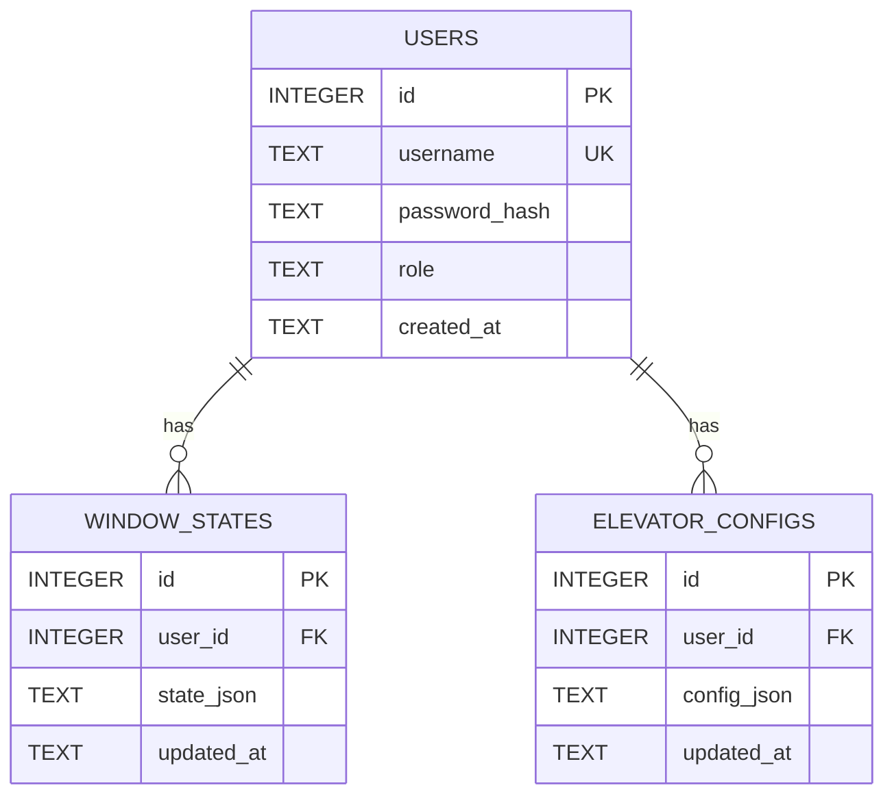
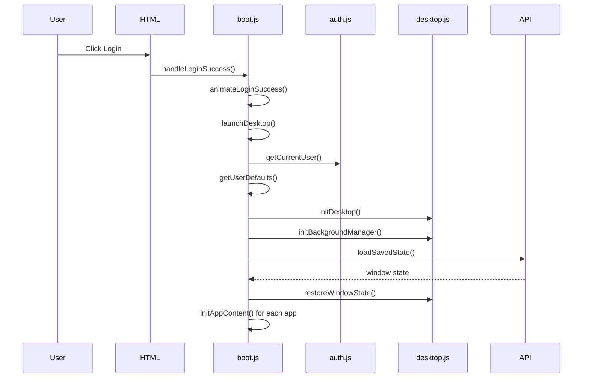
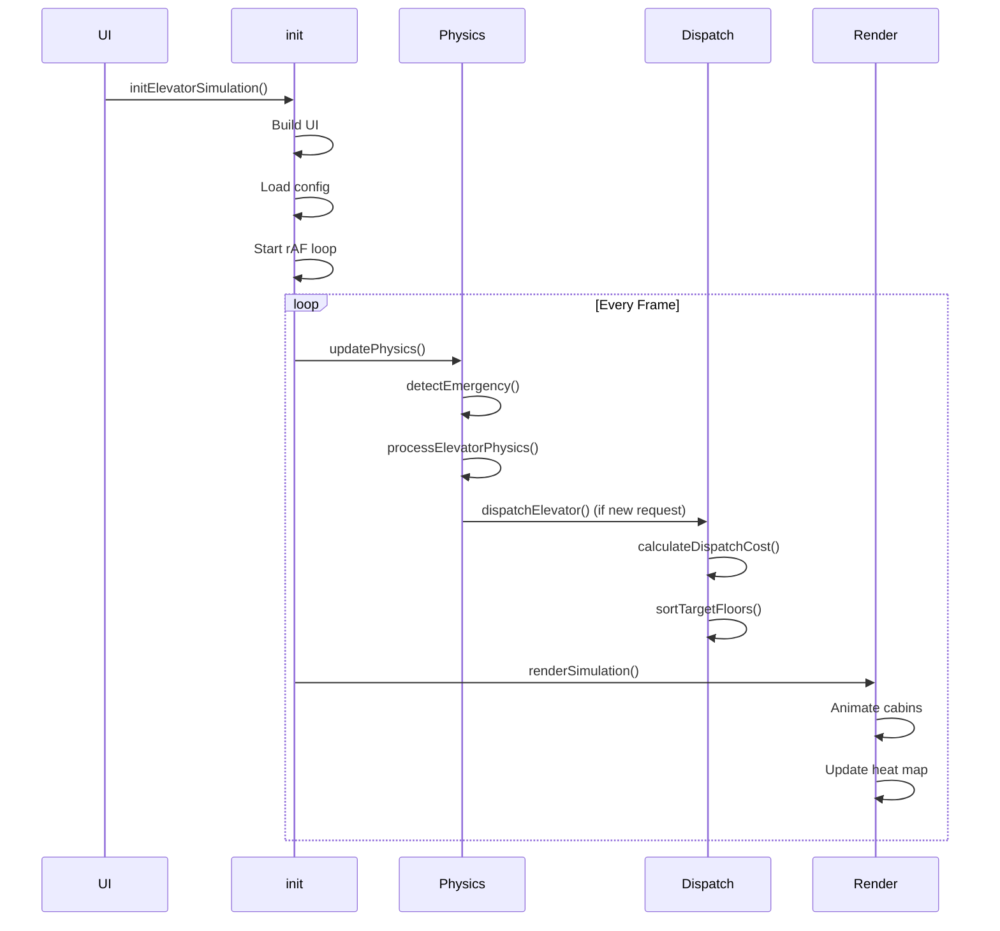
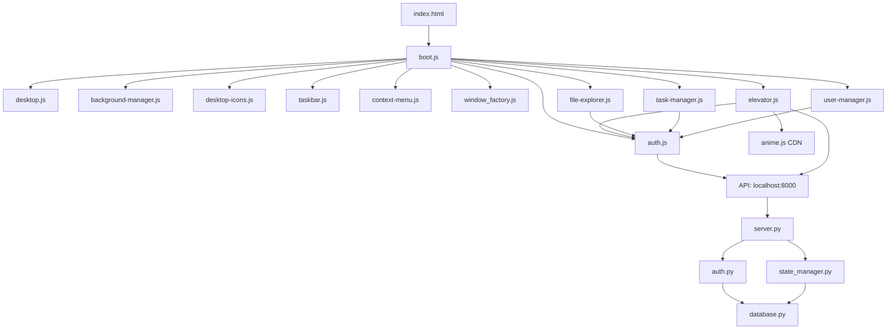
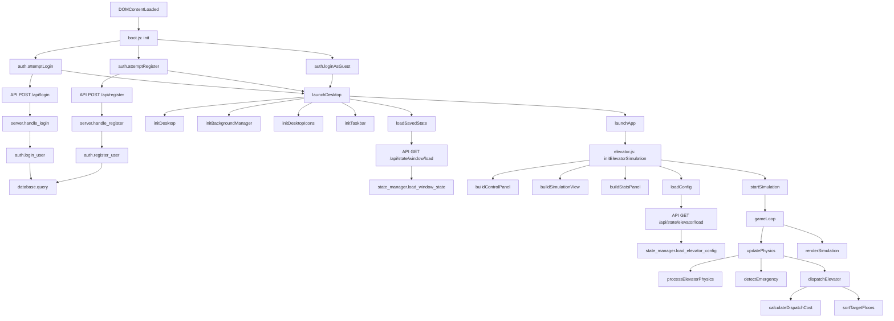

# PROJECT ANALYSIS - Web OS Elevator Simulation

## 1. PROJECT OVERVIEW

### 1.1 Project Purpose

This project is a **Web-based Operating System (Web OS)** simulation featuring a comprehensive **elevator dispatch simulation** as its flagship application. The system demonstrates advanced front-end engineering techniques including real-time physics simulation, multi-criteria dispatch algorithms, and a complete desktop environment metaphor.

### 1.2 Problem Being Solved

The project addresses several technical challenges:
- **Real-time physics simulation** of elevator systems with accurate kinematics
- **Multi-criteria dispatch algorithms** (LOOK/SCAN) for optimal elevator assignment
- **State persistence** across sessions for both authenticated users and guests
- **Responsive UI design** that adapts to different viewport sizes
- **Modular architecture** supporting multiple applications within a desktop environment

### 1.3 Target Users

- **Students/Researchers**: Studying elevator dispatch algorithms and real-time simulation
- **Developers**: Learning advanced JavaScript patterns, physics simulation, and state management
- **System Architects**: Reference implementation for modular Web OS architecture
- **Guest Users**: Casual users exploring the simulation without authentication

### 1.4 Core Business Goals

1. Provide an accurate, interactive elevator simulation
2. Demonstrate LOOK/SCAN dispatch algorithm with configurable parameters
3. Implement fault detection and recovery mechanisms
4. Support multiple user roles (admin, user, guest) with different permissions
5. Enable state persistence across sessions
6. Create an extensible Web OS framework for additional applications

### 1.5 High-Level Feature List

**Elevator Simulation Features:**
- Real-time physics simulation with acceleration/deceleration
- LOOK/SCAN dispatch algorithm with multi-criteria scoring
- Fault detection (overload, stuck) and manual recovery
- Heat map visualization of floor queue density
- ETA calculation and display
- Zoning algorithm for high-rise buildings
- Pre-positioning for idle elevators
- Direction indicators on cabin displays
- Responsive UI with breakpoint handling

**Web OS Features:**
- Desktop environment with window management
- Taskbar with sleep/logout/shutdown controls
- User authentication (login/register/guest access)
- State persistence (localStorage + server)
- Multiple applications (File Explorer, Task Manager, User Manager)
- Context menu system
- Background management with sleep mode

---

## 2. THEORETICAL FOUNDATIONS

### 2.1 LOOK/SCAN Dispatch Algorithm

#### Purpose
The LOOK algorithm (also known as SCAN) is a disk scheduling algorithm adapted for elevator dispatch. It optimizes elevator movement by servicing requests in one direction until no requests remain in that direction, then reverses.

#### Inputs/Outputs
- **Inputs:** 
  - Current elevator positions and velocities
  - Floor request queues (up/down per floor)
  - Elevator states (idle, moving, loading, fault)
  - Configuration parameters (max load, max velocity, max acceleration)
- **Outputs:**
  - Assigned elevator for each floor request
  - Sorted target floor lists for each elevator
  - Dispatch cost scores for decision logging

#### Workflow
```
1. For each floor request:
   a. Calculate dispatch cost for each elevator
   b. Cost = distance × 2 + penalties - bonuses
   c. Select elevator with minimum cost
   d. Add floor to elevator's target list
   e. Sort target list using LOOK ordering

2. LOOK Target Sorting:
   a. If direction = UP: sort ascending, prioritize floors ≥ current
   b. If direction = DOWN: sort descending, prioritize floors ≤ current
   c. After servicing all in direction, reverse and service remaining
```

#### Cost Function Formula

$$ \text{Cost} = 2 \times |P_e - F_r| + P_{wrong} + P_{overload} - B_{same} + P_{fault} + P_{door} - B_{target} - B_{idle} + P_{zone} $$

Where:
- $P_e$: Elevator position
- $F_r$: Requested floor
- $P_{wrong} = 8$: Wrong direction penalty
- $P_{overload} = 15 \times \text{load ratio}$: Overload penalty
- $B_{same} = 3$: Same direction bonus
- $P_{fault} = 100$: Fault penalty
- $P_{door} = 2$: Door not closed penalty
- $B_{target} = 5$: Already has target bonus
- $B_{idle} = 2$: Idle bonus
- $P_{zone} = 30$: Zoning penalty (if enabled)

#### Time/Space Complexity
- **Time Complexity:** $O(E \times F)$ for dispatch, where $E$ = elevators, $F$ = floors
- **Space Complexity:** $O(E \times F)$ for storing target lists and queues
- **Sorting Complexity:** $O(T \log T)$ per elevator, where $T$ = target count

#### Advantages
- Reduces total travel distance by eliminating unnecessary direction changes
- Fair service distribution across floors
- Predictable movement patterns
- Easy to implement and debug

#### Limitations
- May cause starvation for middle floors in heavy traffic
- Does not consider passenger wait times in cost calculation
- Static direction changes may not be optimal for dynamic traffic patterns

#### Reason for Selection
LOOK is the industry standard for elevator dispatch due to its balance of efficiency and fairness. It's well-documented, easy to understand, and provides good performance for typical building traffic patterns.

### 2.2 Physics Simulation

#### Purpose
Simulate realistic elevator kinematics using Newtonian mechanics with acceleration, velocity, and position integration.

#### Inputs/Outputs
- **Inputs:**
  - Target floor
  - Current position, velocity, acceleration
  - Max acceleration, max velocity
  - Door timing parameters
- **Outputs:**
  - Updated position, velocity, acceleration
  - Current phase (accelerating, cruising, decelerating, door sequence)
  - Door state (closed, opening, open, closing)

#### Workflow
```
1. Calculate distance to target: d = |target - current_position|

2. Calculate braking distance: d_brake = v² / (2a)

3. Determine phase:
   - If d < threshold: DECELERATING
   - Else if d_brake ≥ d: DECELERATING
   - Else if |v| < v_max: ACCELERATING
   - Else: CRUISING

4. Integrate motion:
   - a = ±a_max based on phase
   - v = v + a × dt
   - v = clamp(v, -v_max, v_max)
   - p = p + v × dt

5. Handle floor stops when p crosses integer floor boundary
```

#### Kinematics Formulas

**Braking Distance:**
$$ d_{brake} = \frac{v^2}{2a} $$

**Time to Reach Distance:**
$$ t = \begin{cases} 
2\sqrt{\frac{d}{a}} & \text{if } d \leq 2d_{accel} \\
2t_{accel} + \frac{d - 2d_{accel}}{v_{max}} & \text{otherwise}
\end{cases} $$

Where $d_{accel} = \frac{1}{2}at_{accel}^2$ and $t_{accel} = \frac{v_{max}}{a}$

#### Time/Space Complexity
- **Time Complexity:** $O(1)$ per elevator per frame
- **Space Complexity:** $O(1)$ per elevator

#### Advantages
- Physically accurate motion
- Smooth acceleration/deceleration
- Predictable stopping behavior
- Configurable parameters for different elevator types

#### Limitations
- Assumes instant acceleration changes (jerk not modeled)
- Does not account for cable stretch or counterweight dynamics
- Simplified door timing (no door safety sensors)

#### Reason for Selection
Provides realistic simulation while maintaining computational efficiency. The kinematics model is sufficient for visual simulation and dispatch algorithm testing.

### 2.3 Gaussian Random Weight Distribution

#### Purpose
Generate realistic passenger weights using Box-Muller transform for normal distribution.

#### Formula
$$ z = \sqrt{-2\ln(u_1)} \cos(2\pi u_2) $$
$$ \text{weight} = \text{clamp}(\mu + z\sigma, \min, \max) $$

Where:
- $u_1, u_2$: Uniform random numbers in (0, 1]
- $\mu = 75$: Mean weight (kg)
- $\sigma = 15$: Standard deviation
- $\min = 50$: Minimum weight
- $\max = 130$: Maximum weight

#### Advantages
- More realistic than uniform distribution
- Matches real-world human weight statistics
- Configurable parameters
- Updated range (50-130kg) for better realism

### 2.4 Zoning Algorithm

#### Purpose
Divide building floors into zones assigned to specific elevators to reduce travel time in high-rise buildings.

#### Workflow
```
1. Calculate zone size: zone_size = ceil(total_floors / elevator_count)

2. For each elevator i:
   - zone_min = i × zone_size
   - zone_max = zone_min + zone_size - 1

3. In dispatch cost calculation:
   - If requested floor ∉ [zone_min, zone_max]:
     - Add penalty +30 to cost
```

#### Advantages
- Reduces cross-zone travel
- Improves efficiency in tall buildings
- Configurable zone boundaries

#### Limitations
- May cause imbalance if traffic is not evenly distributed
- Requires manual zone sizing or dynamic adjustment

---

## 3. TECHNOLOGY STACK

### 3.1 Languages

| Language | Version | Role |
|-----------|---------|------|
| JavaScript | ES6+ | Frontend application logic, simulation, UI |
| Python | 3.x | Backend API server, authentication, state management |
| HTML5 | - | Markup structure |
| CSS3 | - | Styling and animations |
| SQL | SQLite 3 | Database schema and queries |

### 3.2 Frameworks & Libraries

| Library | Purpose | Usage Location | Justification |
|---------|---------|----------------|---------------|
| anime.js | Animation library | elevator.js (cabin movement, door animation, UI transitions) | Smooth, performant animations with simple API |
| No external frameworks | - | All frontend code | Pure JavaScript demonstrates core skills, reduces dependencies |

### 3.3 Database

**DBMS:** SQLite 3

**Schema Strategy:**
- Single database file (`backend/data.db`)
- Three main tables: users, window_states, elevator_configs
- Foreign key constraints with CASCADE delete
- Row factory for dictionary-like access

**Tables:**

```sql
CREATE TABLE users (
    id INTEGER PRIMARY KEY AUTOINCREMENT,
    username TEXT UNIQUE NOT NULL,
    password_hash TEXT NOT NULL,
    role TEXT DEFAULT 'user',
    created_at TEXT DEFAULT (datetime('now', 'localtime'))
);

CREATE TABLE window_states (
    id INTEGER PRIMARY KEY AUTOINCREMENT,
    user_id INTEGER NOT NULL,
    state_json TEXT NOT NULL,
    updated_at TEXT DEFAULT (datetime('now', 'localtime')),
    FOREIGN KEY (user_id) REFERENCES users (id) ON DELETE CASCADE
);

CREATE TABLE elevator_configs (
    id INTEGER PRIMARY KEY AUTOINCREMENT,
    user_id INTEGER NOT NULL,
    config_json TEXT NOT NULL,
    updated_at TEXT DEFAULT (datetime('now', 'localtime')),
    FOREIGN KEY (user_id) REFERENCES users (id) ON DELETE CASCADE
);
```

**Indexing:**
- Primary keys auto-indexed by SQLite
- Username UNIQUE constraint creates index
- Foreign key constraints for referential integrity

**Constraints:**
- NOT NULL on required fields
- UNIQUE on username
- FOREIGN KEY with CASCADE delete
- DEFAULT values for timestamps and role

**Migrations:**
- Simple migration function `_migrate_add_role_column()` adds role column to existing databases

**Normalization:**
- **1NF:** All atomic values, no repeating groups
- **2NF:** All non-key attributes fully dependent on primary key
- **3NF:** No transitive dependencies
- **BCNF:** Satisfied (no non-trivial multivalued dependencies)

### 3.4 Infrastructure & Tooling

**Docker:** Not used (development environment)

**CI/CD:** Not implemented (manual deployment)

**Git:** Version control (`.git/` directory present)

**Caching:** 
- LocalStorage for guest users
- Server-side SQLite for authenticated users
- In-memory state during session

**Logging:**
- Console logging for frontend
- Print statements for backend
- Event log system in elevator simulation

**Monitoring:** Not implemented

**Reverse Proxies:** Not used (direct HTTP server)

**External Services:**
- CDN: anime.js from cdnjs.cloudflare.com
- None for backend (local HTTP server)

---

## 4. SYSTEM ANALYSIS & DESIGN

### 4.1 Functional Requirements

**Authentication:**
- User registration with username/password
- User login with credential validation
- Guest access without authentication
- Role-based access control (admin, user, guest)
- Session management

**Elevator Simulation:**
- Configurable building parameters (floors, elevators, load, speed)
- Real-time physics simulation
- Passenger generation with random weights
- Floor call buttons (up/down)
- Cabin destination buttons
- Door operation sequence
- Fault detection (overload, stuck)
- Manual fault recovery
- Statistics tracking (wait time, served count, load per elevator)
- Configuration persistence

**Web OS Features:**
- Desktop environment with icons
- Window management (create, move, minimize, close)
- Taskbar with system controls
- Background management
- Sleep mode
- Context menus
- Multiple applications
- State persistence across sessions

**User Management (Admin):**
- List all users
- Create new users
- Update user passwords
- Update user roles
- Delete users

### 4.2 Non-Functional Requirements

**Security:**
- Password hashing (SHA-256 in backend)
- CORS headers for cross-origin requests
- Input validation on API endpoints
- SQL injection prevention (parameterized queries)
- Role-based access control
- **Limitations:** No HTTPS, no session tokens, no rate limiting

**Performance:**
- RequestAnimationFrame for smooth 60fps animation
- Debounced resize handlers (200ms)
- Efficient DOM updates (batch operations)
- **Limitations:** No virtual scrolling for large lists, no lazy loading

**Scalability:**
- Stateless backend design
- SQLite database (suitable for small to medium scale)
- **Limitations:** Single-threaded Python server, no horizontal scaling, no connection pooling

**Reliability:**
- Error handling with try-catch blocks
- Graceful degradation (localStorage fallback)
- MutationObserver for cleanup
- **Limitations:** No retry logic for API failures, no health checks

**Maintainability:**
- Modular ES6 module structure
- Clear separation of concerns
- Comprehensive inline documentation
- **Strengths:** Well-organized code, consistent naming conventions

**Availability:**
- Local server deployment
- No redundancy or failover
- **Limitations:** Single point of failure

### 4.3 Architecture Analysis

**Architecture Pattern:** **Modular Monolith with Layered Frontend**

The system follows a **layered architecture** on the frontend with a **monolithic backend**:

```
┌─────────────────────────────────────────────────────────────┐
│                     Presentation Layer                       │
│  ┌──────────────┐  ┌──────────────┐  ┌──────────────┐      │
│  │   Desktop    │  │  Taskbar     │  │  Windows     │      │
│  │   Manager    │  │  Manager     │  │  Factory     │      │
│  └──────────────┘  └──────────────┘  └──────────────┘      │
└─────────────────────────────────────────────────────────────┘
                              ↓
┌─────────────────────────────────────────────────────────────┐
│                     Application Layer                         │
│  ┌──────────────┐  ┌──────────────┐  ┌──────────────┐      │
│  │   Auth       │  │  App Loader  │  │  State Mgr   │      │
│  │   Module     │  │              │  │              │      │
│  └──────────────┘  └──────────────┘  └──────────────┘      │
└─────────────────────────────────────────────────────────────┘
                              ↓
┌─────────────────────────────────────────────────────────────┐
│                     Business Logic Layer                     │
│  ┌──────────────┐  ┌──────────────┐  ┌──────────────┐      │
│  │   Elevator   │  │  File Exp.   │  │  Task Mgr    │      │
│  │   Simulation │  │              │  │              │      │
│  └──────────────┘  └──────────────┘  └──────────────┘      │
└─────────────────────────────────────────────────────────────┘
                              ↓
┌─────────────────────────────────────────────────────────────┐
│                      Data Access Layer                        │
│  ┌──────────────┐  ┌──────────────┐  ┌──────────────┐      │
│  │  LocalStorage│  │  API Client  │  │  Event Bus   │      │
│  └──────────────┘  └──────────────┘  └──────────────┘      │
└─────────────────────────────────────────────────────────────┘
                              ↓
┌─────────────────────────────────────────────────────────────┐
│                      Backend (Python)                        │
│  ┌──────────────┐  ┌──────────────┐  ┌──────────────┐      │
│  │   HTTP       │  │   Auth       │  │   State      │      │
│  │   Server     │  │   Service    │  │   Manager    │      │
│  └──────────────┘  └──────────────┘  └──────────────┘      │
└─────────────────────────────────────────────────────────────┘
                              ↓
┌─────────────────────────────────────────────────────────────┐
│                      Database (SQLite)                       │
│  ┌──────────────┐  ┌──────────────┐  ┌──────────────┐      │
│  │    Users     │  │  Window      │  │  Elevator    │      │
│  │              │  │  States     │  │  Configs     │      │
│  └──────────────┘  └──────────────┘  └──────────────┘      │
└─────────────────────────────────────────────────────────────┘
```

**Architecture Characteristics:**
- **Frontend:** ES6 modules with clear separation of concerns
- **Backend:** Simple HTTP server with routing table
- **Data Flow:** Unidirectional from UI → Business Logic → API → Database
- **State Management:** Local state with persistence to localStorage/server
- **Event Handling:** DOM events → Event handlers → State updates → UI re-render

**Layer Interactions:**
1. **Presentation → Application:** User interactions trigger auth and app loading
2. **Application → Business Logic:** App initialization calls business logic functions
3. **Business Logic → Data Access:** Simulation state persisted via API/localStorage
4. **Data Access → Backend:** HTTP requests for authenticated users
5. **Backend → Database:** SQLite queries for persistence

---

## 5. DATABASE ANALYSIS

### 5.1 Entity Relationship Diagram



### 5.2 Table Analysis

#### Users Table
**Purpose:** Store user authentication credentials and roles

**Fields:**
- `id`: Primary key, auto-increment
- `username`: Unique identifier for login
- `password_hash`: SHA-256 hashed password
- `role`: User role ('admin', 'user')
- `created_at`: Timestamp of account creation

**Constraints:**
- PRIMARY KEY on id
- UNIQUE on username
- NOT NULL on username, password_hash

**Relationships:**
- One-to-many with window_states
- One-to-many with elevator_configs

**Indexes:**
- Primary key index on id
- Unique index on username

**Usage Locations:**
- `backend/auth.py`: User registration, login, listing
- `backend/database.py`: Table creation, migration

#### Window States Table
**Purpose:** Persist desktop window layout and state per user

**Fields:**
- `id`: Primary key, auto-increment
- `user_id`: Foreign key to users
- `state_json`: JSON string containing window positions, sizes, states
- `updated_at`: Timestamp of last update

**Constraints:**
- PRIMARY KEY on id
- FOREIGN KEY to users with CASCADE delete
- NOT NULL on user_id, state_json

**Relationships:**
- Many-to-one with users

**Indexes:**
- Primary key index on id
- Foreign key index on user_id (implicit)

**Usage Locations:**
- `backend/state_manager.py`: Save/load window state
- `src/shell/boot.js`: Auto-save window state every 30s

#### Elevator Configs Table
**Purpose:** Persist elevator simulation configuration per user

**Fields:**
- `id`: Primary key, auto-increment
- `user_id`: Foreign key to users
- `config_json`: JSON string containing simulation parameters
- `updated_at`: Timestamp of last update

**Constraints:**
- PRIMARY KEY on id
- FOREIGN KEY to users with CASCADE delete
- NOT NULL on user_id, config_json

**Relationships:**
- Many-to-one with users

**Indexes:**
- Primary key index on id
- Foreign key index on user_id (implicit)

**Usage Locations:**
- `backend/state_manager.py`: Save/load elevator config
- `src/apps/elevator/elevator.js`: Load/save configuration

### 5.3 Normalization Evaluation

**First Normal Form (1NF):** ✅ Satisfied
- All atomic values
- No repeating groups
- Each row uniquely identified

**Second Normal Form (2NF):** ✅ Satisfied
- All non-key attributes fully dependent on primary key
- No partial dependencies

**Third Normal Form (3NF):** ✅ Satisfied
- No transitive dependencies
- All non-key attributes directly dependent on primary key

**Boyce-Codd Normal Form (BCNF):** ✅ Satisfied
- No non-trivial multivalued dependencies
- All determinants are candidate keys

---

## 6. PROJECT STRUCTURE

```
Bai-tap-lon-mon-js/
├── a/                          # Additional assets (2 items)
├── apps/                       # Legacy app directory (3 items)
│   ├── file-explorer/
│   │   └── file-explorer.js
│   ├── task-manager/
│   │   └── task-manager.js
│   └── user-manager/
│       └── user-manager.js
├── backend/                    # Python backend server
│   ├── __pycache__/           # Python bytecode cache
│   ├── backend/               # Backend package directory
│   ├── auth.py               # Authentication service
│   ├── database.py           # Database schema and connection
│   ├── server.py             # HTTP server and routing
│   └── state_manager.py      # State persistence service
├── src/                       # Source code directory
│   ├── apps/                  # Application modules
│   │   └── elevator/
│   │       └── elevator.js   # Main elevator simulation
│   ├── sdk/                   # SDK utilities
│   │   └── event-bus.js      # Event communication
│   └── shell/                 # Web OS shell components
│       ├── assets/
│       │   └── styles.js      # Shared styles
│       ├── auth.js            # Frontend authentication
│       ├── boot.js            # Application bootstrap
│       ├── desktop/
│       │   ├── background-manager.js  # Background image management
│       │   ├── desktop-icons.js       # Desktop icon rendering
│       │   ├── desktop.js              # Desktop initialization
│       │   └── window_factory.js       # Window creation/management
│       ├── login-animation.js  # Login screen animations
│       └── system-ui/
│           ├── context-menu.js        # Right-click context menu
│           └── taskbar.js             # Taskbar controls
├── temp/                       # Temporary/build files (32 items)
├── index.html                 # Entry point HTML
└── PROJECT_ANALYSIS.md       # This document
```

### Directory Responsibilities

**`backend/`**: Python HTTP server providing REST API for authentication and state persistence
- **Dependencies:** None (standard library only)
- **Key Files:** `server.py`, `auth.py`, `database.py`, `state_manager.py`

**`src/apps/elevator/`**: Elevator simulation application
- **Responsibilities:** Physics simulation, dispatch algorithm, UI rendering, statistics
- **Dependencies:** `anime.js` (CDN), `../../shell/auth.js`
- **Key Files:** `elevator.js` (2582 lines, comprehensive simulation)

**`src/shell/`**: Web OS shell infrastructure
- **Responsibilities:** Desktop environment, window management, authentication, system UI
- **Dependencies:** ES6 modules, no external libraries
- **Key Files:** `boot.js`, `auth.js`, `desktop/desktop.js`, `desktop/window_factory.js`

**`src/sdk/`**: Shared utilities
- **Responsibilities:** Event communication between modules
- **Key Files:** `event-bus.js`

---

## 7. FILE-BY-FILE ANALYSIS

### 7.1 `index.html`

**Overview:** Entry point HTML file that defines the application structure and loads the bootstrap script.

**Responsibilities:**
- Define login screen and desktop screen containers
- Load external dependencies (anime.js CDN)
- Define CSS for login form and screen transitions
- Bootstrap the application via `boot.js`

**Dependencies:**
- External: anime.js from cdnjs.cloudflare.com
- Internal: `./src/shell/boot.js`

**Internal Logic:**
- Two main sections: `#login-screen` and `#desktop-screen`
- Login form with username/password inputs
- Three buttons: Login, Register, Guest access
- CSS for glassmorphism login container
- Sleep mode CSS classes

### 7.2 `src/shell/boot.js`

**Overview:** Application bootstrap that orchestrates the entire Web OS lifecycle from login to desktop initialization.

**Responsibilities:**
- Handle authentication flow (login, register, guest)
- Initialize desktop environment
- Launch applications based on user role
- Manage window state persistence
- Handle sleep mode, logout, shutdown

**Dependencies:**
- Imports: All shell modules and app initializers
- External: None

**Internal Logic:**

**Key Functions:**

**`launchDesktop()`**
- Purpose: Initialize desktop environment after successful login
- Parameters: None
- Return: void
- Workflow:
  1. Get user defaults based on role
  2. Initialize desktop, background, context menu
  3. Create desktop icons for available apps
  4. Initialize taskbar with system controls
  5. Load saved window state from server/localStorage
  6. Restore windows or launch default apps
  7. Start auto-save timer (30s interval)

**`launchApp(desktop, appName)`**
- Purpose: Launch an application in a new window
- Parameters: desktop element, app name string
- Return: Window DOM element
- Workflow:
  1. Check if app already running (restore if yes)
  2. Create new window via window_factory
  3. Set specific size for Elevator Simulation (960x640)
  4. Initialize app content based on app name
  5. Track instance in appInstances Map

**`handleLogout()`**
- Purpose: Clean up and return to login screen
- Parameters: None
- Return: void
- Workflow:
  1. Save current window state
  2. Clear auto-save timer
  3. Logout from auth
  4. Clear app instances and open windows
  5. Teardown desktop
  6. Show login screen with animation

**Execution Flow:**


### 7.3 `src/shell/auth.js`

**Overview:** Frontend authentication module handling user sessions, localStorage persistence, and API communication.

**Responsibilities:**
- Manage user session state
- Handle login/register API calls
- Persist state to localStorage (guest mode)
- Provide user information to other modules

**Dependencies:**
- External: fetch API
- Internal: None

**Internal Logic:**

**Key Functions:**

**`attemptLogin(username, password, onSuccess)`**
- Purpose: Authenticate user with credentials
- Parameters: username (string), password (string), onSuccess (callback)
- Return: Promise<{success, message}>
- Workflow:
  1. Validate inputs
  2. Call POST /api/login with credentials
  3. On success: store user session, call onSuccess
  4. On failure: return error message

**`attemptRegister(username, password, onSuccess)`**
- Purpose: Register new user account
- Parameters: username (string), password (string), onSuccess (callback)
- Return: Promise<{success, message}>
- Workflow:
  1. Call POST /api/register with credentials
  2. On success: store user session, call onSuccess
  3. On failure: return error message

**`loginAsGuest(onSuccess)`**
- Purpose: Allow guest access without authentication
- Parameters: onSuccess (callback)
- Return: void
- Workflow:
  1. Set guest user object
  2. Call onSuccess callback

**State Management:**
- Session stored in memory variable
- Guest state persisted to localStorage
- Authenticated state persisted via API

### 7.4 `src/apps/elevator/elevator.js`

**Overview:** Comprehensive elevator simulation with physics engine, LOOK/SCAN dispatch algorithm, fault detection, and real-time visualization. Single-file architecture (2740 lines) with pure functions extracted for testability.

**Responsibilities:**
- Real-time physics simulation (acceleration, velocity, position)
- Multi-criteria dispatch algorithm (LOOK/SCAN) with pure function implementation
- Passenger generation with Gaussian weight distribution (50-130kg)
- Fault detection (overload, stuck) and recovery with DOM ref guards
- Statistics tracking and visualization
- Responsive UI with three-column layout and optimized resize handler
- Heat map visualization of floor queues
- ETA calculation and display
- Zoning algorithm for high-rise buildings
- Pre-positioning for idle elevators
- Passenger journey tooltips with fixed positioning
- Self-tests for dispatcher and sorting algorithms

**Dependencies:**
- External: anime.js (CDN)
- Internal: `../../shell/auth.js`

**Internal Logic:**

**Constants:**
```javascript
FLOOR_HEIGHT_PX = 36              
STATS_UPDATE_MS = 1000            
STUCK_THRESHOLD_MS = 5000         
OVERLOAD_FAULT_RATIO = 1.1        
CHART_HISTORY_MAX = 60            
WRONG_DIRECTION_PENALTY = 8       
OVERLOAD_PENALTY = 15            
SAME_DIRECTION_BONUS = 3          
PASSENGER_DOT_SIZE = 6            
```

**Enums:**
```javascript
DOOR_STATE = { CLOSED, OPENING, OPEN, CLOSING }
ELEVATOR_STATUS = { IDLE, MOVING, LOADING, FAULT }
ELEVATOR_PHASE = { IDLE, ACCELERATING, CRUISING, DECELERATING, DOOR_SEQUENCE }
PASSENGER_STATE = { WAITING, BOARDING, RIDING, EXITING, SERVED }
FAULT_TYPE = { NONE, OVERLOAD, STUCK }
```

**Key Functions:**

**`sortTargetFloorsPure(elevator)` (Module Scope)**
- Purpose: Pure function for LOOK/SCAN target floor sorting - extracted for testability
- Parameters: elevator (object with position, direction, targetFloors)
- Return: sorted targetFloors array
- Workflow:
  1. Deduplicate targets using Set
  2. Sort based on direction (ascending for up, descending for down)
  3. Partition into above/below current position
  4. Concatenate: above (in direction) then below (reverse direction)
- Advantages: Testable, no side effects, reusable

**`calculateDispatchCostPure(elevator, floor, direction, config)` (Module Scope)**
- Purpose: Pure function for dispatch cost calculation - extracted for testability
- Parameters: elevator (object), floor (number), direction (string), config (object)
- Return: cost (number)
- Cost Formula:
  ```
  cost = distance × 2
  + wrong_direction_penalty (if applicable)
  + overload_penalty × load_ratio
  - same_direction_bonus (if applicable)
  + fault_penalty (if faulted)
  + door_not_closed_penalty
  - has_target_bonus
  - idle_bonus
  ```
- Advantages: Testable, no side effects, used in self-tests

**`initElevatorSimulation(contentElement)`**
- Purpose: Main entry point, initializes entire simulation
- Parameters: contentElement (DOM element)
- Return: void
- Workflow:
  1. Initialize simConfig and systemState
  2. Add lastKnownWidth, lastBuiltFloors, lastBuiltElevatorCount for resize optimization
  3. Build three-column UI (Control Panel, Simulation View, Stats Panel)
  4. Setup event listeners (resize with 50px threshold, mutation observer)
  5. Load saved configuration from API/localStorage
  6. Initialize spawn and stats intervals
  7. Run self-tests including dispatcher and sorting tests

**`dispatchElevator({ floor, direction })`**
- Purpose: Assign best elevator to floor request using multi-criteria scoring
- Parameters: floor (number), direction ('up'/'down')
- Return: elevatorId (number) or -1
- Workflow:
  1. For each elevator, calculate dispatch cost
  2. Cost = distance × 2 + penalties - bonuses
  3. Select elevator with minimum cost
  4. Add floor to elevator's target list
  5. Sort targets using LOOK algorithm (calls sortTargetFloorsPure)
  6. Log dispatch decision

**`calculateDispatchCost(elevator, floor, direction)` (Closure)**
- Purpose: Compute cost score for elevator-floor assignment (closure version with zoning)
- Parameters: elevator (object), floor (number), direction (string)
- Return: cost (number)
- Cost Formula:
  ```
  cost = distance × 2
  + wrong_direction_penalty (if applicable)
  + overload_penalty × load_ratio
  - same_direction_bonus (if applicable)
  + fault_penalty (if faulted)
  + door_not_closed_penalty
  - has_target_bonus
  - idle_bonus
  + zone_penalty (if zoning enabled)
  ```
- Note: This is the closure version that includes zoning logic

**`processElevatorPhysics(elevator, dtSec)`**
- Purpose: Integrate elevator motion using kinematics
- Parameters: elevator (object), dtSec (number, delta time in seconds)
- Return: void
- Workflow:
  1. If faulted, set velocity/acceleration to 0
  2. If in door sequence, update door state
  3. Calculate distance to target
  4. Determine phase (accel/cruise/decel) based on braking distance
  5. Integrate: a → v → p
  6. Handle floor stops when crossing integer boundaries
  7. Update status based on velocity

**`detectEmergency(elevatorId, deltaMs)`**
- Purpose: Detect and set fault conditions
- Parameters: elevatorId (number), deltaMs (number)
- Return: boolean (has fault)
- Workflow:
  1. Check overload: if load > 110% maxLoad, set OVERLOAD fault
  2. Check stuck: if velocity ≈ 0 for 5s with pending work, set STUCK fault
  3. Auto-recover overload when load drops below threshold
  4. Return true if any fault active

**`updateCabinDots(elevatorId)`**
- Purpose: Update passenger dots in cabin with click listeners for tooltips
- Parameters: elevatorId (number)
- Return: void
- Workflow:
  1. Check if passenger count changed using cabinDotCounts Map
  2. If unchanged, return early (optimization)
  3. Clear dots container
  4. Create new dots for each passenger (max 12)
  5. Attach click listener to each dot for showPassengerTooltip
  6. Update cabinDotCounts with new count
- Optimization: Only rebuild when passenger count changes, not every frame

**`showPassengerTooltip(anchorEl, passenger)`**
- Purpose: Display passenger journey information in floating tooltip
- Parameters: anchorEl (DOM element), passenger (object)
- Return: void
- Workflow:
  1. Remove existing tooltip if present
  2. Calculate position using getBoundingClientRect
  3. Create tooltip with passenger info (ID, From, To, Waited, Riding)
  4. Position using position:fixed (not absolute) for scroll/iframe compatibility
  5. Append to document.body
  6. Add click-outside listener to dismiss
- Positioning: position:fixed ensures correct coordinates in scroll/iframe contexts

**`renderFaultButtons()`**
- Purpose: Render fault reset buttons in control panel
- Parameters: None
- Return: void
- Workflow:
  1. Guard: Check if faultButtonsContainer is null or detached
  2. If detached, re-query using [data-fault-container] selector
  3. Clear container
  4. Create button for each elevator with fault
  5. Attach click handler to reset elevator
  6. Show "(Không có lỗi)" if no faults
- DOM Ref Guard: Uses data-fault-container attribute to survive rebuilds

**`renderSimulation()`**
- Purpose: Update UI to reflect current simulation state
- Parameters: None
- Return: void
- Workflow:
  1. Animate cabin positions using anime.js
  2. Update passenger dots in cabins (calls updateCabinDots)
  3. Update fault blink animation
  4. Update floor indicators
  5. Update direction arrows (▲/▼/●)
  6. Update load indicators
  7. Update call button states
  8. Update heat map colors based on queue depth
  9. Animate fault blinking

**`renderElevatorDetailCards()`**
- Purpose: Display detailed elevator status in stats panel
- Parameters: None
- Return: void
- Workflow:
  1. For each elevator, create status card
  2. Display: position, velocity, acceleration, direction, phase
  3. Display: door state, fault status, load, passenger count
  4. Display: target floors list
  5. Display: ETA to next target
  6. Display: braking distance

**Execution Flow:**


**Data Structures:**

**Elevator Object:**
```javascript
{
    id: number,
    position: number,           
    velocity: number,           
    acceleration: number,       
    direction: 'up'|'down'|'none',
    doorState: DOOR_STATE,
    passengers: Passenger[],
    targetFloors: number[],     
    currentLoad: number,        
    status: ELEVATOR_STATUS,
    faultStatus: FAULT_TYPE,
    stuckTimer: number,         
    doorTimer: number,          
    phase: ELEVATOR_PHASE,
    _doorPhase: string|null,    
    _lastPosition: number,      
    _floorStopHandled: number,  
    idleTimer: number           
}
```

**Passenger Object:**
```javascript
{
    id: number,
    originFloor: number,
    destinationFloor: number,
    weight: number,             
    waitStartTime: number,      
    boardTime: number|null,
    exitTime: number|null,
    state: PASSENGER_STATE,
    direction: 'up'|'down'|'none'
}
```

**SystemState Object:**
```javascript
{
    elevators: Elevator[],
    floorQueues: { up: number[], down: number[] }[],
    stats: {
        avgWaitTime: number,
        totalServed: number,
        passengersWaiting: number,
        loadPerElevator: number[],
        waitTimeHistory: number[]
    },
    allPassengers: Passenger[],
    pendingAnimations: any[]
}
```

### 7.5 `backend/server.py`

**Overview:** Python HTTP server providing REST API for authentication and state persistence.

**Responsibilities:**
- Handle HTTP requests with routing table
- Implement CORS headers
- Route to appropriate handlers
- Return JSON responses

**Dependencies:**
- Standard library: http.server, json, urllib.parse
- Internal: database, auth, state_manager

**Internal Logic:**

**Routing Table:**
```python
ROUTES = {
    ('POST', '/api/register'): handle_register,
    ('POST', '/api/login'): handle_login,
    ('POST', '/api/state/window/save'): handle_save_window,
    ('GET', '/api/state/window/load'): handle_load_window,
    ('POST', '/api/state/elevator/save'): handle_save_elevator,
    ('GET', '/api/state/elevator/load'): handle_load_elevator,
    ('GET', '/api/admin/users'): handle_list_users,
    ('POST', '/api/admin/users'): handle_admin_create_user,
    ('PUT', '/api/admin/users'): handle_admin_update_user,
    ('DELETE', '/api/admin/users'): handle_admin_delete_user,
}
```

**Key Functions:**

**`handle_request()`**
- Purpose: Route incoming HTTP request to appropriate handler
- Parameters: None (uses self.path, self.command)
- Return: void (sends response)
- Workflow:
  1. Parse URL path and query parameters
  2. Look up handler in ROUTES table
  3. Call handler if found, return 404 otherwise
  4. Handle exceptions with 500 error

**`run_server(host, port)`**
- Purpose: Start HTTP server
- Parameters: host (string), port (number)
- Return: void
- Workflow:
  1. Initialize database
  2. Seed sample users
  3. Create HTTPServer instance
  4. Serve forever until KeyboardInterrupt

### 7.6 `backend/auth.py`

**Overview:** Authentication service handling user registration, login, and role management.

**Responsibilities:**
- Hash passwords using SHA-256
- Register new users
- Authenticate login attempts
- List all users (admin)
- Create/update/delete users (admin)
- Seed sample users on startup

**Dependencies:**
- Standard library: hashlib, sqlite3
- Internal: database

**Internal Logic:**

**Key Functions:**

**`register_user(username, password)`**
- Purpose: Create new user account
- Parameters: username (string), password (string)
- Return: (success: boolean, message: string)
- Workflow:
  1. Hash password with SHA-256
  2. Insert into users table
  3. Handle duplicate username error

**`login_user(username, password)`**
- Purpose: Authenticate user credentials
- Parameters: username (string), password (string)
- Return: user object or None
- Workflow:
  1. Hash password
  2. Query users table for matching credentials
  3. Return user object if found, None otherwise

### 7.7 `backend/state_manager.py`

**Overview:** State persistence service for window layouts and elevator configurations.

**Responsibilities:**
- Save window state to database
- Load window state from database
- Save elevator configuration to database
- Load elevator configuration from database

**Dependencies:**
- Standard library: sqlite3, json
- Internal: database

**Internal Logic:**

**Key Functions:**

**`save_window_state(user_id, state)`**
- Purpose: Persist window layout state
- Parameters: user_id (number), state (array/object)
- Return: boolean (success)
- Workflow:
  1. Serialize state to JSON
  2. Delete existing state for user
  3. Insert new state record

**`load_window_state(user_id)`**
- Purpose: Retrieve saved window layout
- Parameters: user_id (number)
- Return: state (object) or None
- Workflow:
  1. Query most recent state for user
  2. Deserialize JSON
  3. Return parsed object

### 7.8 `src/shell/desktop/desktop.js`

**Overview:** Desktop initialization and management, including window container and background.

**Responsibilities:**
- Create desktop container
- Manage window z-index
- Handle desktop interactions

**Dependencies:**
- Internal: background-manager, window_factory

### 7.9 `src/shell/desktop/window_factory.js`

**Overview:** Window creation and management system.

**Responsibilities:**
- Create new application windows
- Manage window state (minimized, maximized, closed)
- Handle window dragging and resizing
- Track open windows

**Dependencies:**
- Internal: None

**Key Functions:**

**`create_single_app(desktop, appName)`**
- Purpose: Create a new application window
- Parameters: desktop (DOM element), appName (string)
- Return: window (DOM element)
- Workflow:
  1. Create window container with header and content
  2. Add close/minimize buttons
  3. Enable dragging
  4. Add to openWindows tracking
  5. Set z-index

### 7.10 `src/shell/desktop/background-manager.js`

**Overview:** Background image management with sleep mode support.

**Responsibilities:**
- Load and display background images
- Handle sleep mode transitions
- Manage background layer z-index

**Dependencies:**
- Internal: None

---

## 8. CODE FLOW & DEPENDENCY ANALYSIS

### 8.1 Dependency Graph



### 8.2 Call Graph



### 8.3 Lifecycle Analysis

**Application Startup:**
```
1. DOMContentLoaded
   ↓
2. boot.js initializes login screen
   ↓
3. User enters credentials / clicks guest
   ↓
4. auth.js calls API (or sets guest session)
   ↓
5. On success: animateLoginSuccess()
   ↓
6. launchDesktop()
   ↓
7. Initialize desktop components
   ↓
8. Load saved state from API/localStorage
   ↓
9. Restore windows or launch default apps
   ↓
10. Start auto-save timer (30s interval)
   ↓
11. Application ready
```

**Simulation Loop:**
```
1. startSimulation()
   ↓
2. requestAnimationFrame(gameLoop)
   ↓
3. gameLoop(timestamp)
   ↓
4. Calculate deltaTime
   ↓
5. updatePhysics(deltaTime)
   ↓
6. For each elevator:
   - detectEmergency()
   - processElevatorPhysics()
   - Pre-positioning check
   ↓
7. renderSimulation()
   ↓
8. Update statistics
   ↓
9. Repeat (60fps target)
```

**Request Lifecycle (Login):**
```
1. User clicks Login button
   ↓
2. boot.js validates inputs
   ↓
3. auth.attemptLogin(username, password)
   ↓
4. fetch('POST /api/login', { body: credentials })
   ↓
5. server.py receives request
   ↓
6. Routes to handle_login()
   ↓
7. Calls auth.login_user()
   ↓
8. Queries database for matching credentials
   ↓
9. Returns user object or None
   ↓
10. server sends JSON response
   ↓
11. auth.js receives response
   ↓
12. On success: stores session, calls handleLoginSuccess()
   ↓
13. boot.js launches desktop
```

---

## 9. UI/UX ANALYSIS

### 9.1 Login Screen

**Purpose:** Authenticate users before accessing the desktop environment.

**Components:**
- Login container with glassmorphism effect
- Username input field
- Password input field
- Login button (primary action)
- Register button (secondary action)
- Guest access button (secondary action)
- Error message display

**State Flow:**
1. Initial state: Form visible, inputs empty
2. Validation failure: Shake animation on invalid inputs
3. API failure: Error message displayed, shake animation
4. Success: Fade out login screen, fade in desktop

**Validation:**
- Username required (non-empty)
- Password required (non-empty)
- Server-side validation for credentials

**API Interactions:**
- POST /api/login (login)
- POST /api/register (register)

**User Workflow:**
```
Enter credentials → Click Login → 
Validate inputs → Call API → 
On success: Transition to desktop
On failure: Show error, allow retry
```

### 9.2 Desktop Screen

**Purpose:** Main application environment providing desktop metaphor.

**Components:**
- Background layer (image)
- Desktop icons (clickable app launchers)
- Windows (draggable, resizable containers)
- Taskbar (system controls)
- Context menu (right-click menu)

**State Flow:**
1. Hidden initially
2. On login success: Fade in with animation
3. Sleep mode: Hide icons and taskbar
4. Logout: Fade out, return to login

**API Interactions:**
- GET /api/state/window/load (restore state)
- POST /api/state/window/save (auto-save every 30s)

**User Workflow:**
```
View desktop → Click icon → Launch app → 
Interact with app → Close/minimize window → 
Use taskbar controls → Logout/shutdown
```

### 9.3 Elevator Simulation UI

**Purpose:** Three-column interface for elevator simulation control and visualization.

**Components:**

**Left Column - Control Panel (320px width):**
- Configuration sliders (floors, elevators, load, speed, etc.)
- Control buttons (Start, Pause, Reset)
- Speed controls (1x, 2x, 5x, 10x)
- Inject Surge button
- Save Configuration button
- Preset dropdown
- Algorithm info panel
- Zoning toggle
- Fault Management section
- Event log panel

**Center Column - Simulation View:**
- Building visualization with elevator shafts
- Floor rows with call buttons
- Cabin displays with:
  - Floor indicator
  - Direction arrow (▲/▼/●)
  - Load indicator
  - Passenger dots
- Door animation
- Wait badges showing queue depth
- Heat map coloring (amber/red based on queue depth)

**Right Column - Stats Panel (280px width):**
- Average wait time
- Total served passengers
- Currently waiting passengers
- Load per elevator
- Wait time history chart
- Elevator detail cards with:
  - Position, velocity, acceleration
  - Direction, phase
  - Door state, fault status
  - Load, passenger count
  - Target floors
  - ETA to next target
  - Braking distance

**State Flow:**
1. Initial: Default configuration, simulation paused
2. Running: Physics loop active, UI updates every frame
3. Paused: Physics loop stopped, UI static
4. Fault: Red blinking cabin, reset button appears
5. Responsive: < 900px hides stats panel, shrinks control panel

**API Interactions:**
- GET /api/state/elevator/load (load config on startup)
- POST /api/state/elevator/save (save config)

**User Workflow:**
```
Adjust configuration → Click Start → 
Watch simulation → Monitor statistics → 
Inject surge → Observe dispatch → 
Trigger fault → Reset fault → 
Save configuration → Pause/Reset
```

---

## 10. API DOCUMENTATION

### 10.1 POST /api/register

**Purpose:** Register a new user account.

**Request Schema:**
```json
{
  "username": "string (required)",
  "password": "string (required)"
}
```

**Response Schema:**
```json
{
  "success": boolean,
  "message": "string"
}
```

**Authentication:** None

**Validation Rules:**
- Username must be unique
- Username and password required
- Password hashed with SHA-256

**Business Logic:**
1. Hash password with SHA-256
2. Insert into users table
3. Return success or error message

**Database Operations:**
- INSERT into users table

**Error Handling:**
- 400: Duplicate username
- 500: Database error

### 10.2 POST /api/login

**Purpose:** Authenticate user with credentials.

**Request Schema:**
```json
{
  "username": "string (required)",
  "password": "string (required)"
}
```

**Response Schema:**
```json
{
  "success": boolean,
  "user_id": number,
  "username": "string",
  "role": "string"
}
```

**Authentication:** None

**Validation Rules:**
- Username and password required
- Credentials must match database

**Business Logic:**
1. Hash password with SHA-256
2. Query users table for matching credentials
3. Return user data if found, error otherwise

**Database Operations:**
- SELECT from users table

**Error Handling:**
- 401: Invalid credentials
- 500: Database error

### 10.3 GET /api/admin/users

**Purpose:** List all users (admin only).

**Request Schema:** None (query params: none)

**Response Schema:**
```json
{
  "success": boolean,
  "users": [
    {
      "id": number,
      "username": "string",
      "role": "string",
      "created_at": "string"
    }
  ]
}
```

**Authentication:** Not enforced (TODO)

**Validation Rules:** None

**Business Logic:**
1. Query all users from database
2. Return user list

**Database Operations:**
- SELECT all from users table

**Error Handling:**
- 500: Database error

### 10.4 POST /api/admin/users

**Purpose:** Create new user (admin only).

**Request Schema:**
```json
{
  "username": "string (required)",
  "password": "string (required)",
  "role": "string (default: 'user')"
}
```

**Response Schema:**
```json
{
  "success": boolean,
  "message": "string"
}
```

**Authentication:** Not enforced (TODO)

**Validation Rules:**
- Username must be unique
- Password required

**Business Logic:**
1. Hash password
2. Insert into users table with role

**Database Operations:**
- INSERT into users table

**Error Handling:**
- 400: Duplicate username
- 500: Database error

### 10.5 PUT /api/admin/users

**Purpose:** Update user password or role (admin only).

**Request Schema:**
```json
{
  "user_id": number (required),
  "password": "string (optional)",
  "role": "string (optional)"
}
```

**Response Schema:**
```json
{
  "success": boolean,
  "message": "string"
}
```

**Authentication:** Not enforced (TODO)

**Validation Rules:**
- user_id required
- At least one of password or role required

**Business Logic:**
1. If password provided: hash and update
2. If role provided: update role
3. Return success or error

**Database Operations:**
- UPDATE users table

**Error Handling:**
- 400: Invalid request
- 500: Database error

### 10.6 DELETE /api/admin/users

**Purpose:** Delete user (admin only).

**Request Schema:**
```json
{
  "user_id": number (required)
}
```

**Response Schema:**
```json
{
  "success": boolean,
  "message": "string"
}
```

**Authentication:** Not enforced (TODO)

**Validation Rules:**
- user_id required

**Business Logic:**
1. Delete user from database
2. CASCADE deletes associated states

**Database Operations:**
- DELETE from users table

**Error Handling:**
- 400: Invalid request
- 500: Database error

### 10.7 POST /api/state/window/save

**Purpose:** Save window layout state for user.

**Request Schema:**
```json
{
  "user_id": number (required),
  "state": array/object (required)
}
```

**Response Schema:**
```json
{
  "success": boolean
}
```

**Authentication:** Not enforced (TODO)

**Validation Rules:**
- user_id required
- state required

**Business Logic:**
1. Serialize state to JSON
2. Delete existing state for user
3. Insert new state record

**Database Operations:**
- DELETE + INSERT into window_states table

**Error Handling:**
- 500: Database error

### 10.8 GET /api/state/window/load

**Purpose:** Load saved window layout state.

**Request Schema:**
```
Query params: user_id (number, required)
```

**Response Schema:**
```json
{
  "success": boolean,
  "state": object/array
}
```

**Authentication:** Not enforced (TODO)

**Validation Rules:**
- user_id required

**Business Logic:**
1. Query most recent state for user
2. Deserialize JSON
3. Return state object

**Database Operations:**
- SELECT from window_states table

**Error Handling:**
- 400: Invalid user_id
- 500: Database error

### 10.9 POST /api/state/elevator/save

**Purpose:** Save elevator simulation configuration.

**Request Schema:**
```json
{
  "user_id": number (required),
  "config": object (required)
}
```

**Response Schema:**
```json
{
  "success": boolean
}
```

**Authentication:** Not enforced (TODO)

**Validation Rules:**
- user_id required
- config required

**Business Logic:**
1. Serialize config to JSON
2. Delete existing config for user
3. Insert new config record

**Database Operations:**
- DELETE + INSERT into elevator_configs table

**Error Handling:**
- 500: Database error

### 10.10 GET /api/state/elevator/load

**Purpose:** Load saved elevator configuration.

**Request Schema:**
```
Query params: user_id (number, required)
```

**Response Schema:**
```json
{
  "success": boolean,
  "config": object
}
```

**Authentication:** Not enforced (TODO)

**Validation Rules:**
- user_id required

**Business Logic:**
1. Query most recent config for user
2. Deserialize JSON
3. Return config object

**Database Operations:**
- SELECT from elevator_configs table

**Error Handling:**
- 400: Invalid user_id
- 500: Database error

---

## 11. DEPLOYMENT & OPERATIONS

### 11.1 Environment Setup

**Prerequisites:**
- Python 3.x installed
- Modern web browser with ES6 support
- Node.js not required (pure Python backend)

**Setup Steps:**
1. Clone repository
2. Navigate to project directory
3. Start backend server: `python backend/server.py`
4. Open `index.html` in web browser
5. Server runs on `http:

### 11.2 Build Process

**Frontend:** No build process required (pure ES6 modules)
- Direct browser execution
- No bundling or transpilation

**Backend:** No build process required
- Pure Python standard library
- No dependencies to install

### 11.3 Runtime Configuration

**Frontend Configuration:**
- Located in `getDefaultSimConfig()` function
- Config keys: totalFloors, elevatorCount, maxLoad, maxAcceleration, maxVelocity, doorOpenTime, doorCloseTime, spawnRate, simSpeed, enableZoning
- Stored in localStorage (guest) or database (authenticated)

**Backend Configuration:**
- Hardcoded in `server.py`: host='localhost', port=8000
- Database path: `backend/data.db`
- No external configuration files

### 11.4 Deployment Workflow

**Development:**
1. Start Python server: `python backend/server.py`
2. Open `index.html` in browser
3. Make changes to source files
4. Refresh browser to see changes

**Production:**
1. Deploy backend server to hosting provider
2. Update API URL in frontend (BACKEND_URL constant)
3. Serve static files via web server
4. Configure CORS if needed

### 11.5 Docker Setup

**Not implemented** - Manual deployment only.

### 11.6 CI/CD Pipelines

**Not implemented** - Manual deployment only.

### 11.7 Monitoring

**Not implemented** - No monitoring or alerting.

### 11.8 Logging

**Frontend:**
- Console.log for debugging
- Event log system in elevator simulation
- Error handlers for unhandled errors

**Backend:**
- Print statements for server logs
- HTTP request logging in log_message()
- Error logging with try-catch blocks

### 11.9 Backup & Recovery

**Database:**
- SQLite file: `backend/data.db`
- Manual backup: Copy file to safe location
- Recovery: Restore file from backup

**User Data:**
- Authenticated users: Stored in SQLite
- Guest users: Stored in browser localStorage
- Window/elevator states: SQLite (auth) or localStorage (guest)

---

## 12. TESTING & EVALUATION

### 12.1 Unit Tests

**Not implemented** - No automated unit tests.

**Manual Testing:**
- Self-test function `runConfigSelfTest()` in elevator.js
- Tests 8 configuration validations including:
  - validateSimConfig: Config validation
  - createSystemState: System state creation
  - floorQueues: Floor queue initialization
  - decelDistance: Deceleration distance calculation
  - timeToTop: Time to reach top floor
  - dispatcherSelectsNearest: Tests pure calculateDispatchCostPure function
  - sortTargetFloorsLookUp: Tests pure sortTargetFloorsPure with up direction
  - sortTargetFloorsLookDown: Tests pure sortTargetFloorsPure with down direction
- Runs on simulation initialization
- Uses pure module-scope functions for true algorithm testing

### 12.2 Integration Tests

**Not implemented** - No automated integration tests.

**Manual Testing:**
- Test authentication flow (login, register, guest)
- Test state persistence (save/load)
- Test API endpoints manually

### 12.3 End-to-End Tests

**Not implemented** - No automated E2E tests.

**Manual Testing:**
- Full user journey: login → use apps → logout
- Elevator simulation: configure → run → observe → save

### 12.4 Coverage

**Not measured** - No coverage tracking.

### 12.5 Test Cases

**Authentication:**
- Test valid login
- Test invalid login
- Test duplicate registration
- Test guest access
- Test session persistence

**Elevator Simulation:**
- Test physics accuracy (position, velocity, acceleration)
- Test dispatch algorithm (correct elevator selection)
- Test fault detection (overload, stuck)
- Test fault recovery (manual reset)
- Test state persistence (save/load config)
- Test responsive UI (resize behavior)

**Web OS:**
- Test window creation/deletion
- Test window dragging
- Test state save/load
- Test sleep mode
- Test logout/shutdown

### 12.6 Performance Metrics

**Not measured** - No performance tracking.

**Expected Performance:**
- 60fps animation loop
- < 100ms API response time
- < 16ms frame time for physics

---

## 13. SYSTEM ASSESSMENT

### 13.1 Strengths

1. **Comprehensive Simulation:** Accurate physics simulation with LOOK/SCAN algorithm
2. **Modular Architecture:** Clean separation of concerns, ES6 modules
3. **Extensible Design:** Easy to add new applications to Web OS
4. **State Persistence:** Robust save/load for both guests and authenticated users
5. **Rich UI:** Three-column layout with real-time visualization
6. **Fault Detection:** Automatic fault detection with manual recovery
7. **Advanced Features:** Heat map, ETA, zoning, pre-positioning, passenger tooltips
8. **No Dependencies:** Pure JavaScript/Python, minimal external dependencies
9. **Well-Documented:** Comprehensive inline comments and function documentation
10. **Responsive:** Adapts to different viewport sizes with optimized resize handler
11. **Pure Functions:** Critical algorithms extracted to module scope for testability
12. **DOM Ref Guards:** Robust DOM reference management across rebuilds
13. **Optimized Rendering:** Passenger dots only rebuild when count changes
14. **Self-Tests:** Behavioral tests for dispatcher and sorting algorithms

### 13.2 Weaknesses

1. **No Automated Testing:** No unit, integration, or E2E tests
2. **Limited Security:** No HTTPS, no session tokens, no rate limiting
3. **Single-Threaded Backend:** Python HTTP server cannot handle concurrent requests efficiently
4. **No CI/CD:** Manual deployment only
5. **No Monitoring:** No health checks, metrics, or alerting
6. **Limited Scalability:** SQLite not suitable for high-concurrency scenarios
7. **No Error Recovery:** Limited retry logic for API failures
8. **Hardcoded Configuration:** Backend URL and port hardcoded
9. **No Input Sanitization:** Limited input validation on API endpoints
10. **No Authentication Enforcement:** Admin endpoints not protected

### 13.3 Technical Debt

1. **API Authentication:** Admin endpoints lack authentication middleware
2. **Error Handling:** Inconsistent error handling across modules
3. **Code Duplication:** Some repeated patterns in UI construction
4. **Magic Numbers:** Some hardcoded values without constants
5. **Global State:** Some global variables in elevator simulation
6. **Callback Hell:** Some nested callback chains in auth module
7. **Mixed Concerns:** Some UI logic mixed with business logic
8. **Large File Size:** elevator.js is 2740 lines (should be split into modules)

### 13.4 Security Risks

1. **No HTTPS:** Credentials transmitted in plain text
2. **No Session Tokens:** No session management after login
3. **SQL Injection Risk:** While using parameterized queries, input validation is limited
4. **No Rate Limiting:** Vulnerable to brute force attacks
5. **No CSRF Protection:** No CSRF tokens on forms
6. **CORS Wide Open:** Allows all origins (`Access-Control-Allow-Origin: *`)
7. **No Password Complexity:** No password strength requirements
8. **No Account Lockout:** No protection against brute force

### 13.5 Performance Bottlenecks

1. **Single-Threaded Backend:** Python HTTP server blocks on each request
2. **No Connection Pooling:** New database connection per request
3. **Synchronous Physics:** Physics calculations on main thread
4. **No Virtual Scrolling:** Large lists may cause performance issues
5. **No Lazy Loading:** All modules loaded upfront

### 13.6 Scalability Concerns

1. **SQLite Limitations:** Not suitable for high-concurrency or large datasets
2. **No Horizontal Scaling:** Single server instance
3. **No Load Balancing:** No support for multiple backend instances
4. **No Caching:** No Redis or similar caching layer
5. **No Message Queue:** No async task processing

### 13.7 Maintainability Issues

1. **Large File Size:** elevator.js is 2740 lines (should be split into modules)
2. **Limited Type Safety:** No TypeScript or JSDoc annotations
3. **No Linting:** No ESLint or similar tools
4. **No Code Formatting:** No Prettier or similar tools
5. **Limited Documentation:** No separate API documentation
6. **Improved:** Pure functions extracted for testability (sortTargetFloorsPure, calculateDispatchCostPure)
7. **Improved:** DOM ref guards prevent stale reference issues

---

## 14. IMPROVEMENT RECOMMENDATIONS

### 14.1 Critical

**1. Implement API Authentication**
- **Problem:** Admin endpoints not protected
- **Root Cause:** No authentication middleware
- **Proposed Solution:** Add JWT or session-based authentication middleware
- **Expected Impact:** Prevent unauthorized access to admin functions
- **Implementation Complexity:** Medium

**2. Add HTTPS Support**
- **Problem:** Credentials transmitted in plain text
- **Root Cause:** HTTP only, no SSL certificate
- **Proposed Solution:** Use reverse proxy (nginx) with SSL termination
- **Expected Impact:** Encrypt all traffic, protect credentials
- **Implementation Complexity:** Medium

**3. Add Input Validation**
- **Problem:** Limited input validation on API endpoints
- **Root Cause:** No validation library or schema
- **Proposed Solution:** Add validation library (e.g., pydantic for Python)
- **Expected Impact:** Prevent injection attacks, invalid data
- **Implementation Complexity:** Low

### 14.2 High

**4. Split elevator.js into Modules**
- **Problem:** Single file is 2740 lines, hard to maintain
- **Root Cause:** Monolithic design for simplicity
- **Proposed Solution:** Split into physics.js, dispatch.js, ui.js, config.js
- **Expected Impact:** Improved maintainability, easier testing
- **Implementation Complexity:** Medium
- **Note:** Pure functions already extracted (sortTargetFloorsPure, calculateDispatchCostPure)

**5. Add Automated Tests**
- **Problem:** No automated testing
- **Root Cause:** Not prioritized during development
- **Proposed Solution:** Add Jest for frontend, pytest for backend
- **Expected Impact:** Catch regressions, improve code quality
- **Implementation Complexity:** High

**6. Implement Rate Limiting**
- **Problem:** Vulnerable to brute force attacks
- **Root Cause:** No rate limiting middleware
- **Proposed Solution:** Add rate limiting (e.g., flask-limiter)
- **Expected Impact:** Prevent abuse, improve security
- **Implementation Complexity:** Low

### 14.3 Medium

**7. Add TypeScript**
- **Problem:** No type safety
- **Root Cause:** Pure JavaScript for simplicity
- **Proposed Solution:** Migrate to TypeScript with JSDoc first
- **Expected Impact:** Catch type errors at compile time
- **Implementation Complexity:** High

**8. Add Error Recovery**
- **Problem:** Limited retry logic for API failures
- **Root Cause:** No error handling strategy
- **Proposed Solution:** Implement exponential backoff retry
- **Expected Impact:** Improve reliability, handle transient failures
- **Implementation Complexity:** Medium

**9. Add Monitoring**
- **Problem:** No visibility into system health
- **Root Cause:** No monitoring infrastructure
- **Proposed Solution:** Add logging, metrics, health checks
- **Expected Impact:** Detect issues early, debug faster
- **Implementation Complexity:** Medium

**10. Optimize Database**
- **Problem:** New connection per request
- **Root Cause:** No connection pooling
- **Proposed Solution:** Add connection pool (e.g., SQLAlchemy)
- **Expected Impact:** Improve performance, reduce latency
- **Implementation Complexity:** Medium

### 14.4 Low

**11. Add Linting**
- **Problem:** No code quality checks
- **Root Cause:** No linting tools configured
- **Proposed Solution:** Add ESLint for JavaScript, Pylint for Python
- **Expected Impact:** Consistent code style, catch common errors
- **Implementation Complexity:** Low

**12. Add Code Formatting**
- **Problem:** Inconsistent code formatting
- **Root Cause:** No formatting tools
- **Proposed Solution:** Add Prettier for JavaScript, Black for Python
- **Expected Impact:** Consistent formatting, easier reviews
- **Implementation Complexity:** Low

**13. Add API Documentation**
- **Problem:** No separate API documentation
- **Root Cause:** Documentation inline only
- **Proposed Solution:** Generate OpenAPI/Swagger documentation
- **Expected Impact:** Better API understanding for developers
- **Implementation Complexity:** Low

**14. Add Password Complexity**
- **Problem:** No password strength requirements
- **Root Cause:** Simple validation
- **Proposed Solution:** Add password strength checker
- **Expected Impact:** Improve security, prevent weak passwords
- **Implementation Complexity:** Low

**15. Add Account Lockout**
- **Problem:** No protection against brute force
- **Root Cause:** No account lockout mechanism
- **Proposed Solution:** Lock account after N failed attempts
- **Expected Impact:** Prevent brute force attacks
- **Implementation Complexity:** Low

---

## 15. EXECUTIVE SUMMARY

### 15.1 System Overview

The Web OS Elevator Simulation is a comprehensive web-based application that demonstrates advanced front-end engineering techniques through a realistic elevator dispatch simulation. The system consists of a modular JavaScript frontend implementing a desktop environment metaphor, and a Python backend providing REST API services for authentication and state persistence.

### 15.2 Module Interactions

**Core Modules:**
- **Shell System:** Provides desktop environment, window management, authentication
- **Elevator Simulation:** Physics engine, LOOK/SCAN dispatch algorithm, fault detection
- **Backend Services:** HTTP server, authentication, state persistence, database

**Data Flow:**
```
User Interaction → Shell UI → App Logic → API Client → 
Backend API → Database → Response → UI Update
```

**Key Interactions:**
1. Shell bootstraps application and manages user sessions
2. Elevator simulation runs physics loop at 60fps
3. Backend persists state for authenticated users via SQLite
4. Frontend uses localStorage for guest users
5. API communication for config save/load

### 15.3 Critical Files/Components

**Frontend:**
- `src/shell/boot.js` (253 lines) - Application bootstrap and lifecycle
- `src/apps/elevator/elevator.js` (2740 lines) - Main simulation engine with pure functions
- `src/shell/auth.js` - Frontend authentication
- `src/shell/desktop/window_factory.js` - Window management

**Backend:**
- `backend/server.py` (183 lines) - HTTP server and routing
- `backend/auth.py` - Authentication service
- `backend/database.py` - Database schema and connection
- `backend/state_manager.py` - State persistence

### 15.4 Key Architectural Decisions

**1. Pure JavaScript/Python Stack**
- **Decision:** Use no frameworks, pure ES6 and Python standard library
- **Rationale:** Demonstrate core skills, reduce dependencies, improve understanding
- **Impact:** Simpler deployment, but requires more manual code

**2. LOOK/SCAN Dispatch Algorithm**
- **Decision:** Implement industry-standard LOOK algorithm
- **Rationale:** Well-documented, efficient, fair service distribution
- **Impact:** Realistic simulation, good performance

**3. SQLite Database**
- **Decision:** Use SQLite for persistence
- **Rationale:** Simple, file-based, no separate database server
- **Impact:** Easy deployment, but limited scalability

**4. LocalStorage Fallback**
- **Decision:** Use localStorage for guest users
- **Rationale:** Allow guest access without server dependency
- **Impact:** Better UX, but data not portable across devices

**5. Three-Column UI Layout**
- **Decision:** Control panel, simulation view, stats panel
- **Rationale:** Comprehensive information display, professional appearance
- **Impact:** Rich UI, but requires responsive handling

**6. Pure Function Extraction**
- **Decision:** Extract sortTargetFloors and calculateDispatchCost to module scope
- **Rationale:** Enable true algorithm testing without monkey-patching
- **Impact:** Better testability, more reliable self-tests

**7. DOM Ref Guards**
- **Decision:** Use data-fault-container attribute to protect DOM references
- **Rationale:** Prevent stale reference issues across partial DOM rebuilds
- **Impact:** More robust fault management UI

### 15.5 Risks and Future Considerations

**Risks:**
1. **Security:** No HTTPS, no session tokens, limited input validation
2. **Scalability:** Single-threaded backend, SQLite limitations
3. **Maintainability:** Large monolithic files, no automated testing
4. **Reliability:** Limited error recovery, no monitoring

**Future Considerations:**
1. **Migration to Framework:** Consider React/Vue for larger applications
2. **Database Migration:** Consider PostgreSQL for production scalability
3. **Containerization:** Add Docker for consistent deployment
4. **CI/CD:** Implement automated testing and deployment
5. **Monitoring:** Add observability for production systems
6. **Microservices:** Split backend into separate services for scalability
7. **WebSocket:** Add real-time updates for multi-user scenarios
8. **Mobile:** Add responsive design for mobile devices

### 15.6 Conclusion

The Web OS Elevator Simulation is a well-engineered demonstration of advanced front-end techniques, featuring a realistic physics simulation, industry-standard dispatch algorithms, and a comprehensive desktop environment. While the system has limitations in security, scalability, and testing, it provides an excellent foundation for understanding modern web application architecture and serves as a valuable reference for developers learning simulation algorithms and state management patterns.

The modular architecture, clear separation of concerns, and comprehensive inline documentation make the system maintainable and extensible. Recent improvements include:
- Pure function extraction (sortTargetFloorsPure, calculateDispatchCostPure) for true algorithm testing
- DOM ref guards to prevent stale reference issues
- Optimized resize handler with 50px threshold to avoid unnecessary DOM rebuilds
- Passenger journey tooltips with fixed positioning for scroll/iframe compatibility
- Optimized passenger dot rendering that only rebuilds when count changes
- Extended self-tests for dispatcher and sorting algorithms
- Updated Gaussian weight distribution (50-130kg) for better realism

With the recommended improvements in security, testing, and scalability, the system could be production-ready for educational or demonstration purposes.
