# Web OS Elevator Simulation

A comprehensive web-based operating system simulation featuring a realistic elevator dispatch system with real-time physics, LOOK/SCAN dispatch algorithms, and a complete desktop environment metaphor.

## Overview

This project demonstrates advanced front-end engineering techniques through a sophisticated elevator simulation that runs entirely in the browser. It implements industry-standard dispatch algorithms, accurate kinematics physics, fault detection systems, and a modular Web OS architecture supporting multiple applications.

**Business Purpose:** Educational and reference implementation for developers studying simulation algorithms, state management patterns, and real-time physics in web applications.

**Main Use Cases:**
- Studying LOOK/SCAN dispatch algorithms in elevator systems
- Learning real-time physics simulation with kinematics
- Understanding modular Web OS architecture patterns
- Reference implementation for state persistence strategies
- Demonstrating responsive UI design patterns

**Target Users:**
- Students and researchers studying elevator dispatch algorithms
- Frontend developers learning advanced JavaScript patterns
- System architects studying modular application design
- Developers interested in real-time simulation techniques

**Key Features:**
- Real-time physics simulation with acceleration/deceleration
- LOOK/SCAN dispatch algorithm with multi-criteria scoring
- Fault detection (overload, stuck) and manual recovery
- Heat map visualization of floor queue density
- ETA calculation and display
- Zoning algorithm for high-rise buildings
- Pre-positioning for idle elevators
- Passenger journey tooltips
- Responsive UI with breakpoint handling
- State persistence (localStorage + server)
- Desktop environment with window management
- User authentication (login/register/guest access)

---

## Features

### Elevator Simulation

- **Real-time Physics**: Accurate kinematics with acceleration, velocity, and position integration
- **LOOK/SCAN Dispatch**: Multi-criteria scoring algorithm for optimal elevator assignment
- **Fault Detection**: Automatic detection of overload and stuck conditions
- **Fault Recovery**: Manual reset buttons for faulted elevators
- **Heat Map**: Visual floor queue density indicator (amber/red coloring)
- **ETA Display**: Estimated time to reach next target floor
- **Zoning Algorithm**: Configurable zone-based dispatch for high-rise buildings
- **Pre-positioning**: Idle elevators automatically move to floors with most waiting passengers
- **Direction Indicators**: Visual arrows (▲/▼/●) on cabin displays
- **Passenger Tooltips**: Click passenger dots to view journey information
- **Responsive UI**: Adapts to different viewport sizes (< 900px hides stats panel)

### Web OS Shell

- **Desktop Environment**: Complete desktop metaphor with icons and windows
- **Window Management**: Create, move, minimize, close windows
- **Taskbar**: System controls (sleep, logout, shutdown)
- **Background Management**: Background images with sleep mode support
- **Context Menu**: Right-click menu system
- **Multiple Applications**: Extensible app framework

### Authentication

- **User Registration**: Create new user accounts
- **User Login**: Credential-based authentication
- **Guest Access**: Explore simulation without authentication
- **Role-based Access**: Admin, user, and guest roles
- **Session Management**: Session persistence across page refreshes

### State Persistence

- **LocalStorage**: Guest user state persistence
- **Server Persistence**: Authenticated user state via SQLite
- **Window States**: Save/restore desktop window layouts
- **Configuration**: Save/restore elevator simulation parameters
- **Auto-save**: Automatic state saving every 30 seconds

### User Management (Admin)

- **List Users**: View all registered users
- **Create Users**: Add new user accounts
- **Update Users**: Modify passwords and roles
- **Delete Users**: Remove user accounts

---

## System Architecture

The system follows a **modular monolith architecture** with a layered frontend and a simple Python backend.

### Architecture Diagram

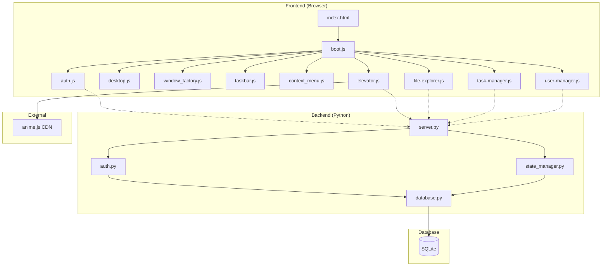

### Component Responsibilities

**Frontend Layers:**

1. **Presentation Layer** (Desktop UI, Windows, Taskbar)
   - Manages user interactions
   - Renders desktop environment
   - Handles window lifecycle

2. **Application Layer** (Auth, App Loader, State Manager)
   - Manages user sessions
   - Loads application modules
   - Coordinates state persistence

3. **Business Logic Layer** (Elevator Simulation, File Explorer, Task Manager)
   - Implements domain logic
   - Runs physics simulation
   - Manages application state

4. **Data Access Layer** (LocalStorage, API Client, Event Bus)
   - Handles data persistence
   - Manages API communication
   - Coordinates event propagation

**Backend Components:**

- **HTTP Server** (`server.py`): Routes requests to handlers, implements CORS
- **Authentication Service** (`auth.py`): User registration, login, role management
- **State Manager** (`state_manager.py`): Window and elevator config persistence
- **Database** (`database.py`): SQLite connection and schema management

### Communication Paths

```
User Interaction → DOM Event → Event Handler → Business Logic → State Update → UI Render
                                                    ↓
                                              API Call (if authenticated)
                                                    ↓
                                              HTTP Request → Backend → Database
                                                    ↓
                                              Response → State Update → UI Render
```

### Data Flow

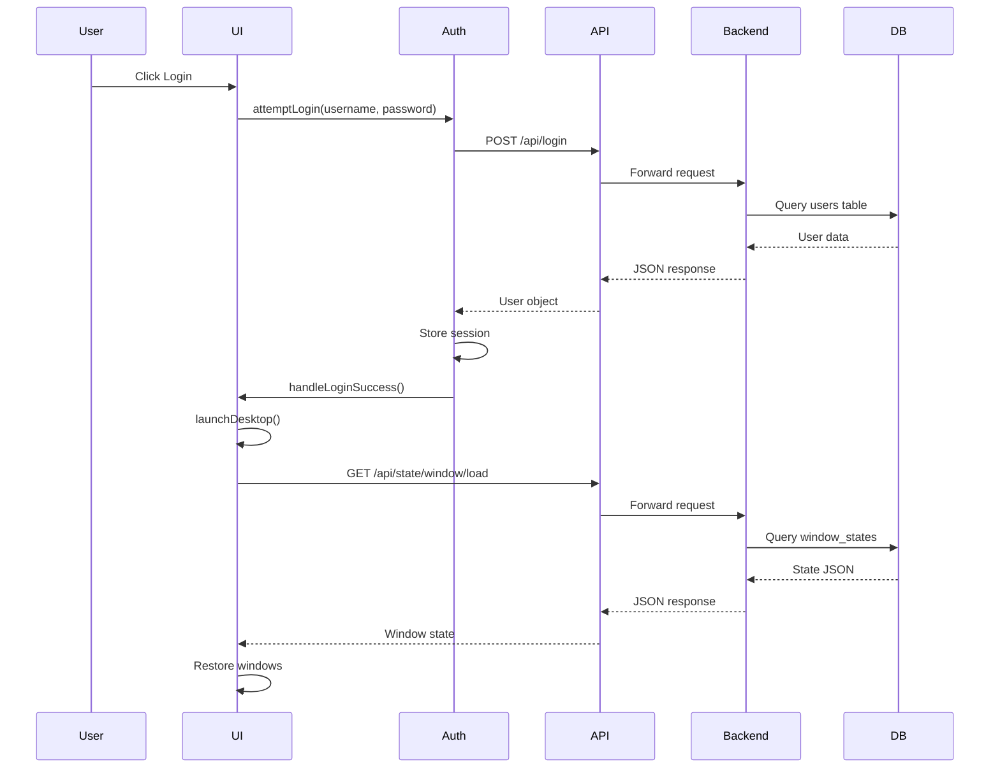

---

## How the System Works

### Application Startup

1. **DOMContentLoaded** fires in browser
2. **boot.js** initializes login screen
3. User enters credentials or clicks guest
4. **auth.js** calls API (or sets guest session)
5. On success: **animateLoginSuccess()** executes
6. **launchDesktop()** is called:
   - Get user defaults based on role
   - Initialize desktop, background, context menu
   - Create desktop icons for available apps
   - Initialize taskbar with system controls
   - Load saved window state from server/localStorage
   - Restore windows or launch default apps
   - Start auto-save timer (30s interval)
7. Application ready for user interaction

### Simulation Loop

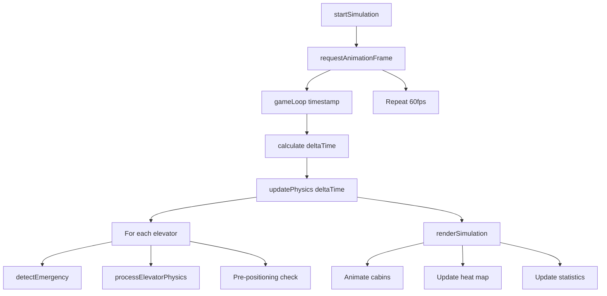

### Request Lifecycle (Login)

1. User clicks Login button
2. **boot.js** validates inputs (username/password required)
3. **auth.attemptLogin(username, password)** is called
4. **fetch('POST /api/login', { body: credentials })** executes
5. **server.py** receives request
6. Routes to **handle_login()**
7. Calls **auth.login_user()**
8. Queries database for matching credentials
9. Returns user object or None
10. Server sends JSON response
11. **auth.js** receives response
12. On success: stores session, calls **handleLoginSuccess()**
13. **boot.js** launches desktop

---

## Project Structure

```
Bai-tap-lon-mon-js/
├── a/                          # Additional assets
├── apps/                       # Legacy app directory
│   ├── file-explorer/
│   │   └── file-explorer.js
│   ├── task-manager/
│   │   └── task-manager.js
│   └── user-manager/
│       └── user-manager.js
├── backend/                    # Python backend server
│   ├── __pycache__/           # Python bytecode cache
│   ├── backend/               # Backend package directory
│   ├── auth.py               # Authentication service
│   ├── database.py           # Database schema and connection
│   ├── server.py             # HTTP server and routing
│   └── state_manager.py      # State persistence service
├── src/                       # Source code directory
│   ├── apps/                  # Application modules
│   │   └── elevator/
│   │       └── elevator.js   # Main elevator simulation (2740 lines)
│   ├── sdk/                   # SDK utilities
│   │   └── event-bus.js      # Event communication
│   └── shell/                 # Web OS shell components
│       ├── assets/
│       │   └── styles.js      # Shared styles
│       ├── auth.js            # Frontend authentication
│       ├── boot.js            # Application bootstrap
│       ├── desktop/
│       │   ├── background-manager.js  # Background image management
│       │   ├── desktop-icons.js       # Desktop icon rendering
│       │   ├── desktop.js              # Desktop initialization
│       │   └── window_factory.js       # Window creation/management
│       ├── login-animation.js  # Login screen animations
│       └── system-ui/
│           ├── context-menu.js        # Right-click context menu
│           └── taskbar.js             # Taskbar controls
├── temp/                       # Temporary/build files
├── index.html                 # Entry point HTML
├── PROJECT_ANALYSIS.md        # Technical handover document
└── README.md                  # This file
```

### Directory Responsibilities

**`backend/`**: Python HTTP server providing REST API
- **Purpose**: Handle authentication and state persistence
- **Responsibilities**: API routing, user management, database operations
- **Key Files**: `server.py`, `auth.py`, `database.py`, `state_manager.py`

**`src/apps/elevator/`**: Elevator simulation application
- **Purpose**: Real-time elevator dispatch simulation
- **Responsibilities**: Physics simulation, dispatch algorithm, UI rendering, statistics
- **Dependencies**: `anime.js` (CDN), `../../shell/auth.js`
- **Key Files**: `elevator.js` (2740 lines, comprehensive simulation)

**`src/shell/`**: Web OS shell infrastructure
- **Purpose**: Desktop environment, window management, authentication
- **Responsibilities**: Desktop UI, window lifecycle, system controls
- **Dependencies**: ES6 modules, no external libraries
- **Key Files**: `boot.js`, `auth.js`, `desktop/desktop.js`, `desktop/window_factory.js`

**`src/sdk/`**: Shared utilities
- **Purpose**: Event communication between modules
- **Key Files**: `event-bus.js`

---

## Core Modules

### Authentication Module (`src/shell/auth.js`)

**Purpose**: Manage user sessions and authentication flow

**Responsibilities**:
- Store user session state
- Handle login/register API calls
- Persist state to localStorage (guest mode)
- Provide user information to other modules

**Internal Workflow**:
1. User enters credentials
2. Validate inputs
3. Call API endpoint
4. On success: store session in memory
5. On success: persist to localStorage (guest) or API (authenticated)
6. Provide user data to other modules

**Dependencies**: fetch API

**Interactions with Other Modules**:
- Called by `boot.js` for authentication
- Used by `elevator.js` for config persistence
- Used by `boot.js` for state loading

**Key Files**: `src/shell/auth.js`

**Important Functions**:
- `attemptLogin(username, password, onSuccess)`
- `attemptRegister(username, password, onSuccess)`
- `loginAsGuest(onSuccess)`
- `getCurrentUser()`
- `isGuest()`
- `saveToLocalStorage(key, value)`
- `loadFromLocalStorage(key)`

### Desktop Module (`src/shell/desktop/`)

**Purpose**: Provide desktop environment and window management

**Responsibilities**:
- Create desktop container
- Manage window z-index
- Handle desktop interactions
- Create and manage application windows

**Internal Workflow**:
1. Initialize desktop container
2. Load background image
3. Create desktop icons
4. Handle icon clicks to launch apps
5. Manage window lifecycle (create, move, minimize, close)

**Dependencies**: `background-manager.js`, `window_factory.js`

**Interactions with Other Modules**:
- Initialized by `boot.js`
- Uses `window_factory.js` to create windows
- Communicates with app modules for content

**Key Files**: 
- `desktop.js`
- `window_factory.js`
- `background-manager.js`
- `desktop-icons.js`

**Important Functions**:
- `initDesktop(container)`
- `create_single_app(desktop, appName)`
- `bringToFront(window)`

### Elevator Simulation Module (`src/apps/elevator/elevator.js`)

**Purpose**: Real-time elevator dispatch simulation with physics engine

**Responsibilities**:
- Real-time physics simulation (acceleration, velocity, position)
- Multi-criteria dispatch algorithm (LOOK/SCAN)
- Passenger generation with Gaussian weight distribution (50-130kg)
- Fault detection (overload, stuck) and recovery
- Statistics tracking and visualization
- Responsive UI with three-column layout
- Heat map visualization of floor queues
- ETA calculation and display
- Zoning algorithm for high-rise buildings
- Pre-positioning for idle elevators
- Passenger journey tooltips with fixed positioning
- Self-tests for dispatcher and sorting algorithms

**Internal Workflow**:
1. Initialize configuration and system state
2. Build three-column UI
3. Setup event listeners (resize with 50px threshold)
4. Load saved configuration
5. Start physics loop (60fps)
6. Render simulation every frame
7. Update statistics every second

**Dependencies**: `anime.js` (CDN), `../../shell/auth.js`

**Interactions with Other Modules**:
- Uses `auth.js` for config persistence
- Called by `boot.js` when app launched
- Communicates with backend API for config save/load

**Key Files**: `src/apps/elevator/elevator.js` (2740 lines)

**Important Functions**:
- `initElevatorSimulation(contentElement)` - Main entry point
- `dispatchElevator({ floor, direction })` - Assign elevator to request
- `sortTargetFloorsPure(elevator)` - Pure LOOK sorting function
- `calculateDispatchCostPure(elevator, floor, direction, config)` - Pure cost calculation
- `processElevatorPhysics(elevator, dtSec)` - Integrate motion
- `detectEmergency(elevatorId, deltaMs)` - Detect faults
- `renderSimulation()` - Update UI
- `updateCabinDots(elevatorId)` - Update passenger dots with optimization
- `showPassengerTooltip(anchorEl, passenger)` - Display journey info
- `renderFaultButtons()` - Render fault reset buttons with DOM guard
- `runConfigSelfTest(config)` - Behavioral self-tests

### Backend Server Module (`backend/server.py`)

**Purpose**: HTTP server providing REST API for authentication and state persistence

**Responsibilities**:
- Handle HTTP requests with routing table
- Implement CORS headers
- Route to appropriate handlers
- Return JSON responses

**Internal Workflow**:
1. Initialize database
2. Seed sample users
3. Create HTTPServer instance
4. Serve forever until KeyboardInterrupt

**Dependencies**: Standard library (http.server, json, urllib.parse)

**Interactions with Other Modules**:
- Called by frontend via fetch API
- Uses `auth.py` for authentication
- Uses `state_manager.py` for state operations
- Uses `database.py` for data persistence

**Key Files**: `backend/server.py`

**Important Functions**:
- `run_server(host, port)`
- `handle_request()` - Route requests
- `handle_register()` - User registration
- `handle_login()` - User authentication
- `handle_save_window()` - Save window state
- `handle_load_window()` - Load window state
- `handle_save_elevator()` - Save elevator config
- `handle_load_elevator()` - Load elevator config
- `handle_list_users()` - List all users (admin)
- `handle_admin_create_user()` - Create user (admin)
- `handle_admin_update_user()` - Update user (admin)
- `handle_admin_delete_user()` - Delete user (admin)

---

## File-Level Overview

### `index.html`

**Purpose**: Entry point HTML file that defines the application structure

**Responsibilities**:
- Define login screen and desktop screen containers
- Load external dependencies (anime.js CDN)
- Define CSS for login form and screen transitions
- Bootstrap the application via `boot.js`

**Key Functions**: None (HTML structure only)

**Inputs**: None

**Outputs**: DOM structure for application

**Dependencies**: 
- External: anime.js from cdnjs.cloudflare.com
- Internal: `./src/shell/boot.js`

**Usage in System Workflow**: First file loaded by browser, initializes application

**Related Files**: `src/shell/boot.js`

### `src/shell/boot.js`

**Purpose**: Application bootstrap that orchestrates the entire Web OS lifecycle

**Responsibilities**:
- Handle authentication flow (login, register, guest)
- Initialize desktop environment
- Launch applications based on user role
- Manage window state persistence
- Handle sleep mode, logout, shutdown

**Key Functions**:
- `launchDesktop()` - Initialize desktop after login
- `launchApp(desktop, appName)` - Launch application in window
- `handleLogout()` - Clean up and return to login
- `handleSleep()` - Enter sleep mode
- `handleShutdown()` - Shutdown application

**Inputs**: DOM elements, user credentials

**Outputs**: Desktop environment, application windows

**Dependencies**: All shell modules and app initializers

**Usage in System Workflow**: Main entry point after HTML loads

**Related Files**: `src/shell/auth.js`, `src/shell/desktop/desktop.js`

### `src/shell/auth.js`

**Purpose**: Frontend authentication module handling user sessions

**Responsibilities**:
- Manage user session state
- Handle login/register API calls
- Persist state to localStorage (guest mode)
- Provide user information to other modules

**Key Functions**:
- `attemptLogin(username, password, onSuccess)` - Authenticate user
- `attemptRegister(username, password, onSuccess)` - Register new user
- `loginAsGuest(onSuccess)` - Allow guest access
- `getCurrentUser()` - Get current user object
- `isGuest()` - Check if guest user
- `saveToLocalStorage(key, value)` - Persist to localStorage
- `loadFromLocalStorage(key)` - Load from localStorage

**Inputs**: Username, password, callbacks

**Outputs**: User object, success/failure status

**Dependencies**: fetch API

**Usage in System Workflow**: Called by boot.js for authentication

**Related Files**: `backend/auth.py`, `src/shell/boot.js`

### `src/apps/elevator/elevator.js`

**Purpose**: Comprehensive elevator simulation with physics engine and dispatch algorithm

**Responsibilities**:
- Real-time physics simulation (acceleration, velocity, position)
- Multi-criteria dispatch algorithm (LOOK/SCAN)
- Passenger generation with Gaussian weight distribution (50-130kg)
- Fault detection (overload, stuck) and recovery
- Statistics tracking and visualization
- Responsive UI with three-column layout
- Heat map visualization of floor queues
- ETA calculation and display
- Zoning algorithm for high-rise buildings
- Pre-positioning for idle elevators
- Passenger journey tooltips with fixed positioning
- Self-tests for dispatcher and sorting algorithms

**Key Functions**:
- `initElevatorSimulation(contentElement)` - Main entry point
- `dispatchElevator({ floor, direction })` - Assign elevator to request
- `sortTargetFloorsPure(elevator)` - Pure LOOK sorting function
- `calculateDispatchCostPure(elevator, floor, direction, config)` - Pure cost calculation
- `processElevatorPhysics(elevator, dtSec)` - Integrate motion
- `detectEmergency(elevatorId, deltaMs)` - Detect faults
- `renderSimulation()` - Update UI
- `updateCabinDots(elevatorId)` - Update passenger dots (optimized)
- `showPassengerTooltip(anchorEl, passenger)` - Display journey info
- `renderFaultButtons()` - Render fault reset buttons (DOM guard)
- `runConfigSelfTest(config)` - Behavioral self-tests

**Inputs**: Configuration parameters, user interactions

**Outputs**: Visual simulation, statistics, fault states

**Dependencies**: 
- External: anime.js (CDN)
- Internal: `../../shell/auth.js`

**Usage in System Workflow**: Called by boot.js when elevator app launched

**Related Files**: `src/shell/boot.js`, `backend/state_manager.py`

### `backend/server.py`

**Purpose**: Python HTTP server providing REST API

**Responsibilities**:
- Handle HTTP requests with routing table
- Implement CORS headers
- Route to appropriate handlers
- Return JSON responses

**Key Functions**:
- `run_server(host, port)` - Start HTTP server
- `handle_request()` - Route incoming requests
- `handle_register()` - User registration handler
- `handle_login()` - User authentication handler
- `handle_save_window()` - Save window state handler
- `handle_load_window()` - Load window state handler
- `handle_save_elevator()` - Save elevator config handler
- `handle_load_elevator()` - Load elevator config handler
- `handle_list_users()` - List users handler
- `handle_admin_create_user()` - Create user handler
- `handle_admin_update_user()` - Update user handler
- `handle_admin_delete_user()` - Delete user handler

**Inputs**: HTTP requests (POST, GET, PUT, DELETE)

**Outputs**: JSON responses

**Dependencies**: 
- Standard library: http.server, json, urllib.parse
- Internal: database, auth, state_manager

**Usage in System Workflow**: Handles all API requests from frontend

**Related Files**: `backend/auth.py`, `backend/state_manager.py`, `backend/database.py`

### `backend/auth.py`

**Purpose**: Authentication service handling user registration and login

**Responsibilities**:
- Hash passwords using SHA-256
- Register new users
- Authenticate login attempts
- List all users (admin)
- Create/update/delete users (admin)
- Seed sample users on startup

**Key Functions**:
- `register_user(username, password)` - Create new user
- `login_user(username, password)` - Authenticate user
- `list_users()` - Get all users
- `create_user(username, password, role)` - Create user (admin)
- `update_user(user_id, password, role)` - Update user (admin)
- `delete_user(user_id)` - Delete user (admin)
- `seed_users()` - Create sample users

**Inputs**: Username, password, role

**Outputs**: Success/failure status, user objects

**Dependencies**: 
- Standard library: hashlib, sqlite3
- Internal: database

**Usage in System Workflow**: Called by server.py for authentication operations

**Related Files**: `backend/server.py`, `backend/database.py`

### `backend/database.py`

**Purpose**: Database schema and connection management

**Responsibilities**:
- Initialize SQLite database
- Create tables (users, window_states, elevator_configs)
- Provide database connection
- Handle migrations

**Key Functions**:
- `get_db_connection()` - Get database connection
- `initialize_database()` - Create tables
- `_migrate_add_role_column()` - Add role column migration

**Inputs**: None

**Outputs**: Database connection object

**Dependencies**: Standard library: sqlite3

**Usage in System Workflow**: Used by all backend modules for data persistence

**Related Files**: `backend/auth.py`, `backend/state_manager.py`

### `backend/state_manager.py`

**Purpose**: State persistence service for window layouts and elevator configurations

**Responsibilities**:
- Save window state to database
- Load window state from database
- Save elevator configuration to database
- Load elevator configuration from database

**Key Functions**:
- `save_window_state(user_id, state)` - Save window layout
- `load_window_state(user_id)` - Load window layout
- `save_elevator_config(user_id, config)` - Save elevator config
- `load_elevator_config(user_id)` - Load elevator config

**Inputs**: User ID, state/config objects

**Outputs**: Success/failure status, state/config objects

**Dependencies**: 
- Standard library: sqlite3, json
- Internal: database

**Usage in System Workflow**: Called by server.py for state operations

**Related Files**: `backend/server.py`, `backend/database.py`

---

## Data Flow

### Authentication Flow

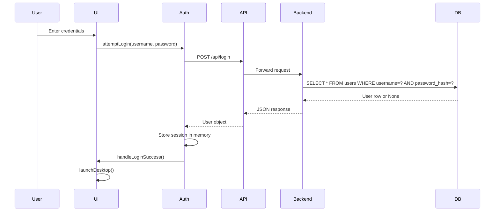

### Configuration Save Flow

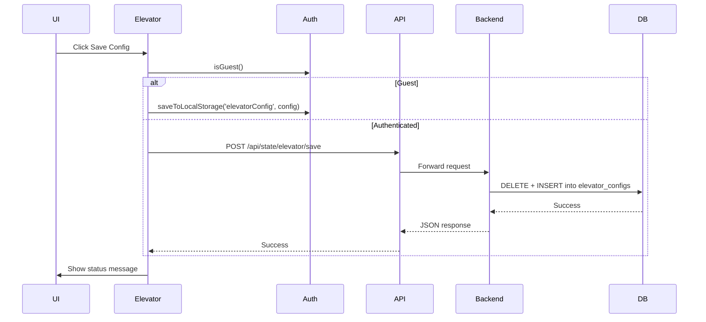

### Simulation Loop Flow

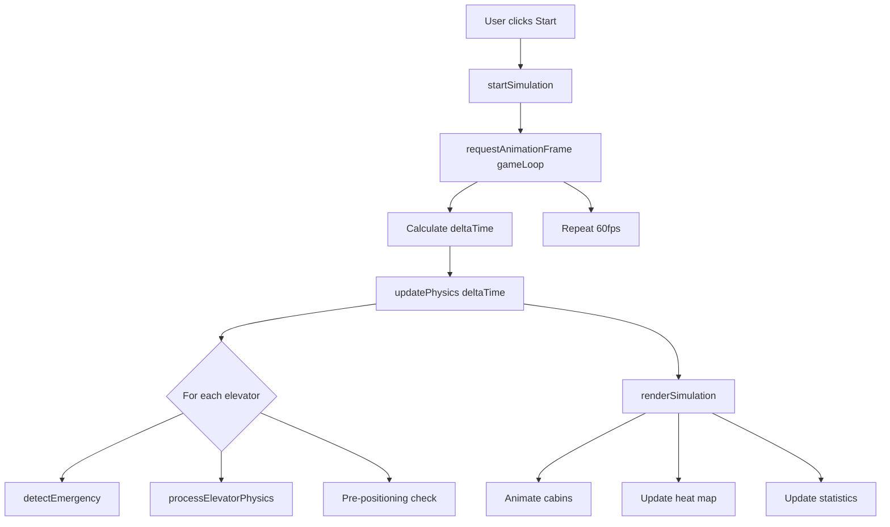

---

## Database

### Database Technology

**DBMS:** SQLite 3

**File Location:** `backend/data.db`

### Schema Overview

Three main tables:
- `users` - User authentication and roles
- `window_states` - Desktop window layout persistence
- `elevator_configs` - Elevator simulation configuration persistence

### Tables

#### Users Table

```sql
CREATE TABLE users (
    id INTEGER PRIMARY KEY AUTOINCREMENT,
    username TEXT UNIQUE NOT NULL,
    password_hash TEXT NOT NULL,
    role TEXT DEFAULT 'user',
    created_at TEXT DEFAULT (datetime('now', 'localtime'))
);
```

**Purpose:** Store user authentication credentials and roles

**Fields:**
- `id`: Primary key, auto-increment
- `username`: Unique identifier for login
- `password_hash`: SHA-256 hashed password
- `role`: User role ('admin', 'user')
- `created_at`: Timestamp of account creation

**Constraints:**
- PRIMARY KEY on id
- UNIQUE on username
- NOT NULL on username, password_hash
- DEFAULT on role, created_at

#### Window States Table

```sql
CREATE TABLE window_states (
    id INTEGER PRIMARY KEY AUTOINCREMENT,
    user_id INTEGER NOT NULL,
    state_json TEXT NOT NULL,
    updated_at TEXT DEFAULT (datetime('now', 'localtime')),
    FOREIGN KEY (user_id) REFERENCES users (id) ON DELETE CASCADE
);
```

**Purpose:** Persist desktop window layout and state per user

**Fields:**
- `id`: Primary key, auto-increment
- `user_id`: Foreign key to users
- `state_json`: JSON string containing window positions, sizes, states
- `updated_at`: Timestamp of last update

**Constraints:**
- PRIMARY KEY on id
- FOREIGN KEY to users with CASCADE delete
- NOT NULL on user_id, state_json
- DEFAULT on updated_at

#### Elevator Configs Table

```sql
CREATE TABLE elevator_configs (
    id INTEGER PRIMARY KEY AUTOINCREMENT,
    user_id INTEGER NOT NULL,
    config_json TEXT NOT NULL,
    updated_at TEXT DEFAULT (datetime('now', 'localtime')),
    FOREIGN KEY (user_id) REFERENCES users (id) ON DELETE CASCADE
);
```

**Purpose:** Persist elevator simulation configuration per user

**Fields:**
- `id`: Primary key, auto-increment
- `user_id`: Foreign key to users
- `config_json`: JSON string containing simulation parameters
- `updated_at`: Timestamp of last update

**Constraints:**
- PRIMARY KEY on id
- FOREIGN KEY to users with CASCADE delete
- NOT NULL on user_id, config_json
- DEFAULT on updated_at

### Relationships

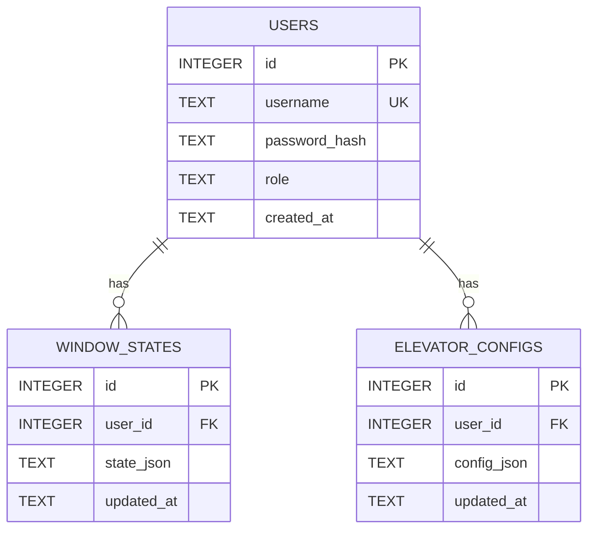

### Indexes

- Primary keys auto-indexed by SQLite
- Username UNIQUE constraint creates index
- Foreign key constraints for referential integrity

### Constraints

- NOT NULL on required fields
- UNIQUE on username
- FOREIGN KEY with CASCADE delete
- DEFAULT values for timestamps and role

### Migrations

Simple migration function `_migrate_add_role_column()` adds role column to existing databases for backward compatibility.

### Normalization

- **1NF:** ✅ Satisfied - All atomic values, no repeating groups
- **2NF:** ✅ Satisfied - All non-key attributes fully dependent on primary key
- **3NF:** ✅ Satisfied - No transitive dependencies
- **BCNF:** ✅ Satisfied - No non-trivial multivalued dependencies

---

## API Documentation

### POST /api/register

**Purpose:** Register a new user account

**Request:**
```json
{
  "username": "string (required)",
  "password": "string (required)"
}
```

**Response:**
```json
{
  "success": boolean,
  "message": "string"
}
```

**Authentication:** None

**Validation Rules:**
- Username must be unique
- Username and password required
- Password hashed with SHA-256

**Business Logic:**
1. Hash password with SHA-256
2. Insert into users table
3. Return success or error message

**Error Handling:**
- 400: Duplicate username
- 500: Database error

### POST /api/login

**Purpose:** Authenticate user with credentials

**Request:**
```json
{
  "username": "string (required)",
  "password": "string (required)"
}
```

**Response:**
```json
{
  "success": boolean,
  "user_id": number,
  "username": "string",
  "role": "string"
}
```

**Authentication:** None

**Validation Rules:**
- Username and password required
- Credentials must match database

**Business Logic:**
1. Hash password with SHA-256
2. Query users table for matching credentials
3. Return user data if found, error otherwise

**Error Handling:**
- 401: Invalid credentials
- 500: Database error

### GET /api/admin/users

**Purpose:** List all users (admin only)

**Request:** Query params: none

**Response:**
```json
{
  "success": boolean,
  "users": [
    {
      "id": number,
      "username": "string",
      "role": "string",
      "created_at": "string"
    }
  ]
}
```

**Authentication:** Not enforced (TODO)

**Validation Rules:** None

**Business Logic:**
1. Query all users from database
2. Return user list

**Error Handling:**
- 500: Database error

### POST /api/admin/users

**Purpose:** Create new user (admin only)

**Request:**
```json
{
  "username": "string (required)",
  "password": "string (required)",
  "role": "string (default: 'user')"
}
```

**Response:**
```json
{
  "success": boolean,
  "message": "string"
}
```

**Authentication:** Not enforced (TODO)

**Validation Rules:**
- Username must be unique
- Password required

**Business Logic:**
1. Hash password
2. Insert into users table with role

**Error Handling:**
- 400: Duplicate username
- 500: Database error

### PUT /api/admin/users

**Purpose:** Update user password or role (admin only)

**Request:**
```json
{
  "user_id": number (required),
  "password": "string (optional)",
  "role": "string (optional)
}
```

**Response:**
```json
{
  "success": boolean,
  "message": "string"
}
```

**Authentication:** Not enforced (TODO)

**Validation Rules:**
- user_id required
- At least one of password or role required

**Business Logic:**
1. If password provided: hash and update
2. If role provided: update role
3. Return success or error

**Error Handling:**
- 400: Invalid request
- 500: Database error

### DELETE /api/admin/users

**Purpose:** Delete user (admin only)

**Request:**
```json
{
  "user_id": number (required)
}
```

**Response:**
```json
{
  "success": boolean,
  "message": "string"
}
```

**Authentication:** Not enforced (TODO)

**Validation Rules:**
- user_id required

**Business Logic:**
1. Delete user from database
2. CASCADE deletes associated states

**Error Handling:**
- 400: Invalid request
- 500: Database error

### POST /api/state/window/save

**Purpose:** Save window layout state for user

**Request:**
```json
{
  "user_id": number (required),
  "state": array/object (required)
}
```

**Response:**
```json
{
  "success": boolean
}
```

**Authentication:** Not enforced (TODO)

**Validation Rules:**
- user_id required
- state required

**Business Logic:**
1. Serialize state to JSON
2. Delete existing state for user
3. Insert new state record

**Error Handling:**
- 500: Database error

### GET /api/state/window/load

**Purpose:** Load saved window layout state

**Request:** Query params: user_id (number, required)

**Response:**
```json
{
  "success": boolean,
  "state": object/array
}
```

**Authentication:** Not enforced (TODO)

**Validation Rules:**
- user_id required

**Business Logic:**
1. Query most recent state for user
2. Deserialize JSON
3. Return state object

**Error Handling:**
- 400: Invalid user_id
- 500: Database error

### POST /api/state/elevator/save

**Purpose:** Save elevator simulation configuration

**Request:**
```json
{
  "user_id": number (required),
  "config": object (required)
}
```

**Response:**
```json
{
  "success": boolean
}
```

**Authentication:** Not enforced (TODO)

**Validation Rules:**
- user_id required
- config required

**Business Logic:**
1. Serialize config to JSON
2. Delete existing config for user
3. Insert new config record

**Error Handling:**
- 500: Database error

### GET /api/state/elevator/load

**Purpose:** Load saved elevator configuration

**Request:** Query params: user_id (number, required)

**Response:**
```json
{
  "success": boolean,
  "config": object
}
```

**Authentication:** Not enforced (TODO)

**Validation Rules:**
- user_id required

**Business Logic:**
1. Query most recent config for user
2. Deserialize JSON
3. Return config object

**Error Handling:**
- 400: Invalid user_id
- 500: Database error

---

## Configuration

### Frontend Configuration

Located in `getDefaultSimConfig()` function in `elevator.js`:

| Variable | Required | Default | Description |
| -------- | -------- | ------- | ----------- |
| totalFloors | Yes | 20 | Number of floors in building (5-40) |
| elevatorCount | Yes | 3 | Number of elevators (1-6) |
| maxLoad | Yes | 800 | Maximum elevator load in kg |
| maxAcceleration | Yes | 1.0 | Maximum acceleration in fl/s² |
| maxVelocity | Yes | 2.5 | Maximum velocity in fl/s |
| doorOpenTime | Yes | 2000 | Door open time in ms |
| doorCloseTime | Yes | 1500 | Door close time in ms |
| spawnRate | Yes | 3000 | Passenger spawn rate in ms |
| simSpeed | Yes | 1 | Simulation speed multiplier (1, 2, 5, 10) |
| enableZoning | Yes | false | Enable zoning algorithm |

### Backend Configuration

Hardcoded in `server.py`:

| Variable | Required | Default | Description |
| -------- | -------- | ------- | ----------- |
| host | Yes | localhost | Server host address |
| port | Yes | 8000 | Server port |
| db_path | Yes | backend/data.db | SQLite database file path |

### Frontend Constants

Located in `elevator.js`:

| Variable | Value | Description |
| -------- | ----- | ----------- |
| BACKEND_URL | http:
| CONFIG_STORAGE_KEY | elevatorConfig | localStorage key for config |
| FLOOR_HEIGHT_PX | 36 | Pixel height per floor |
| STATS_UPDATE_MS | 1000 | Statistics refresh interval |
| STUCK_THRESHOLD_MS | 5000 | Time before stuck fault |
| OVERLOAD_FAULT_RATIO | 1.1 | Load threshold for fault |
| CHART_HISTORY_MAX | 60 | Max data points in chart |
| WRONG_DIRECTION_PENALTY | 8 | Dispatch cost penalty |
| OVERLOAD_PENALTY | 15 | Dispatch cost penalty |
| SAME_DIRECTION_BONUS | 3 | Dispatch cost bonus |
| PASSENGER_DOT_SIZE | 6 | Visual size of passenger dots |

---

## Installation

### Prerequisites

- Python 3.x installed
- Modern web browser with ES6 support (Chrome, Firefox, Edge, Safari)
- Node.js not required (pure Python backend)

### Dependencies

**Frontend:**
- anime.js (loaded from CDN: cdnjs.cloudflare.com/ajax/libs/animejs/3.2.1/anime.min.js)

**Backend:**
- Python standard library only (no external dependencies)

### Clone Repository

```bash
git clone <repository-url>
cd Bai-tap-lon-mon-js
```

### Install Packages

No package installation required for frontend (pure ES6 modules).

No package installation required for backend (Python standard library only).

### Configure Environment

No environment configuration required. Backend URL is hardcoded in `elevator.js`:

```javascript
const BACKEND_URL = 'http:
```

To change backend URL, update this constant in `src/apps/elevator/elevator.js`.

### Database Setup

Database is automatically created on first backend run:

```bash
cd backend
python server.py
```

This will:
1. Create `backend/data.db` if it doesn't exist
2. Initialize tables (users, window_states, elevator_configs)
3. Run migration to add role column if needed
4. Seed sample users (admin/admin, user/user)

### Run Application

**Start Backend:**
```bash
cd backend
python server.py
```

Backend will start on `http:

**Start Frontend:**
Open `index.html` in web browser:
```bash
# Method 1: Double-click index.html
# Method 2: Open in browser from command line
start index.html  # Windows
open index.html   # macOS
xdg-open index.html  # Linux
```

### Verify Installation

1. Backend should show: "Server running at http:
2. Frontend should show login screen
3. Test login with credentials:
   - Admin: username `admin`, password `admin`
   - User: username `user`, password `user`
4. Test guest access by clicking "Guest" button
5. Launch Elevator Simulation app
6. Click Start to begin simulation
7. Verify physics animation and statistics updates

---

## Running the Project

### Development Mode

**Backend:**
```bash
cd backend
python server.py
```

**Frontend:**
Open `index.html` in browser. No build process required.

**Hot Reload:**
- Backend: Restart server after code changes
- Frontend: Refresh browser after code changes

### Production Mode

Same as development mode. No separate production configuration.

### Docker Mode

Not implemented (manual deployment only).

### Containerized Deployment

Not implemented.

### Cloud Deployment

Not implemented.

### CI/CD Execution

Not implemented.

---

## Testing

### Unit Tests

**Not implemented** - No automated unit tests.

**Manual Testing:**
- Self-test function `runConfigSelfTest()` in elevator.js
- Tests 8 configuration validations:
  - validateSimConfig
  - createSystemState
  - floorQueues
  - decelDistance
  - timeToTop
  - dispatcherSelectsNearest (uses pure calculateDispatchCostPure)
  - sortTargetFloorsLookUp (uses pure sortTargetFloorsPure)
  - sortTargetFloorsLookDown (uses pure sortTargetFloorsPure)
- Runs on simulation initialization

### Integration Tests

**Not implemented** - No automated integration tests.

**Manual Testing:**
- Test authentication flow (login, register, guest)
- Test state persistence (save/load)
- Test API endpoints manually

### E2E Tests

**Not implemented** - No automated E2E tests.

**Manual Testing:**
- Full user journey: login → use apps → logout
- Elevator simulation: configure → run → observe → save

### Coverage

**Not measured** - No coverage tracking.

### Test Commands

No automated test commands.

### Test Structure

No test directory structure.

---

## Logging & Monitoring

### Logging System

**Frontend:**
- Console.log for debugging
- Event log system in elevator simulation (visible in UI)
- Error handlers for unhandled errors

**Backend:**
- Print statements for server logs
- HTTP request logging in `log_message()` function
- Error logging with try-catch blocks

### Error Tracking

No centralized error tracking system.

### Monitoring

Not implemented - No health checks, metrics, or alerting.

---

## Security

### Authentication

- Password hashing with SHA-256
- Session storage in memory (frontend)
- No session tokens or JWT
- No session expiration

### Authorization

- Role-based access control (admin, user, guest)
- Admin endpoints not protected by authentication middleware (TODO)

### Encryption

- Passwords hashed with SHA-256 (not bcrypt/argon2)
- No HTTPS (HTTP only)
- Credentials transmitted in plain text

### Input Validation

- Frontend: Basic validation (required fields)
- Backend: Limited validation
- SQL injection prevention via parameterized queries

### Security Considerations

**Known Issues:**
- No HTTPS - credentials transmitted in plain text
- No session tokens - no session management after login
- No rate limiting - vulnerable to brute force attacks
- No CSRF protection - no CSRF tokens on forms
- CORS wide open - allows all origins
- No password complexity requirements
- No account lockout - no protection against brute force
- Admin endpoints not protected by authentication

**Recommendations:**
- Implement HTTPS with reverse proxy (nginx)
- Add JWT or session-based authentication
- Implement rate limiting
- Add CSRF tokens
- Restrict CORS origins
- Add password strength requirements
- Add account lockout after N failed attempts
- Add authentication middleware for admin endpoints

---

## Performance

### Caching

- LocalStorage for guest users
- In-memory state during session
- No server-side caching

### Optimization Strategies

- RequestAnimationFrame for smooth 60fps animation
- Debounced resize handlers (200ms)
- Efficient DOM updates (batch operations)
- Passenger dots only rebuild when count changes (optimization)
- Resize handler only rebuilds when width changes ≥ 50px (optimization)
- Pure functions for algorithm testing (no side effects)

### Database Tuning

- SQLite with row factory for dictionary-like access
- Foreign key constraints with CASCADE delete
- No connection pooling (new connection per request)

### Concurrency Handling

- Single-threaded Python HTTP server
- No async processing
- No connection pooling
- No load balancing

---

## Troubleshooting

### Symptom: Backend won't start

**Cause:** Port 8000 already in use

**Solution:**
```bash
# Find process using port 8000 (Windows)
netstat -ano | findstr :8000
# Kill process
taskkill /PID <PID> /F

# Or change port in server.py
```

**Verification:** Server starts successfully

---

### Symptom: Login fails with "Invalid credentials"

**Cause:** Incorrect username/password or database not initialized

**Solution:**
1. Verify credentials: admin/admin or user/user
2. Check if backend is running
3. Check browser console for API errors
4. Verify database exists at `backend/data.db`

**Verification:** Login succeeds with correct credentials

---

### Symptom: Elevator simulation not animating

**Cause:** anime.js not loaded or JavaScript error

**Solution:**
1. Check browser console for errors
2. Verify anime.js CDN is accessible
3. Check if `getAnime()` returns null
4. Verify simulation is started (click Start button)

**Verification:** Animation runs smoothly at 60fps

---

### Symptom: Configuration not saving

**Cause:** Backend not running or API error

**Solution:**
1. Verify backend is running on port 8000
2. Check browser console for API errors
3. Verify user is authenticated (not guest)
4. Check network tab for failed requests

**Verification:** Configuration saves and loads correctly

---

### Symptom: Window state not restoring

**Cause:** Database error or API failure

**Solution:**
1. Verify backend is running
2. Check if user has saved state
3. Check browser console for errors
4. Verify database has window_states table

**Verification:** Windows restore to previous positions

---

### Symptom: Passenger dots not clickable

**Cause:** Click listeners not attached after rebuild

**Solution:**
1. This should be fixed with the optimization (only rebuild when count changes)
2. If issue persists, check `updateCabinDots()` function
3. Verify click listeners are attached in the function

**Verification:** Clicking passenger dots shows tooltip

---

### Symptom: Tooltip positioning incorrect

**Cause:** Using position:absolute instead of position:fixed

**Solution:**
1. This should be fixed with position:fixed
2. If issue persists, check `showPassengerTooltip()` function
3. Verify CSS uses position:fixed

**Verification:** Tooltip appears at correct position in scroll/iframe contexts

---

## Development Guide

### Coding Standards

- ES6+ JavaScript for frontend
- Python 3.x for backend
- Use const/let instead of var
- Use arrow functions for callbacks
- Use template literals for string interpolation
- Follow existing code style in each file

### Folder Conventions

- `src/` - Source code
- `src/apps/` - Application modules
- `src/shell/` - Web OS shell components
- `backend/` - Python backend
- Use lowercase with hyphens for file names

### Naming Conventions

- JavaScript: camelCase for variables/functions, PascalCase for classes
- Python: snake_case for variables/functions, PascalCase for classes
- Constants: UPPER_SNAKE_CASE
- File names: lowercase-with-hyphens

### Git Workflow

Not formally defined. Use standard Git workflow:
- main branch for stable code
- feature branches for new features
- Pull requests for code review

### Branching Strategy

Not formally defined. Suggested:
- `main` - Production code
- `develop` - Development code
- `feature/*` - Feature branches
- `bugfix/*` - Bug fixes

### Pull Request Process

Not formally defined. Suggested:
1. Create feature branch
2. Make changes
3. Test thoroughly
4. Create pull request
5. Code review
6. Merge to main

---

## Extending the System

### Add a New Feature to Elevator Simulation

1. Open `src/apps/elevator/elevator.js`
2. Add configuration parameter to `getDefaultSimConfig()`
3. Add UI control in `buildControlPanel()`
4. Implement logic in appropriate function (physics, dispatch, rendering)
5. Update `PHASE6_CHECKLIST` if needed
6. Test thoroughly

**Example:** Add new dispatch algorithm
```javascript

function getDefaultSimConfig() {
    return {
        
        dispatchAlgorithm: 'LOOK' 
    };
}


function buildControlPanel(container) {
    
    const algoSelect = document.createElement('select');
    algoSelect.addEventListener('change', (e) => {
        updateConfig({ dispatchAlgorithm: e.target.value });
    });
}


function dispatchElevator({ floor, direction }) {
    if (simConfig.dispatchAlgorithm === 'LOOK') {
        
    } else if (simConfig.dispatchAlgorithm === 'FCFS') {
        
    }
}
```

### Add a New API Endpoint

1. Open `backend/server.py`
2. Add route to ROUTES dictionary
3. Implement handler function
4. Add business logic in appropriate module
5. Test with curl or Postman

**Example:** Add user statistics endpoint
```python
# 1. Add route
ROUTES = {
    # ... existing routes
    ('GET', '/api/admin/stats'): handle_get_stats,
}

# 2. Implement handler
def handle_get_stats(self):
    try:
        stats = get_user_statistics()
        self.send_json_response(200, {'success': True, 'stats': stats})
    except Exception as e:
        self.send_json_response(500, {'success': False, 'message': str(e)})

# 3. Implement business logic in auth.py or new module
def get_user_statistics():
    conn = get_db_connection()
    cursor = conn.cursor()
    cursor.execute('SELECT COUNT(*) FROM users')
    total_users = cursor.fetchone()[0]
    conn.close()
    return {'total_users': total_users}
```

### Add a New Database Table

1. Open `backend/database.py`
2. Add CREATE TABLE statement to `initialize_database()`
3. Add migration function if needed
4. Restart backend to apply changes

**Example:** Add user activity log table
```python
def initialize_database():
    conn = get_db_connection()
    cursor = conn.cursor()
    
    # ... existing tables
    
    cursor.execute('''
        CREATE TABLE IF NOT EXISTS user_activity (
            id INTEGER PRIMARY KEY AUTOINCREMENT,
            user_id INTEGER NOT NULL,
            action TEXT NOT NULL,
            timestamp TEXT DEFAULT (datetime('now', 'localtime')),
            FOREIGN KEY (user_id) REFERENCES users (id) ON DELETE CASCADE
        )
    ''')
    
    conn.commit()
    conn.close()
```

### Add a New Service

1. Create new Python file in `backend/`
2. Implement service logic
3. Import in `server.py`
4. Add routes to use service

**Example:** Add notification service
```python
# backend/notification.py
def send_notification(user_id, message):
    # Implement notification logic
    pass

# server.py
from notification import send_notification

def handle_send_notification(self):
    # Use notification service
    send_notification(user_id, message)
```

### Add a New UI Page

1. Create new app module in `src/apps/`
2. Implement `init[AppName](contentElement)` function
3. Add app to `boot.js` launch logic
4. Add desktop icon in `boot.js`

**Example:** Add settings app
```javascript

export function initSettings(contentElement) {
    contentElement.innerHTML = '<h1>Settings</h1>';
    
}


import { initSettings } from '../../apps/settings/settings.js';

function launchApp(desktop, appName) {
    if (appName === 'settings') {
        initSettings(contentElement);
    }
    
}
```

### Add a New Module to Shell

1. Create new file in `src/shell/`
2. Export functions/classes
3. Import in `boot.js` or other modules
4. Integrate into workflow

**Example:** Add notification module
```javascript

export function showNotification(message) {
    
}


import { showNotification } from './notifications.js';


showNotification('Welcome!');
```

---

## Deployment Guide

### Infrastructure Requirements

**Minimum:**
- Python 3.x
- Web browser with ES6 support
- 100MB disk space
- 512MB RAM

**Recommended:**
- Python 3.8+
- Modern browser (Chrome, Firefox, Edge)
- 1GB disk space
- 1GB RAM

### Scaling Recommendations

**Current Limitations:**
- Single-threaded Python server
- SQLite database (not suitable for high concurrency)
- No horizontal scaling
- No load balancing

**Scaling Strategy:**
1. Replace Python HTTP server with production server (Gunicorn, uWSGI)
2. Replace SQLite with PostgreSQL for better concurrency
3. Add load balancer (nginx) for multiple backend instances
4. Add Redis for caching and session storage
5. Add CDN for static assets

### Docker Deployment

Not currently implemented. Suggested Dockerfile:

```dockerfile
# Multi-stage build for Python backend
FROM python:3.9-slim as backend
WORKDIR /app
COPY backend/ ./backend/
RUN pip install --no-cache-dir gunicorn
EXPOSE 8000
CMD ["gunicorn", "server:app"]

# Nginx for static files and reverse proxy
FROM nginx:alpine
COPY --from=backend /app /app
COPY nginx.conf /etc/nginx/nginx.conf
COPY index.html /usr/share/nginx/html/
COPY src/ /usr/share/nginx/html/src/
EXPOSE 80
```

### Kubernetes Deployment

Not currently implemented. Would require:
- Containerization (Docker)
- Kubernetes manifests
- ConfigMaps for configuration
- Secrets for sensitive data
- Service definitions
- Ingress configuration

### Reverse Proxy Setup

Suggested nginx configuration:

```nginx
server {
    listen 80;
    server_name example.com;
    
    location / {
        root /var/www/html;
        index index.html;
    }
    
    location /api/ {
        proxy_pass http:
        proxy_set_header Host $host;
        proxy_set_header X-Real-IP $remote_addr;
    }
}
```

### SSL Configuration

Suggested using Let's Encrypt with Certbot:

```bash
sudo apt-get install certbot python3-certbot-nginx
sudo certbot --nginx -d example.com
```

### Backup Strategy

**Database Backup:**
```bash
# Manual backup
cp backend/data.db backup/data.db.$(date +%Y%m%d)

# Automated backup (cron)
0 2 * * * cp /path/to/backend/data.db /backup/data.db.$(date +\%Y\%m\%d)
```

**User Data Backup:**
- Authenticated users: Backed up with database
- Guest users: Not backed up (localStorage only)

---

## Known Limitations

### Current Constraints

- Single-threaded Python HTTP server
- SQLite database (not suitable for high concurrency)
- No automated testing
- No CI/CD pipeline
- No monitoring or alerting
- No HTTPS (HTTP only)
- No session tokens
- No rate limiting

### Technical Debt

- API Authentication: Admin endpoints lack authentication middleware
- Error Handling: Inconsistent error handling across modules
- Code Duplication: Some repeated patterns in UI construction
- Magic Numbers: Some hardcoded values without constants
- Global State: Some global variables in elevator simulation
- Callback Hell: Some nested callback chains in auth module
- Mixed Concerns: Some UI logic mixed with business logic
- Large File Size: elevator.js is 2740 lines (should be split)

### Scalability Concerns

- SQLite limitations for high-concurrency scenarios
- No horizontal scaling (single server instance)
- No load balancing
- No caching layer (Redis)
- No message queue for async processing

### Future Improvements

- Implement API authentication middleware
- Add HTTPS support with SSL
- Add input validation library
- Split elevator.js into modules (physics.js, dispatch.js, ui.js, config.js)
- Add automated tests (Jest for frontend, pytest for backend)
- Implement rate limiting
- Add TypeScript for type safety
- Add error recovery with exponential backoff
- Add monitoring and logging
- Optimize database with connection pooling
- Add linting (ESLint, Pylint)
- Add code formatting (Prettier, Black)
- Generate OpenAPI/Swagger documentation
- Add password complexity requirements
- Add account lockout mechanism

---

## FAQ

### New Developers

**Q: How do I run the project locally?**
A: 
1. Start backend: `cd backend && python server.py`
2. Open `index.html` in browser
3. Login with admin/admin or user/user, or click Guest

**Q: Where is the main simulation logic?**
A: `src/apps/elevator/elevator.js` (2740 lines) contains all simulation logic including physics, dispatch, and UI rendering.

**Q: How do I add a new configuration parameter?**
A: 
1. Add to `getDefaultSimConfig()` in elevator.js
2. Add UI control in `buildControlPanel()`
3. Implement logic in appropriate function
4. Update `PHASE6_CHECKLIST` if needed

**Q: Why are there two versions of dispatch cost calculation?**
A: `calculateDispatchCostPure` is a pure function at module scope for testability. `calculateDispatchCost` is the closure version that includes zoning logic and accesses simConfig.

### Maintainers

**Q: How do I deploy to production?**
A: Currently manual deployment only. Recommended: Use nginx as reverse proxy with SSL, replace Python HTTP server with Gunicorn, migrate to PostgreSQL for better concurrency.

**Q: How do I backup user data?**
A: Backup `backend/data.db` file. Guest user data is in localStorage and not backed up.

**Q: How do I reset the database?**
A: Delete `backend/data.db` and restart backend. Database will be recreated with seed users.

### DevOps Engineers

**Q: Can this run in Docker?**
A: Not currently implemented, but Dockerfile suggested in deployment guide.

**Q: What ports need to be open?**
A: Port 8000 for backend API. Port 80/443 for nginx if using reverse proxy.

**Q: How do I scale this application?**
A: Replace Python HTTP server with Gunicorn, migrate to PostgreSQL, add load balancer, implement caching with Redis.

### Contributors

**Q: What coding standards should I follow?**
A: ES6+ for JavaScript, Python 3.x for backend. Follow existing code style in each file.

**Q: How do I add a new app to the Web OS?**
A: 
1. Create app module in `src/apps/`
2. Implement `init[AppName](contentElement)` function
3. Add to `boot.js` launch logic
4. Add desktop icon in `boot.js`

**Q: How do I run tests?**
A: No automated tests currently. Manual testing via `runConfigSelfTest()` in elevator.js which runs on initialization.

---

## Conclusion

The Web OS Elevator Simulation is a comprehensive demonstration of advanced front-end engineering techniques, featuring a realistic physics simulation with industry-standard dispatch algorithms and a complete desktop environment metaphor.

**System Architecture:**
- **Frontend:** Modular ES6 architecture with clear separation of concerns (Presentation, Application, Business Logic, Data Access layers)
- **Backend:** Simple Python HTTP server with routing table, authentication service, and SQLite database
- **Communication:** REST API with JSON responses, CORS-enabled for cross-origin requests
- **State Management:** LocalStorage for guests, SQLite for authenticated users, in-memory state during session

**Main Modules:**
- **Shell System:** Desktop environment, window management, authentication (`boot.js`, `auth.js`, `desktop/`)
- **Elevator Simulation:** Physics engine, LOOK/SCAN dispatch algorithm, fault detection (`elevator.js` with pure functions for testability)
- **Backend Services:** HTTP server, authentication, state persistence, database (`server.py`, `auth.py`, `state_manager.py`, `database.py`)

**Operational Flow:**
1. User loads `index.html` → `boot.js` initializes login screen
2. User authenticates → `launchDesktop()` initializes desktop environment
3. User launches app → `init[AppName]()` initializes application
4. Elevator simulation runs 60fps physics loop with `requestAnimationFrame`
5. State auto-saves every 30 seconds
6. API calls for authenticated users persist to SQLite

**Critical Implementation Details:**
- **Pure Functions:** `sortTargetFloorsPure` and `calculateDispatchCostPure` extracted to module scope for true algorithm testing
- **DOM Ref Guards:** `data-fault-container` attribute prevents stale reference issues across partial DOM rebuilds
- **Optimized Rendering:** Passenger dots only rebuild when count changes, resize handler only rebuilds when width changes ≥ 50px
- **Fixed Positioning:** Tooltip uses `position:fixed` for correct coordinates in scroll/iframe contexts
- **Self-Tests:** Behavioral tests for dispatcher and sorting algorithms using pure functions
- **Gaussian Distribution:** Passenger weights use Gaussian distribution (μ=75, σ=15, min=50, max=130) for realism

**Risks and Considerations:**
- Security: No HTTPS, no session tokens, limited input validation
- Scalability: Single-threaded backend, SQLite limitations
- Maintainability: Large monolithic files (elevator.js is 2740 lines), no automated testing
- Reliability: Limited error recovery, no monitoring

The modular architecture, clear separation of concerns, and comprehensive inline documentation make the system maintainable and extensible. With the recommended improvements in security, testing, and scalability, the system could be production-ready for educational or demonstration purposes.
# Web OS Mô Phỏng Thang Máy

Hệ thống mô phỏng hệ điều hành web toàn diện với hệ thống điều phối thang máy thực tế, tích hợp vật lý thời gian thực, thuật toán điều phối LOOK/SCAN và giao diện desktop đầy đủ chức năng.

## Tổng Quan

Dự án này trình bày các kỹ thuật lập trình frontend nâng cao thông qua một hệ thống mô phỏng thang máy phức tạp chạy hoàn toàn trên trình duyệt. Hệ thống áp dụng các thuật toán điều phối theo tiêu chuẩn công nghiệp, mô phỏng vật lý động học chính xác, hệ thống phát hiện sự cố và kiến trúc Web OS mô-đun hỗ trợ nhiều ứng dụng.

**Mục Đích Sử Dụng:** Công cụ học tập và tham khảo dành cho các nhà phát triển nghiên cứu về thuật toán mô phỏng, mô hình quản lý trạng thái và vật lý thời gian thực trong ứng dụng web.

**Các Tình Huống Sử Dụng Chính:**
- Nghiên cứu thuật toán điều phối LOOK/SCAN trong hệ thống thang máy
- Học mô phỏng vật lý thời gian thực với động học
- Hiểu các mô hình kiến trúc Web OS mô-đun
- Tham khảo chiến lược lưu trữ trạng thái
- Trình bày các mô hình thiết kế UI responsive

**Đối Tượng Người Dùng:**
- Sinh viên và nhà nghiên cứu học về thuật toán điều phối thang máy
- Lập trình viên frontend học các mô hình JavaScript nâng cao
- Kiến trúc sư hệ thống nghiên cứu thiết kế ứng dụng mô-đun
- Nhà phát triển quan tâm đến kỹ thuật mô phỏng thời gian thực

**Tính Năng Nổi Bật:**
- Mô phỏng vật lý thời gian thực với gia tốc/giảm tốc
- Thuật toán điều phối LOOK/SCAN với tính điểm đa tiêu chí
- Phát hiện sự cố (quá tải, kẹt thang) và phục hồi thủ công
- Bản đồ nhiệt hiển thị mật độ hàng đợi theo tầng
- Hiển thị thời gian ước tính đến (ETA)
- Thuật toán phân vùng cho tòa nhà cao tầng
- Đặt vị trí trước cho thang máy nhàn rỗi
- Tooltip hành trình hành khách
- Giao diện responsive xử lý breakpoint
- Lưu trữ trạng thái (localStorage + server)
- Môi trường desktop với quản lý cửa sổ
- Xác thực người dùng (đăng nhập / đăng ký / truy cập khách)

---

## Tính Năng

### Mô Phỏng Thang Máy

- **Vật Lý Thời Gian Thực**: Động học chính xác với tích hợp gia tốc, vận tốc và vị trí
- **Điều Phối LOOK/SCAN**: Thuật toán tính điểm đa tiêu chí để phân công thang máy tối ưu
- **Phát Hiện Sự Cố**: Tự động phát hiện tình trạng quá tải và kẹt thang
- **Phục Hồi Sự Cố**: Nút reset thủ công cho thang máy bị lỗi
- **Bản Đồ Nhiệt**: Chỉ báo mật độ hàng đợi theo tầng (màu hổ phách/đỏ)
- **Hiển Thị ETA**: Thời gian ước tính đến tầng mục tiêu tiếp theo
- **Thuật Toán Phân Vùng**: Điều phối theo vùng có cấu hình cho tòa nhà cao tầng
- **Đặt Vị Trí Trước**: Thang máy nhàn rỗi tự động di chuyển đến tầng có nhiều hành khách chờ nhất
- **Chỉ Báo Hướng**: Mũi tên trực quan (▲/▼/●) trên bảng hiển thị ca-bin
- **Tooltip Hành Khách**: Nhấp vào dấu chấm hành khách để xem thông tin hành trình
- **Giao Diện Responsive**: Thích nghi với kích thước viewport khác nhau (< 900px ẩn bảng thống kê)

### Vỏ Hệ Điều Hành Web (Web OS Shell)

- **Môi Trường Desktop**: Giao diện desktop hoàn chỉnh với các biểu tượng và cửa sổ
- **Quản Lý Cửa Sổ**: Tạo, di chuyển, thu nhỏ, đóng cửa sổ
- **Thanh Tác Vụ**: Điều khiển hệ thống (ngủ, đăng xuất, tắt máy)
- **Quản Lý Hình Nền**: Hình ảnh nền với hỗ trợ chế độ ngủ
- **Menu Ngữ Cảnh**: Hệ thống menu chuột phải
- **Đa Ứng Dụng**: Framework ứng dụng có thể mở rộng

### Xác Thực

- **Đăng Ký Người Dùng**: Tạo tài khoản người dùng mới
- **Đăng Nhập**: Xác thực dựa trên thông tin đăng nhập
- **Truy Cập Khách**: Khám phá mô phỏng mà không cần xác thực
- **Phân Quyền**: Vai trò quản trị viên, người dùng và khách
- **Quản Lý Phiên**: Duy trì phiên làm việc khi tải lại trang

### Lưu Trữ Trạng Thái

- **LocalStorage**: Lưu trạng thái cho người dùng khách
- **Lưu Trên Server**: Lưu trạng thái người dùng đã xác thực qua SQLite
- **Trạng Thái Cửa Sổ**: Lưu/khôi phục bố cục cửa sổ desktop
- **Cấu Hình**: Lưu/khôi phục thông số mô phỏng thang máy
- **Tự Động Lưu**: Lưu trạng thái tự động mỗi 30 giây

### Quản Lý Người Dùng (Quản Trị Viên)

- **Danh Sách Người Dùng**: Xem tất cả người dùng đã đăng ký
- **Tạo Người Dùng**: Thêm tài khoản người dùng mới
- **Cập Nhật Người Dùng**: Sửa đổi mật khẩu và vai trò
- **Xóa Người Dùng**: Xóa tài khoản người dùng

---

## Kiến Trúc Hệ Thống

Hệ thống tuân theo **kiến trúc monolith mô-đun** với frontend phân lớp và backend Python đơn giản.

### Sơ Đồ Kiến Trúc

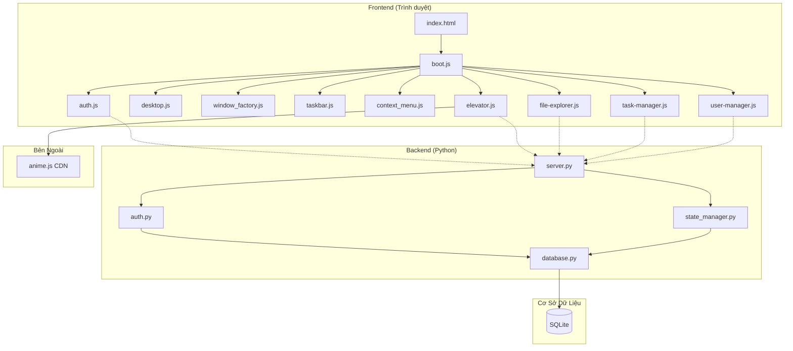

### Trách Nhiệm Từng Thành Phần

**Các Lớp Frontend:**

1. **Lớp Trình Bày** (Desktop UI, Cửa sổ, Thanh tác vụ)
   - Quản lý tương tác người dùng
   - Hiển thị môi trường desktop
   - Xử lý vòng đời cửa sổ

2. **Lớp Ứng Dụng** (Auth, App Loader, State Manager)
   - Quản lý phiên người dùng
   - Tải các mô-đun ứng dụng
   - Điều phối lưu trữ trạng thái

3. **Lớp Logic Nghiệp Vụ** (Mô phỏng thang máy, File Explorer, Task Manager)
   - Triển khai logic miền
   - Chạy mô phỏng vật lý
   - Quản lý trạng thái ứng dụng

4. **Lớp Truy Cập Dữ Liệu** (LocalStorage, API Client, Event Bus)
   - Xử lý lưu trữ dữ liệu
   - Quản lý giao tiếp API
   - Điều phối truyền sự kiện

**Các Thành Phần Backend:**

- **HTTP Server** (`server.py`): Định tuyến yêu cầu đến các handler, triển khai CORS
- **Dịch Vụ Xác Thực** (`auth.py`): Đăng ký, đăng nhập, quản lý vai trò người dùng
- **Quản Lý Trạng Thái** (`state_manager.py`): Lưu trữ cấu hình cửa sổ và thang máy
- **Cơ Sở Dữ Liệu** (`database.py`): Quản lý kết nối SQLite và lược đồ

### Luồng Giao Tiếp

```
Tương Tác Người Dùng → Sự Kiện DOM → Trình Xử Lý Sự Kiện → Logic Nghiệp Vụ → Cập Nhật Trạng Thái → Hiển Thị UI
                                                                    ↓
                                                        Gọi API (nếu đã xác thực)
                                                                    ↓
                                                    Yêu Cầu HTTP → Backend → Cơ Sở Dữ Liệu
                                                                    ↓
                                                        Phản Hồi → Cập Nhật Trạng Thái → Hiển Thị UI
```

### Luồng Dữ Liệu

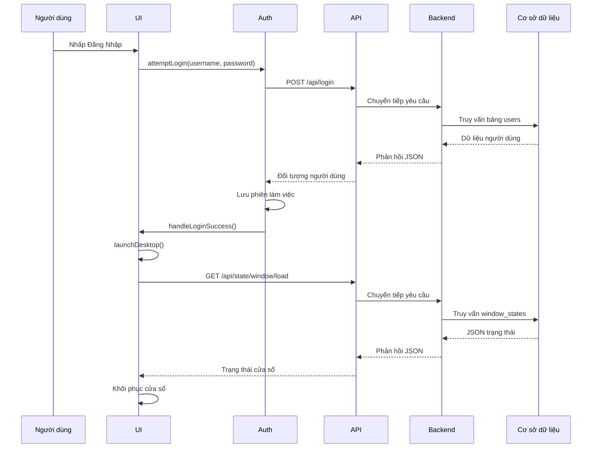

---

## Cơ Chế Hoạt Động

### Khởi Động Ứng Dụng

1. Sự kiện **DOMContentLoaded** kích hoạt trong trình duyệt
2. **boot.js** khởi tạo màn hình đăng nhập
3. Người dùng nhập thông tin đăng nhập hoặc nhấp vào nút khách
4. **auth.js** gọi API (hoặc thiết lập phiên khách)
5. Khi thành công: **animateLoginSuccess()** thực thi
6. **launchDesktop()** được gọi:
   - Lấy cài đặt mặc định theo vai trò người dùng
   - Khởi tạo desktop, nền, menu ngữ cảnh
   - Tạo biểu tượng desktop cho các ứng dụng khả dụng
   - Khởi tạo thanh tác vụ với điều khiển hệ thống
   - Tải trạng thái cửa sổ đã lưu từ server/localStorage
   - Khôi phục cửa sổ hoặc khởi chạy ứng dụng mặc định
   - Bắt đầu bộ đếm thời gian tự động lưu (mỗi 30 giây)
7. Ứng dụng sẵn sàng cho người dùng tương tác

### Vòng Lặp Mô Phỏng

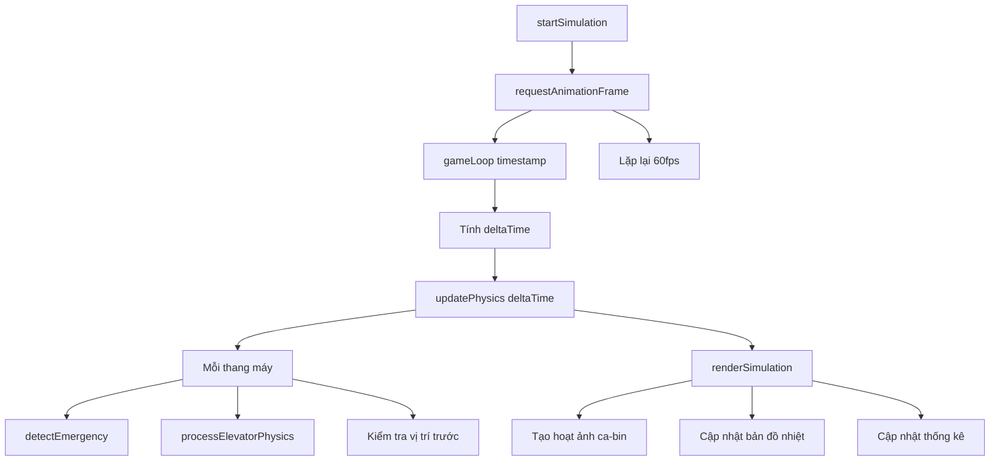

### Vòng Đời Yêu Cầu (Đăng Nhập)

1. Người dùng nhấp nút Đăng Nhập
2. **boot.js** kiểm tra đầu vào (yêu cầu tên đăng nhập/mật khẩu)
3. **auth.attemptLogin(username, password)** được gọi
4. **fetch('POST /api/login', { body: credentials })** thực thi
5. **server.py** nhận yêu cầu
6. Định tuyến đến **handle_login()**
7. Gọi **auth.login_user()**
8. Truy vấn cơ sở dữ liệu để khớp thông tin đăng nhập
9. Trả về đối tượng người dùng hoặc None
10. Server gửi phản hồi JSON
11. **auth.js** nhận phản hồi
12. Khi thành công: lưu phiên, gọi **handleLoginSuccess()**
13. **boot.js** khởi chạy desktop

---

## Cấu Trúc Dự Án

```
Bai-tap-lon-mon-js/
├── a/                          # Tài nguyên bổ sung
├── apps/                       # Thư mục ứng dụng cũ
│   ├── file-explorer/
│   │   └── file-explorer.js
│   ├── task-manager/
│   │   └── task-manager.js
│   └── user-manager/
│       └── user-manager.js
├── backend/                    # Server backend Python
│   ├── __pycache__/           # Bộ nhớ đệm bytecode Python
│   ├── backend/               # Thư mục gói backend
│   ├── auth.py               # Dịch vụ xác thực
│   ├── database.py           # Lược đồ và kết nối cơ sở dữ liệu
│   ├── server.py             # HTTP server và định tuyến
│   └── state_manager.py      # Dịch vụ lưu trữ trạng thái
├── src/                       # Thư mục mã nguồn
│   ├── apps/                  # Các mô-đun ứng dụng
│   │   └── elevator/
│   │       └── elevator.js   # Mô phỏng thang máy chính (2740 dòng)
│   ├── sdk/                   # Tiện ích SDK
│   │   └── event-bus.js      # Giao tiếp sự kiện
│   └── shell/                 # Các thành phần Web OS shell
│       ├── assets/
│       │   └── styles.js      # Styles dùng chung
│       ├── auth.js            # Xác thực phía frontend
│       ├── boot.js            # Khởi động ứng dụng
│       ├── desktop/
│       │   ├── background-manager.js  # Quản lý hình nền
│       │   ├── desktop-icons.js       # Hiển thị biểu tượng desktop
│       │   ├── desktop.js              # Khởi tạo desktop
│       │   └── window_factory.js       # Tạo/quản lý cửa sổ
│       ├── login-animation.js  # Hoạt ảnh màn hình đăng nhập
│       └── system-ui/
│           ├── context-menu.js        # Menu chuột phải
│           └── taskbar.js             # Điều khiển thanh tác vụ
├── temp/                       # Tệp tạm thời / build
├── index.html                 # Tệp HTML điểm vào
├── PROJECT_ANALYSIS.md        # Tài liệu bàn giao kỹ thuật
└── README.md                  # Tệp này
```

### Trách Nhiệm Từng Thư Mục

**`backend/`**: HTTP server Python cung cấp REST API
- **Mục Đích**: Xử lý xác thực và lưu trữ trạng thái
- **Trách Nhiệm**: Định tuyến API, quản lý người dùng, thao tác cơ sở dữ liệu
- **Tệp Chính**: `server.py`, `auth.py`, `database.py`, `state_manager.py`

**`src/apps/elevator/`**: Ứng dụng mô phỏng thang máy
- **Mục Đích**: Mô phỏng điều phối thang máy thời gian thực
- **Trách Nhiệm**: Mô phỏng vật lý, thuật toán điều phối, hiển thị UI, thống kê
- **Phụ Thuộc**: `anime.js` (CDN), `../../shell/auth.js`
- **Tệp Chính**: `elevator.js` (2740 dòng, mô phỏng toàn diện)

**`src/shell/`**: Hạ tầng Web OS shell
- **Mục Đích**: Môi trường desktop, quản lý cửa sổ, xác thực
- **Trách Nhiệm**: Giao diện desktop, vòng đời cửa sổ, điều khiển hệ thống
- **Phụ Thuộc**: Mô-đun ES6, không có thư viện ngoài
- **Tệp Chính**: `boot.js`, `auth.js`, `desktop/desktop.js`, `desktop/window_factory.js`

**`src/sdk/`**: Tiện ích dùng chung
- **Mục Đích**: Giao tiếp sự kiện giữa các mô-đun
- **Tệp Chính**: `event-bus.js`

---

## Các Mô-đun Cốt Lõi

### Mô-đun Xác Thực (`src/shell/auth.js`)

**Mục Đích**: Quản lý phiên người dùng và luồng xác thực

**Trách Nhiệm**:
- Lưu trữ trạng thái phiên người dùng
- Xử lý gọi API đăng nhập/đăng ký
- Lưu trạng thái vào localStorage (chế độ khách)
- Cung cấp thông tin người dùng cho các mô-đun khác

**Luồng Xử Lý Nội Bộ**:
1. Người dùng nhập thông tin đăng nhập
2. Kiểm tra đầu vào
3. Gọi điểm cuối API
4. Khi thành công: lưu phiên vào bộ nhớ
5. Khi thành công: lưu vào localStorage (khách) hoặc API (đã xác thực)
6. Cung cấp dữ liệu người dùng cho các mô-đun khác

**Phụ Thuộc**: fetch API

**Tương Tác Với Các Mô-đun Khác**:
- Được gọi bởi `boot.js` để xác thực
- Được sử dụng bởi `elevator.js` để lưu cấu hình
- Được sử dụng bởi `boot.js` để tải trạng thái

**Tệp Chính**: `src/shell/auth.js`

**Các Hàm Quan Trọng**:
- `attemptLogin(username, password, onSuccess)` — Xác thực người dùng
- `attemptRegister(username, password, onSuccess)` — Đăng ký người dùng mới
- `loginAsGuest(onSuccess)` — Cho phép truy cập khách
- `getCurrentUser()` — Lấy đối tượng người dùng hiện tại
- `isGuest()` — Kiểm tra có phải khách không
- `saveToLocalStorage(key, value)` — Lưu vào localStorage
- `loadFromLocalStorage(key)` — Tải từ localStorage

### Mô-đun Desktop (`src/shell/desktop/`)

**Mục Đích**: Cung cấp môi trường desktop và quản lý cửa sổ

**Trách Nhiệm**:
- Tạo vùng chứa desktop
- Quản lý z-index cửa sổ
- Xử lý tương tác desktop
- Tạo và quản lý cửa sổ ứng dụng

**Luồng Xử Lý Nội Bộ**:
1. Khởi tạo vùng chứa desktop
2. Tải hình ảnh nền
3. Tạo biểu tượng desktop
4. Xử lý nhấp biểu tượng để khởi động ứng dụng
5. Quản lý vòng đời cửa sổ (tạo, di chuyển, thu nhỏ, đóng)

**Phụ Thuộc**: `background-manager.js`, `window_factory.js`

**Tương Tác Với Các Mô-đun Khác**:
- Được khởi tạo bởi `boot.js`
- Sử dụng `window_factory.js` để tạo cửa sổ
- Giao tiếp với các mô-đun ứng dụng để lấy nội dung

**Tệp Chính**: 
- `desktop.js`
- `window_factory.js`
- `background-manager.js`
- `desktop-icons.js`

**Các Hàm Quan Trọng**:
- `initDesktop(container)` — Khởi tạo desktop
- `create_single_app(desktop, appName)` — Tạo cửa sổ ứng dụng
- `bringToFront(window)` — Đưa cửa sổ lên trước

### Mô-đun Mô Phỏng Thang Máy (`src/apps/elevator/elevator.js`)

**Mục Đích**: Mô phỏng điều phối thang máy thời gian thực với engine vật lý

**Trách Nhiệm**:
- Mô phỏng vật lý thời gian thực (gia tốc, vận tốc, vị trí)
- Thuật toán điều phối đa tiêu chí (LOOK/SCAN)
- Tạo hành khách với phân phối trọng lượng Gaussian (50–130 kg)
- Phát hiện sự cố (quá tải, kẹt thang) và phục hồi
- Theo dõi và hiển thị thống kê
- Giao diện responsive ba cột
- Bản đồ nhiệt hiển thị hàng đợi tầng
- Tính toán và hiển thị ETA
- Thuật toán phân vùng cho tòa nhà cao tầng
- Đặt vị trí trước cho thang máy nhàn rỗi
- Tooltip hành trình hành khách với vị trí cố định (position:fixed)
- Tự kiểm tra thuật toán điều phối và sắp xếp

**Luồng Xử Lý Nội Bộ**:
1. Khởi tạo cấu hình và trạng thái hệ thống
2. Xây dựng giao diện ba cột
3. Thiết lập trình nghe sự kiện (resize với ngưỡng 50px)
4. Tải cấu hình đã lưu
5. Bắt đầu vòng lặp vật lý (60fps)
6. Hiển thị mô phỏng mỗi khung hình
7. Cập nhật thống kê mỗi giây

**Phụ Thuộc**: `anime.js` (CDN), `../../shell/auth.js`

**Tương Tác Với Các Mô-đun Khác**:
- Sử dụng `auth.js` để lưu cấu hình
- Được gọi bởi `boot.js` khi khởi chạy ứng dụng
- Giao tiếp với backend API để lưu/tải cấu hình

**Tệp Chính**: `src/apps/elevator/elevator.js` (2740 dòng)

**Các Hàm Quan Trọng**:
- `initElevatorSimulation(contentElement)` — Điểm vào chính
- `dispatchElevator({ floor, direction })` — Phân công thang máy cho yêu cầu
- `sortTargetFloorsPure(elevator)` — Hàm thuần LOOK để sắp xếp tầng mục tiêu
- `calculateDispatchCostPure(elevator, floor, direction, config)` — Hàm thuần tính chi phí điều phối
- `processElevatorPhysics(elevator, dtSec)` — Tích hợp chuyển động
- `detectEmergency(elevatorId, deltaMs)` — Phát hiện sự cố
- `renderSimulation()` — Cập nhật UI
- `updateCabinDots(elevatorId)` — Cập nhật chấm hành khách (tối ưu hóa)
- `showPassengerTooltip(anchorEl, passenger)` — Hiển thị thông tin hành trình
- `renderFaultButtons()` — Hiển thị nút reset sự cố (với DOM guard)
- `runConfigSelfTest(config)` — Tự kiểm tra hành vi

### Mô-đun Backend Server (`backend/server.py`)

**Mục Đích**: HTTP server Python cung cấp REST API cho xác thực và lưu trữ trạng thái

**Trách Nhiệm**:
- Xử lý yêu cầu HTTP với bảng định tuyến
- Triển khai CORS header
- Định tuyến đến các handler phù hợp
- Trả về phản hồi JSON

**Luồng Xử Lý Nội Bộ**:
1. Khởi tạo cơ sở dữ liệu
2. Tạo dữ liệu mẫu ban đầu
3. Tạo instance HTTPServer
4. Phục vụ cho đến khi có KeyboardInterrupt

**Phụ Thuộc**: Thư viện chuẩn Python (http.server, json, urllib.parse)

**Tương Tác Với Các Mô-đun Khác**:
- Được frontend gọi qua fetch API
- Sử dụng `auth.py` để xác thực
- Sử dụng `state_manager.py` để thao tác trạng thái
- Sử dụng `database.py` để lưu trữ dữ liệu

**Tệp Chính**: `backend/server.py`

**Các Hàm Quan Trọng**:
- `run_server(host, port)` — Khởi động HTTP server
- `handle_request()` — Định tuyến yêu cầu
- `handle_register()` — Xử lý đăng ký người dùng
- `handle_login()` — Xử lý xác thực
- `handle_save_window()` — Lưu trạng thái cửa sổ
- `handle_load_window()` — Tải trạng thái cửa sổ
- `handle_save_elevator()` — Lưu cấu hình thang máy
- `handle_load_elevator()` — Tải cấu hình thang máy
- `handle_list_users()` — Liệt kê tất cả người dùng (admin)
- `handle_admin_create_user()` — Tạo người dùng (admin)
- `handle_admin_update_user()` — Cập nhật người dùng (admin)
- `handle_admin_delete_user()` — Xóa người dùng (admin)

---

## Tổng Quan Từng Tệp

### `index.html`

**Mục Đích**: Tệp HTML điểm vào định nghĩa cấu trúc ứng dụng

**Trách Nhiệm**:
- Định nghĩa vùng chứa màn hình đăng nhập và desktop
- Tải các phụ thuộc bên ngoài (CDN anime.js)
- Định nghĩa CSS cho form đăng nhập và chuyển đổi màn hình
- Khởi động ứng dụng qua `boot.js`

**Các Hàm Chính**: Không có (chỉ là cấu trúc HTML)

**Đầu Vào**: Không có

**Đầu Ra**: Cấu trúc DOM cho ứng dụng

**Phụ Thuộc**: 
- Bên ngoài: anime.js từ cdnjs.cloudflare.com
- Nội bộ: `./src/shell/boot.js`

**Vai Trò Trong Luồng**: Tệp đầu tiên được trình duyệt tải, khởi tạo ứng dụng

**Tệp Liên Quan**: `src/shell/boot.js`

### `src/shell/boot.js`

**Mục Đích**: Khởi động ứng dụng, điều phối toàn bộ vòng đời Web OS

**Trách Nhiệm**:
- Xử lý luồng xác thực (đăng nhập, đăng ký, khách)
- Khởi tạo môi trường desktop
- Khởi chạy ứng dụng theo vai trò người dùng
- Quản lý lưu trữ trạng thái cửa sổ
- Xử lý chế độ ngủ, đăng xuất, tắt máy

**Các Hàm Chính**:
- `launchDesktop()` — Khởi tạo desktop sau khi đăng nhập
- `launchApp(desktop, appName)` — Khởi chạy ứng dụng trong cửa sổ
- `handleLogout()` — Dọn dẹp và trở về màn hình đăng nhập
- `handleSleep()` — Vào chế độ ngủ
- `handleShutdown()` — Tắt ứng dụng

**Đầu Vào**: Phần tử DOM, thông tin đăng nhập người dùng

**Đầu Ra**: Môi trường desktop, cửa sổ ứng dụng

**Phụ Thuộc**: Tất cả mô-đun shell và các bộ khởi tạo ứng dụng

**Tệp Liên Quan**: `src/shell/auth.js`, `src/shell/desktop/desktop.js`

### `src/shell/auth.js`

**Mục Đích**: Mô-đun xác thực phía frontend quản lý phiên người dùng

**Các Hàm Chính**:
- `attemptLogin(username, password, onSuccess)` — Xác thực người dùng
- `attemptRegister(username, password, onSuccess)` — Đăng ký người dùng mới
- `loginAsGuest(onSuccess)` — Cho phép truy cập khách
- `getCurrentUser()` — Lấy đối tượng người dùng hiện tại
- `isGuest()` — Kiểm tra có phải khách không
- `saveToLocalStorage(key, value)` — Lưu vào localStorage
- `loadFromLocalStorage(key)` — Tải từ localStorage

**Đầu Vào**: Tên đăng nhập, mật khẩu, hàm callback

**Đầu Ra**: Đối tượng người dùng, trạng thái thành công/thất bại

**Phụ Thuộc**: fetch API

**Tệp Liên Quan**: `backend/auth.py`, `src/shell/boot.js`

### `src/apps/elevator/elevator.js`

**Mục Đích**: Mô phỏng thang máy toàn diện với engine vật lý và thuật toán điều phối

**Đầu Vào**: Tham số cấu hình, tương tác người dùng

**Đầu Ra**: Mô phỏng trực quan, thống kê, trạng thái sự cố

**Phụ Thuộc**: 
- Bên ngoài: anime.js (CDN)
- Nội bộ: `../../shell/auth.js`

### `backend/server.py`

**Mục Đích**: HTTP server Python cung cấp REST API

**Đầu Vào**: Yêu cầu HTTP (POST, GET, PUT, DELETE)

**Đầu Ra**: Phản hồi JSON

**Phụ Thuộc**: 
- Thư viện chuẩn: http.server, json, urllib.parse
- Nội bộ: database, auth, state_manager

### `backend/auth.py`

**Mục Đích**: Dịch vụ xác thực xử lý đăng ký và đăng nhập người dùng

**Các Hàm Chính**:
- `register_user(username, password)` — Tạo người dùng mới
- `login_user(username, password)` — Xác thực người dùng
- `list_users()` — Lấy tất cả người dùng
- `create_user(username, password, role)` — Tạo người dùng (admin)
- `update_user(user_id, password, role)` — Cập nhật người dùng (admin)
- `delete_user(user_id)` — Xóa người dùng (admin)
- `seed_users()` — Tạo người dùng mẫu ban đầu

**Phụ Thuộc**: 
- Thư viện chuẩn: hashlib, sqlite3
- Nội bộ: database

### `backend/database.py`

**Mục Đích**: Quản lý lược đồ và kết nối cơ sở dữ liệu

**Trách Nhiệm**:
- Khởi tạo cơ sở dữ liệu SQLite
- Tạo bảng (users, window_states, elevator_configs)
- Cung cấp kết nối cơ sở dữ liệu
- Xử lý migration

**Các Hàm Chính**:
- `get_db_connection()` — Lấy kết nối cơ sở dữ liệu
- `initialize_database()` — Tạo các bảng
- `_migrate_add_role_column()` — Migration thêm cột role

**Phụ Thuộc**: Thư viện chuẩn: sqlite3

### `backend/state_manager.py`

**Mục Đích**: Dịch vụ lưu trữ trạng thái cho bố cục cửa sổ và cấu hình thang máy

**Các Hàm Chính**:
- `save_window_state(user_id, state)` — Lưu bố cục cửa sổ
- `load_window_state(user_id)` — Tải bố cục cửa sổ
- `save_elevator_config(user_id, config)` — Lưu cấu hình thang máy
- `load_elevator_config(user_id)` — Tải cấu hình thang máy

**Đầu Vào**: ID người dùng, đối tượng trạng thái/cấu hình

**Đầu Ra**: Trạng thái thành công/thất bại, đối tượng trạng thái/cấu hình

---

## Luồng Dữ Liệu Chi Tiết

### Luồng Xác Thực

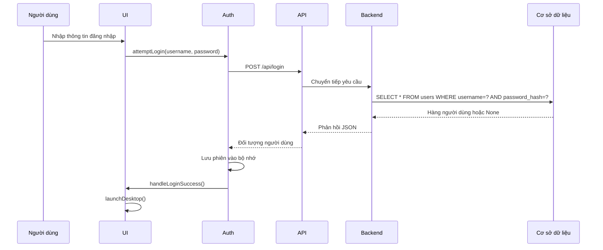

### Luồng Lưu Cấu Hình

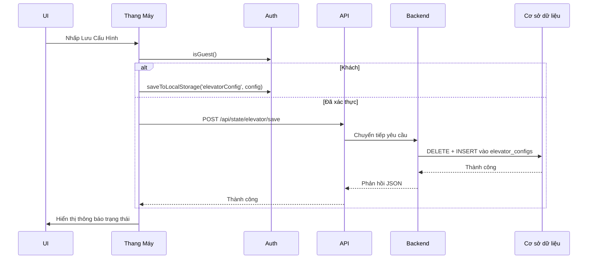

---

## Cơ Sở Dữ Liệu

### Công Nghệ

**Hệ Quản Trị CSDL:** SQLite 3

**Vị Trí Tệp:** `backend/data.db`

### Tổng Quan Lược Đồ

Ba bảng chính:
- `users` — Xác thực người dùng và vai trò
- `window_states` — Lưu trữ bố cục cửa sổ desktop
- `elevator_configs` — Lưu trữ cấu hình mô phỏng thang máy

### Các Bảng

#### Bảng Users (Người Dùng)

```sql
CREATE TABLE users (
    id INTEGER PRIMARY KEY AUTOINCREMENT,
    username TEXT UNIQUE NOT NULL,
    password_hash TEXT NOT NULL,
    role TEXT DEFAULT 'user',
    created_at TEXT DEFAULT (datetime('now', 'localtime'))
);
```

**Mục Đích**: Lưu thông tin xác thực và vai trò người dùng

**Các Trường**:
- `id`: Khóa chính, tự tăng
- `username`: Định danh duy nhất để đăng nhập
- `password_hash`: Mật khẩu đã băm bằng SHA-256
- `role`: Vai trò người dùng ('admin', 'user')
- `created_at`: Thời điểm tạo tài khoản

**Ràng Buộc**:
- PRIMARY KEY trên id
- UNIQUE trên username
- NOT NULL trên username, password_hash
- DEFAULT trên role, created_at

#### Bảng Window States (Trạng Thái Cửa Sổ)

```sql
CREATE TABLE window_states (
    id INTEGER PRIMARY KEY AUTOINCREMENT,
    user_id INTEGER NOT NULL,
    state_json TEXT NOT NULL,
    updated_at TEXT DEFAULT (datetime('now', 'localtime')),
    FOREIGN KEY (user_id) REFERENCES users (id) ON DELETE CASCADE
);
```

**Mục Đích**: Lưu bố cục và trạng thái cửa sổ desktop theo người dùng

**Các Trường**:
- `id`: Khóa chính, tự tăng
- `user_id`: Khóa ngoại liên kết với bảng users
- `state_json`: Chuỗi JSON chứa vị trí, kích thước, trạng thái cửa sổ
- `updated_at`: Thời điểm cập nhật gần nhất

#### Bảng Elevator Configs (Cấu Hình Thang Máy)

```sql
CREATE TABLE elevator_configs (
    id INTEGER PRIMARY KEY AUTOINCREMENT,
    user_id INTEGER NOT NULL,
    config_json TEXT NOT NULL,
    updated_at TEXT DEFAULT (datetime('now', 'localtime')),
    FOREIGN KEY (user_id) REFERENCES users (id) ON DELETE CASCADE
);
```

**Mục Đích**: Lưu cấu hình mô phỏng thang máy theo người dùng

**Các Trường**:
- `id`: Khóa chính, tự tăng
- `user_id`: Khóa ngoại liên kết với bảng users
- `config_json`: Chuỗi JSON chứa các thông số mô phỏng
- `updated_at`: Thời điểm cập nhật gần nhất

### Quan Hệ

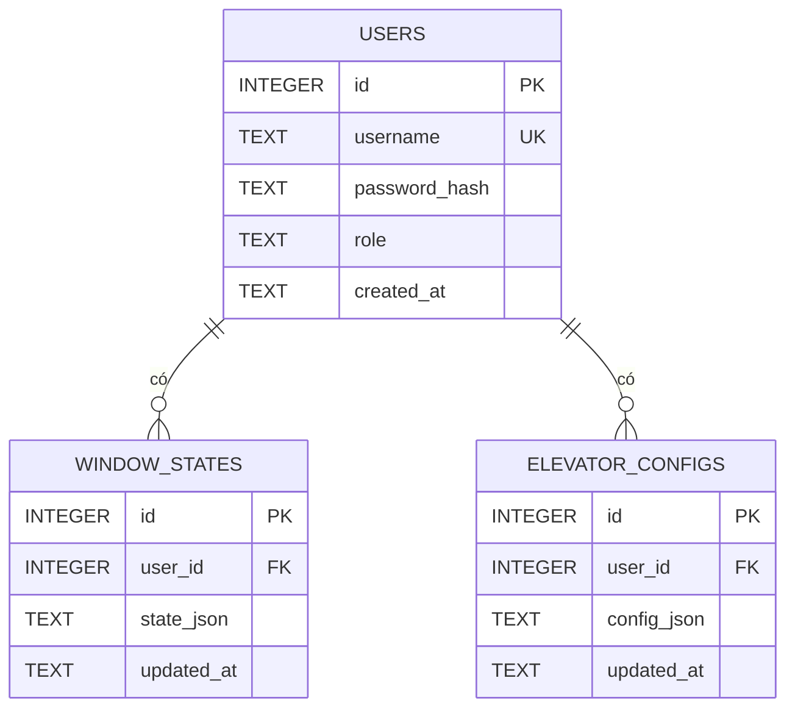

### Chuẩn Hóa

- **1NF:** ✅ Đạt — Tất cả giá trị nguyên tử, không có nhóm lặp
- **2NF:** ✅ Đạt — Tất cả thuộc tính phụ thuộc hoàn toàn vào khóa chính
- **3NF:** ✅ Đạt — Không có phụ thuộc bắc cầu
- **BCNF:** ✅ Đạt — Không có phụ thuộc đa trị không tầm thường

---

## Tài Liệu API

### POST /api/register

**Mục Đích**: Đăng ký tài khoản người dùng mới

**Yêu Cầu:**
```json
{
  "username": "string (bắt buộc)",
  "password": "string (bắt buộc)"
}
```

**Phản Hồi:**
```json
{
  "success": boolean,
  "message": "string"
}
```

**Xác Thực**: Không cần

**Xử Lý Lỗi**:
- 400: Tên đăng nhập đã tồn tại
- 500: Lỗi cơ sở dữ liệu

### POST /api/login

**Mục Đích**: Xác thực người dùng bằng thông tin đăng nhập

**Yêu Cầu:**
```json
{
  "username": "string (bắt buộc)",
  "password": "string (bắt buộc)"
}
```

**Phản Hồi:**
```json
{
  "success": boolean,
  "user_id": number,
  "username": "string",
  "role": "string"
}
```

**Xử Lý Lỗi**:
- 401: Thông tin đăng nhập không hợp lệ
- 500: Lỗi cơ sở dữ liệu

### GET /api/admin/users

**Mục Đích**: Liệt kê tất cả người dùng (chỉ dành cho admin)

**Phản Hồi:**
```json
{
  "success": boolean,
  "users": [
    {
      "id": number,
      "username": "string",
      "role": "string",
      "created_at": "string"
    }
  ]
}
```

**Xác Thực**: Chưa triển khai (TODO)

### POST /api/admin/users

**Mục Đích**: Tạo người dùng mới (chỉ dành cho admin)

**Yêu Cầu:**
```json
{
  "username": "string (bắt buộc)",
  "password": "string (bắt buộc)",
  "role": "string (mặc định: 'user')"
}
```

### PUT /api/admin/users

**Mục Đích**: Cập nhật mật khẩu hoặc vai trò người dùng (chỉ dành cho admin)

**Yêu Cầu:**
```json
{
  "user_id": number,
  "password": "string (tùy chọn)",
  "role": "string (tùy chọn)"
}
```

### DELETE /api/admin/users

**Mục Đích**: Xóa người dùng (chỉ dành cho admin)

**Yêu Cầu:**
```json
{
  "user_id": number
}
```

### POST /api/state/window/save

**Mục Đích**: Lưu trạng thái bố cục cửa sổ cho người dùng

**Yêu Cầu:**
```json
{
  "user_id": number,
  "state": "array/object"
}
```

### GET /api/state/window/load

**Mục Đích**: Tải trạng thái bố cục cửa sổ đã lưu

**Tham Số Truy Vấn**: `user_id` (số, bắt buộc)

### POST /api/state/elevator/save

**Mục Đích**: Lưu cấu hình mô phỏng thang máy

**Yêu Cầu:**
```json
{
  "user_id": number,
  "config": object
}
```

### GET /api/state/elevator/load

**Mục Đích**: Tải cấu hình thang máy đã lưu

**Tham Số Truy Vấn**: `user_id` (số, bắt buộc)

---

## Cấu Hình

### Cấu Hình Frontend

Nằm trong hàm `getDefaultSimConfig()` tại `elevator.js`:

| Biến | Bắt Buộc | Mặc Định | Mô Tả |
| ---- | -------- | -------- | ------ |
| totalFloors | Có | 20 | Số tầng của tòa nhà (5–40) |
| elevatorCount | Có | 3 | Số lượng thang máy (1–6) |
| maxLoad | Có | 800 | Tải trọng tối đa (kg) |
| maxAcceleration | Có | 1.0 | Gia tốc tối đa (tầng/giây²) |
| maxVelocity | Có | 2.5 | Vận tốc tối đa (tầng/giây) |
| doorOpenTime | Có | 2000 | Thời gian mở cửa (ms) |
| doorCloseTime | Có | 1500 | Thời gian đóng cửa (ms) |
| spawnRate | Có | 3000 | Tốc độ tạo hành khách (ms) |
| simSpeed | Có | 1 | Hệ số tốc độ mô phỏng (1, 2, 5, 10) |
| enableZoning | Có | false | Bật thuật toán phân vùng |

### Hằng Số Frontend

Nằm trong `elevator.js`:

| Biến | Giá Trị | Mô Tả |
| ---- | ------- | ------ |
| BACKEND_URL | http://localhost:8000 | URL backend API |
| CONFIG_STORAGE_KEY | elevatorConfig | Khóa localStorage cho cấu hình |
| FLOOR_HEIGHT_PX | 36 | Chiều cao pixel mỗi tầng |
| STATS_UPDATE_MS | 1000 | Chu kỳ cập nhật thống kê (ms) |
| STUCK_THRESHOLD_MS | 5000 | Thời gian trước khi kích hoạt lỗi kẹt (ms) |
| OVERLOAD_FAULT_RATIO | 1.1 | Ngưỡng tải để kích hoạt lỗi |
| CHART_HISTORY_MAX | 60 | Số điểm dữ liệu tối đa trong biểu đồ |
| WRONG_DIRECTION_PENALTY | 8 | Điểm phạt sai hướng trong điều phối |
| OVERLOAD_PENALTY | 15 | Điểm phạt quá tải trong điều phối |
| SAME_DIRECTION_BONUS | 3 | Điểm thưởng cùng hướng trong điều phối |
| PASSENGER_DOT_SIZE | 6 | Kích thước trực quan của chấm hành khách |

---

## Hướng Dẫn Cài Đặt

### Yêu Cầu Hệ Thống

- Python 3.x đã cài đặt
- Trình duyệt web hiện đại hỗ trợ ES6 (Chrome, Firefox, Edge, Safari)
- Không cần Node.js (backend Python thuần)

### Phụ Thuộc

**Frontend:**
- anime.js (tải từ CDN: cdnjs.cloudflare.com/ajax/libs/animejs/3.2.1/anime.min.js)

**Backend:**
- Chỉ cần thư viện chuẩn Python (không cần cài thêm gói ngoài)

### Sao Chép Kho Lưu Trữ

```bash
git clone <repository-url>
cd Bai-tap-lon-mon-js
```

### Cài Đặt Gói

Không cần cài đặt gói cho frontend (mô-đun ES6 thuần).

Không cần cài đặt gói cho backend (thư viện chuẩn Python).

### Cấu Hình Môi Trường

Không cần cấu hình môi trường. URL backend được cứng trong `elevator.js`:

```javascript
const BACKEND_URL = 'http://localhost:8000';
```

Để thay đổi URL backend, cập nhật hằng số này trong `src/apps/elevator/elevator.js`.

### Thiết Lập Cơ Sở Dữ Liệu

Cơ sở dữ liệu được tự động tạo lần đầu chạy backend:

```bash
cd backend
python server.py
```

Thao tác này sẽ:
1. Tạo `backend/data.db` nếu chưa tồn tại
2. Khởi tạo các bảng (users, window_states, elevator_configs)
3. Chạy migration để thêm cột role nếu cần
4. Tạo người dùng mẫu (admin/admin, user/user)

### Chạy Ứng Dụng

**Khởi động Backend:**
```bash
cd backend
python server.py
```

Backend sẽ chạy tại `http://localhost:8000`

**Khởi động Frontend:**
Mở `index.html` trong trình duyệt:
```bash
# Cách 1: Nhấp đúp vào index.html
# Cách 2: Mở trong trình duyệt từ dòng lệnh
start index.html  # Windows
open index.html   # macOS
xdg-open index.html  # Linux
```

### Xác Minh Cài Đặt

1. Backend hiển thị: "Server running at http://localhost:8000"
2. Frontend hiển thị màn hình đăng nhập
3. Kiểm tra đăng nhập với các tài khoản:
   - Admin: tên đăng nhập `admin`, mật khẩu `admin`
   - Người dùng: tên đăng nhập `user`, mật khẩu `user`
4. Kiểm tra truy cập khách bằng cách nhấp nút "Guest"
5. Khởi chạy ứng dụng Mô Phỏng Thang Máy
6. Nhấp Start để bắt đầu mô phỏng
7. Kiểm tra hoạt ảnh vật lý và cập nhật thống kê

---

## Hướng Dẫn Chạy Dự Án

### Chế Độ Phát Triển

**Backend:**
```bash
cd backend
python server.py
```

**Frontend:**
Mở `index.html` trong trình duyệt. Không cần quá trình build.

**Tải Lại Nóng (Hot Reload):**
- Backend: Khởi động lại server sau khi thay đổi code
- Frontend: Tải lại trình duyệt sau khi thay đổi code

### Chế Độ Production

Tương tự như chế độ phát triển. Không có cấu hình production riêng biệt.

### Docker / Container / Cloud

Chưa triển khai (triển khai thủ công).

---

## Kiểm Thử

### Kiểm Thử Đơn Vị

**Chưa triển khai** — Không có kiểm thử đơn vị tự động.

**Kiểm Thử Thủ Công:**
- Hàm tự kiểm tra `runConfigSelfTest()` trong elevator.js
- Kiểm tra 8 trường hợp cấu hình:
  - validateSimConfig
  - createSystemState
  - floorQueues
  - decelDistance
  - timeToTop
  - dispatcherSelectsNearest (dùng hàm thuần `calculateDispatchCostPure`)
  - sortTargetFloorsLookUp (dùng hàm thuần `sortTargetFloorsPure`)
  - sortTargetFloorsLookDown (dùng hàm thuần `sortTargetFloorsPure`)
- Chạy tự động khi khởi tạo mô phỏng

### Kiểm Thử Tích Hợp

**Chưa triển khai** — Không có kiểm thử tích hợp tự động.

**Kiểm Thử Thủ Công**:
- Kiểm tra luồng xác thực (đăng nhập, đăng ký, khách)
- Kiểm tra lưu trữ trạng thái (lưu/tải)
- Kiểm tra các điểm cuối API thủ công

### Kiểm Thử End-to-End (E2E)

**Chưa triển khai** — Không có kiểm thử E2E tự động.

---

## Ghi Nhật Ký & Giám Sát

### Hệ Thống Ghi Nhật Ký

**Frontend:**
- Console.log để gỡ lỗi
- Hệ thống nhật ký sự kiện trong mô phỏng thang máy (hiển thị trên UI)
- Trình xử lý lỗi cho các lỗi chưa được bắt

**Backend:**
- Câu lệnh print để ghi nhật ký server
- Ghi nhật ký yêu cầu HTTP trong hàm `log_message()`
- Ghi nhật ký lỗi với khối try-catch

### Giám Sát

Chưa triển khai — Không có kiểm tra sức khỏe, số liệu hay cảnh báo.

---

## Bảo Mật

### Xác Thực

- Băm mật khẩu bằng SHA-256
- Lưu phiên trong bộ nhớ (frontend)
- Không có mã thông báo phiên (session token) hoặc JWT
- Không có thời hạn hết phiên

### Ủy Quyền

- Kiểm soát truy cập theo vai trò (admin, user, guest)
- Các điểm cuối admin chưa được bảo vệ bằng middleware xác thực (TODO)

### Mã Hóa

- Mật khẩu băm bằng SHA-256 (không phải bcrypt/argon2)
- Không có HTTPS (chỉ HTTP)
- Thông tin đăng nhập truyền dưới dạng văn bản thuần

### Các Vấn Đề Bảo Mật Đã Biết

- Không có HTTPS — thông tin đăng nhập truyền dưới dạng văn bản thuần
- Không có session token — không quản lý phiên sau đăng nhập
- Không có giới hạn tần suất — dễ bị tấn công dò mật khẩu (brute force)
- Không có bảo vệ CSRF
- CORS mở hoàn toàn — cho phép tất cả nguồn gốc
- Không có yêu cầu độ phức tạp mật khẩu
- Không khóa tài khoản sau nhiều lần đăng nhập sai
- Các điểm cuối admin không được bảo vệ bằng xác thực

**Khuyến Nghị Cải Thiện Bảo Mật:**
- Triển khai HTTPS với reverse proxy (nginx)
- Thêm JWT hoặc xác thực dựa trên phiên
- Triển khai giới hạn tần suất (rate limiting)
- Thêm CSRF token
- Giới hạn nguồn gốc CORS
- Thêm yêu cầu độ mạnh mật khẩu
- Thêm cơ chế khóa tài khoản sau N lần thất bại
- Thêm middleware xác thực cho các điểm cuối admin

---

## Hiệu Năng

### Chiến Lược Tối Ưu Hóa

- RequestAnimationFrame để đảm bảo hoạt ảnh 60fps mượt mà
- Trình xử lý resize được debounce (200ms)
- Cập nhật DOM hiệu quả (thao tác hàng loạt)
- Chấm hành khách chỉ được xây dựng lại khi số lượng thay đổi (tối ưu hóa)
- Trình xử lý resize chỉ xây dựng lại khi chiều rộng thay đổi ≥ 50px (tối ưu hóa)
- Hàm thuần để kiểm thử thuật toán (không có tác dụng phụ)

### Xử Lý Đồng Thời

- HTTP server Python đơn luồng
- Không có xử lý bất đồng bộ
- Không có connection pooling
- Không có cân bằng tải

---

## Xử Lý Sự Cố

### Triệu Chứng: Backend Không Khởi Động

**Nguyên Nhân:** Cổng 8000 đã được sử dụng

**Giải Pháp:**
```bash
# Tìm tiến trình đang dùng cổng 8000 (Windows)
netstat -ano | findstr :8000
# Kết thúc tiến trình
taskkill /PID <PID> /F

# Hoặc thay đổi cổng trong server.py
```

---

### Triệu Chứng: Đăng Nhập Thất Bại với "Invalid credentials"

**Nguyên Nhân:** Sai tên đăng nhập/mật khẩu hoặc cơ sở dữ liệu chưa khởi tạo

**Giải Pháp:**
1. Xác minh thông tin: admin/admin hoặc user/user
2. Kiểm tra backend đang chạy
3. Kiểm tra console trình duyệt để tìm lỗi API
4. Xác minh cơ sở dữ liệu tồn tại tại `backend/data.db`

---

### Triệu Chứng: Mô Phỏng Thang Máy Không Tạo Hoạt Ảnh

**Nguyên Nhân:** anime.js chưa tải hoặc lỗi JavaScript

**Giải Pháp:**
1. Kiểm tra console trình duyệt để tìm lỗi
2. Xác minh CDN anime.js có thể truy cập
3. Kiểm tra `getAnime()` có trả về null không
4. Xác minh mô phỏng đã được bắt đầu (nhấp nút Start)

---

### Triệu Chứng: Cấu Hình Không Lưu Được

**Nguyên Nhân:** Backend không chạy hoặc lỗi API

**Giải Pháp:**
1. Xác minh backend đang chạy trên cổng 8000
2. Kiểm tra console trình duyệt để tìm lỗi API
3. Xác minh người dùng đã xác thực (không phải khách)
4. Kiểm tra tab mạng để tìm yêu cầu thất bại

---

### Triệu Chứng: Trạng Thái Cửa Sổ Không Khôi Phục

**Nguyên Nhân:** Lỗi cơ sở dữ liệu hoặc API

**Giải Pháp:**
1. Xác minh backend đang chạy
2. Kiểm tra người dùng đã lưu trạng thái chưa
3. Kiểm tra console trình duyệt để tìm lỗi
4. Xác minh cơ sở dữ liệu có bảng window_states

---

## Hướng Dẫn Phát Triển

### Tiêu Chuẩn Code

- ES6+ JavaScript cho frontend
- Python 3.x cho backend
- Dùng `const`/`let` thay vì `var`
- Dùng arrow function cho callback
- Dùng template literal để nội suy chuỗi
- Tuân theo phong cách code hiện có trong mỗi tệp

### Quy Ước Đặt Tên

- JavaScript: camelCase cho biến/hàm, PascalCase cho lớp
- Python: snake_case cho biến/hàm, PascalCase cho lớp
- Hằng số: UPPER_SNAKE_CASE
- Tên tệp: lowercase-with-hyphens

---

## Mở Rộng Hệ Thống

### Thêm Tính Năng Mới Vào Mô Phỏng Thang Máy

1. Mở `src/apps/elevator/elevator.js`
2. Thêm tham số cấu hình vào `getDefaultSimConfig()`
3. Thêm điều khiển UI trong `buildControlPanel()`
4. Triển khai logic trong hàm phù hợp (vật lý, điều phối, hiển thị)
5. Kiểm thử kỹ lưỡng

**Ví dụ:** Thêm thuật toán điều phối mới
```javascript
// 1. Thêm tham số cấu hình
function getDefaultSimConfig() {
    return {
        // ... tham số hiện có
        dispatchAlgorithm: 'LOOK' // hoặc 'SCAN', 'FCFS'
    };
}

// 2. Thêm điều khiển UI
function buildControlPanel(container) {
    // ... code hiện có
    const algoSelect = document.createElement('select');
    algoSelect.addEventListener('change', (e) => {
        updateConfig({ dispatchAlgorithm: e.target.value });
    });
}

// 3. Triển khai thuật toán
function dispatchElevator({ floor, direction }) {
    if (simConfig.dispatchAlgorithm === 'LOOK') {
        // logic LOOK hiện có
    } else if (simConfig.dispatchAlgorithm === 'FCFS') {
        // logic FCFS mới
    }
}
```

### Thêm Điểm Cuối API Mới

1. Mở `backend/server.py`
2. Thêm route vào từ điển ROUTES
3. Triển khai hàm handler
4. Thêm logic nghiệp vụ trong mô-đun phù hợp
5. Kiểm thử với curl hoặc Postman

### Thêm Bảng Cơ Sở Dữ Liệu Mới

1. Mở `backend/database.py`
2. Thêm câu lệnh CREATE TABLE vào `initialize_database()`
3. Thêm hàm migration nếu cần
4. Khởi động lại backend để áp dụng thay đổi

### Thêm Ứng Dụng Mới Vào Web OS

1. Tạo mô-đun ứng dụng trong `src/apps/`
2. Triển khai hàm `init[TênApp](contentElement)`
3. Thêm ứng dụng vào logic khởi chạy trong `boot.js`
4. Thêm biểu tượng desktop trong `boot.js`

---

## Hướng Dẫn Triển Khai

### Yêu Cầu Hạ Tầng

**Tối Thiểu:**
- Python 3.x
- Trình duyệt web hỗ trợ ES6
- 100MB dung lượng đĩa
- 512MB RAM

**Khuyến Nghị:**
- Python 3.8+
- Trình duyệt hiện đại (Chrome, Firefox, Edge)
- 1GB dung lượng đĩa
- 1GB RAM

### Khuyến Nghị Mở Rộng Quy Mô

**Giới Hạn Hiện Tại:**
- HTTP server Python đơn luồng
- SQLite không phù hợp cho lưu lượng truy cập cao
- Không có khả năng mở rộng ngang
- Không có cân bằng tải

**Chiến Lược Mở Rộng:**
1. Thay thế HTTP server Python bằng server production (Gunicorn, uWSGI)
2. Chuyển SQLite sang PostgreSQL để hỗ trợ đồng thời tốt hơn
3. Thêm load balancer (nginx) cho nhiều instance backend
4. Thêm Redis để caching và lưu phiên
5. Thêm CDN cho tài nguyên tĩnh

### Sao Lưu & Phục Hồi

**Sao Lưu Cơ Sở Dữ Liệu:**
```bash
# Sao lưu thủ công
cp backend/data.db backup/data.db.$(date +%Y%m%d)

# Sao lưu tự động (cron)
0 2 * * * cp /path/to/backend/data.db /backup/data.db.$(date +\%Y\%m\%d)
```

---

## Giới Hạn Đã Biết

### Nợ Kỹ Thuật

- Xác thực API: Các điểm cuối admin thiếu middleware xác thực
- Xử Lý Lỗi: Không nhất quán giữa các mô-đun
- Trùng Lặp Code: Một số mô hình lặp trong xây dựng UI
- Magic Numbers: Một số giá trị cứng không có hằng số
- Trạng Thái Toàn Cục: Một số biến toàn cục trong mô phỏng thang máy
- File Quá Lớn: elevator.js là 2740 dòng (nên tách thành các mô-đun)

### Cải Tiến Trong Tương Lai

- Triển khai middleware xác thực API
- Thêm hỗ trợ HTTPS với SSL
- Tách elevator.js thành các mô-đun (physics.js, dispatch.js, ui.js, config.js)
- Thêm kiểm thử tự động (Jest cho frontend, pytest cho backend)
- Triển khai giới hạn tần suất
- Thêm TypeScript để đảm bảo an toàn kiểu dữ liệu
- Thêm phục hồi lỗi với exponential backoff
- Thêm giám sát và ghi nhật ký
- Tối ưu hóa cơ sở dữ liệu với connection pooling
- Thêm ESLint, Pylint, Prettier, Black

---

## Câu Hỏi Thường Gặp (FAQ)

### Dành Cho Nhà Phát Triển Mới

**H: Làm thế nào để chạy dự án cục bộ?**
Đ: 
1. Khởi động backend: `cd backend && python server.py`
2. Mở `index.html` trong trình duyệt
3. Đăng nhập bằng admin/admin hoặc user/user, hoặc nhấp Guest

**H: Logic mô phỏng chính nằm ở đâu?**
Đ: `src/apps/elevator/elevator.js` (2740 dòng) chứa tất cả logic mô phỏng bao gồm vật lý, điều phối và hiển thị UI.

**H: Tại sao có hai phiên bản tính chi phí điều phối?**
Đ: `calculateDispatchCostPure` là hàm thuần ở phạm vi mô-đun để dễ kiểm thử. `calculateDispatchCost` là phiên bản closure bao gồm logic phân vùng và truy cập simConfig.

### Dành Cho Quản Trị Hệ Thống

**H: Làm thế nào để triển khai production?**
Đ: Hiện chỉ triển khai thủ công. Khuyến nghị: Dùng nginx làm reverse proxy với SSL, thay HTTP server Python bằng Gunicorn, chuyển sang PostgreSQL.

**H: Làm thế nào để sao lưu dữ liệu người dùng?**
Đ: Sao lưu tệp `backend/data.db`. Dữ liệu người dùng khách trong localStorage không được sao lưu.

**H: Làm thế nào để reset cơ sở dữ liệu?**
Đ: Xóa `backend/data.db` và khởi động lại backend. Cơ sở dữ liệu sẽ được tạo lại với người dùng mẫu.

---

## Kết Luận

Web OS Mô Phỏng Thang Máy là minh chứng toàn diện cho các kỹ thuật lập trình frontend nâng cao, với mô phỏng vật lý thực tế, thuật toán điều phối theo tiêu chuẩn công nghiệp và giao diện desktop đầy đủ chức năng.

**Kiến Trúc Hệ Thống:**
- **Frontend:** Kiến trúc ES6 mô-đun với phân tách trách nhiệm rõ ràng (Trình bày, Ứng dụng, Logic Nghiệp Vụ, Truy Cập Dữ Liệu)
- **Backend:** HTTP server Python đơn giản với bảng định tuyến, dịch vụ xác thực và cơ sở dữ liệu SQLite
- **Giao Tiếp:** REST API với phản hồi JSON, CORS-enabled
- **Quản Lý Trạng Thái:** LocalStorage cho khách, SQLite cho người dùng đã xác thực, trạng thái trong bộ nhớ trong phiên làm việc

**Chi Tiết Triển Khai Quan Trọng:**
- **Hàm Thuần:** `sortTargetFloorsPure` và `calculateDispatchCostPure` được trích xuất ra phạm vi mô-đun để kiểm thử thuật toán thực sự
- **DOM Ref Guards:** Thuộc tính `data-fault-container` ngăn các vấn đề tham chiếu cũ khi DOM được xây dựng lại một phần
- **Hiển Thị Tối Ưu:** Chấm hành khách chỉ được xây dựng lại khi số lượng thay đổi; resize handler chỉ xây dựng lại khi chiều rộng thay đổi ≥ 50px
- **Vị Trí Cố Định:** Tooltip dùng `position:fixed` để hiển thị đúng trong ngữ cảnh cuộn/iframe
- **Phân Phối Gaussian:** Trọng lượng hành khách dùng phân phối Gaussian (μ=75, σ=15, min=50, max=130) để tăng tính thực tế

Với các cải tiến được khuyến nghị về bảo mật, kiểm thử và khả năng mở rộng, hệ thống có thể sẵn sàng cho môi trường production phục vụ mục đích giáo dục hoặc trình diễn.