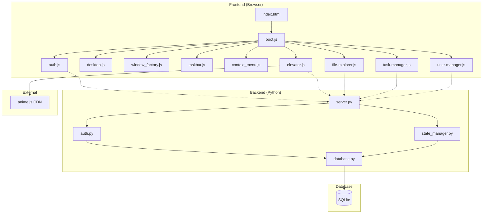
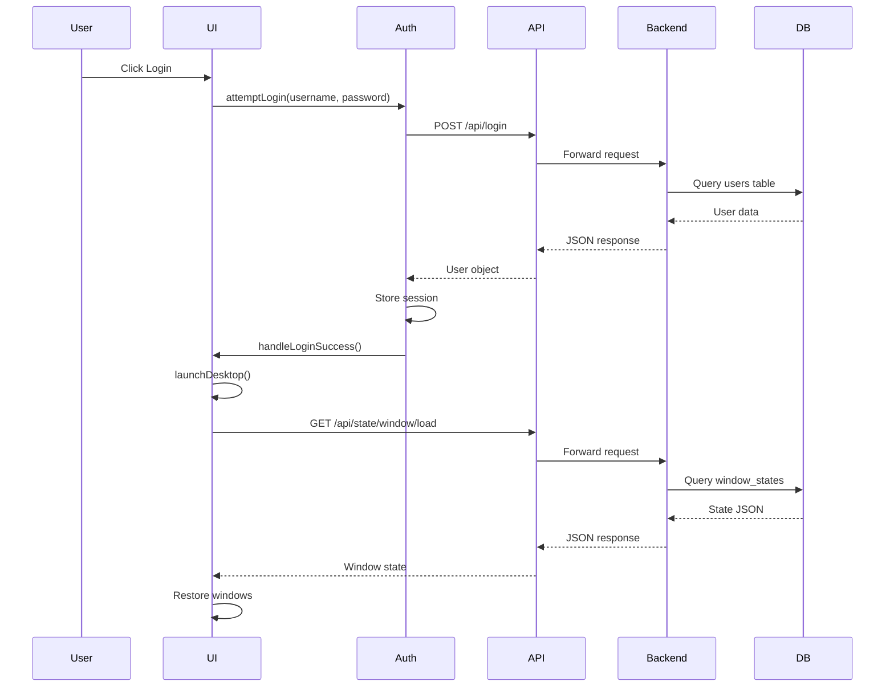
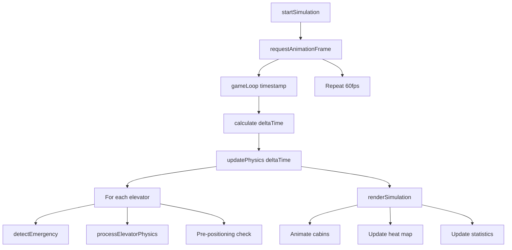
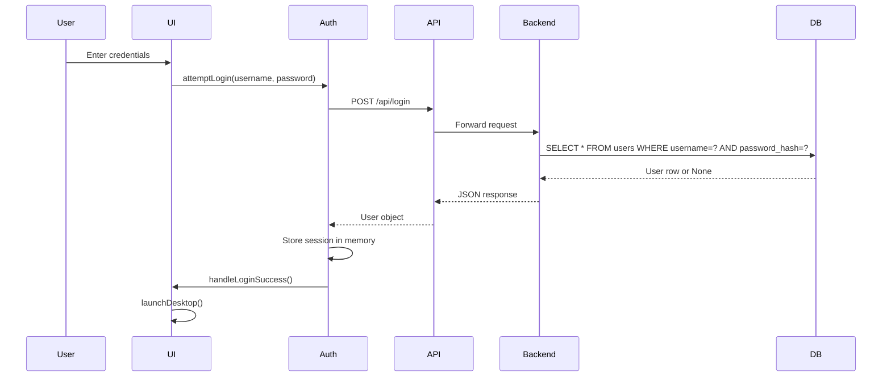
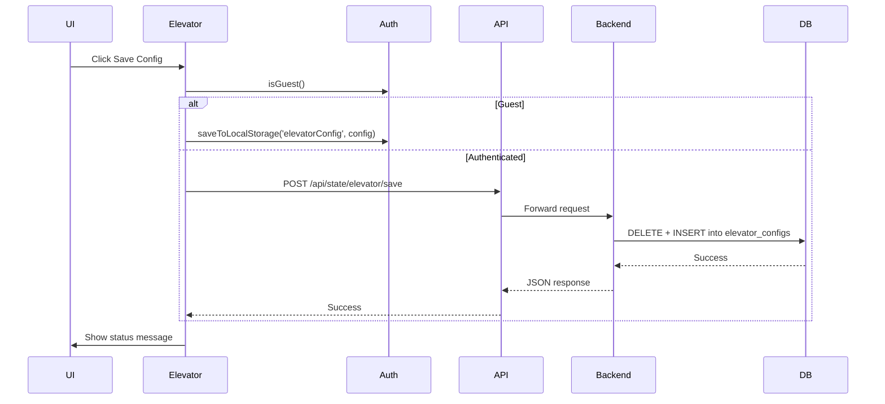
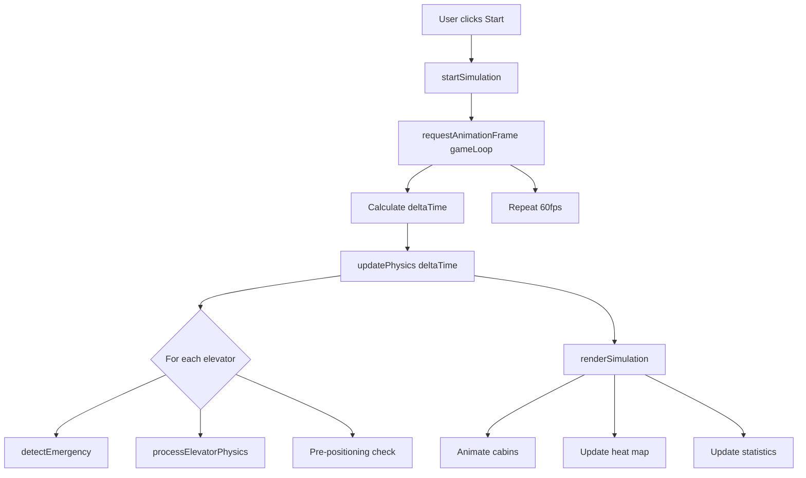
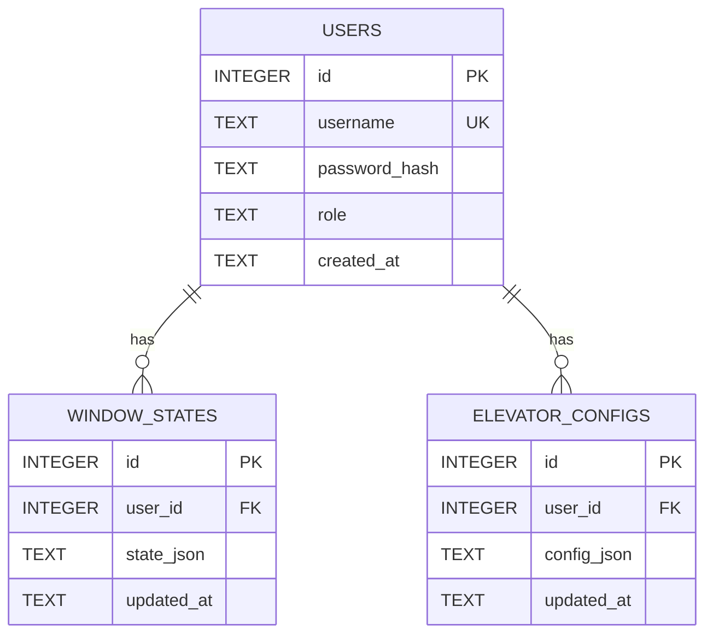

# Web OS Elevator Simulation

A comprehensive web-based operating system simulation featuring a realistic elevator dispatch system with real-time physics, LOOK/SCAN dispatch algorithms, and a complete desktop environment metaphor.

## Overview

This project demonstrates advanced front-end engineering techniques through a sophisticated elevator simulation that runs entirely in the browser. It implements industry-standard dispatch algorithms, accurate kinematics physics, fault detection systems, and a modular Web OS architecture supporting multiple applications.

**Business Purpose:** Educational and reference implementation for developers studying simulation algorithms, state management patterns, and real-time physics in web applications.

**Main Use Cases:**
- Studying LOOK/SCAN dispatch algorithms in elevator systems
- Learning real-time physics simulation with kinematics
- Understanding modular Web OS architecture patterns
- Reference implementation for state persistence strategies
- Demonstrating responsive UI design patterns

**Target Users:**
- Students and researchers studying elevator dispatch algorithms
- Frontend developers learning advanced JavaScript patterns
- System architects studying modular application design
- Developers interested in real-time simulation techniques

**Key Features:**
- Real-time physics simulation with acceleration/deceleration
- LOOK/SCAN dispatch algorithm with multi-criteria scoring
- Fault detection (overload, stuck) and manual recovery
- Heat map visualization of floor queue density
- ETA calculation and display
- Zoning algorithm for high-rise buildings
- Pre-positioning for idle elevators
- Passenger journey tooltips
- Responsive UI with breakpoint handling
- State persistence (localStorage + server)
- Desktop environment with window management
- User authentication (login/register/guest access)

---

## Features

### Elevator Simulation

- **Real-time Physics**: Accurate kinematics with acceleration, velocity, and position integration
- **LOOK/SCAN Dispatch**: Multi-criteria scoring algorithm for optimal elevator assignment
- **Fault Detection**: Automatic detection of overload and stuck conditions
- **Fault Recovery**: Manual reset buttons for faulted elevators
- **Heat Map**: Visual floor queue density indicator (amber/red coloring)
- **ETA Display**: Estimated time to reach next target floor
- **Zoning Algorithm**: Configurable zone-based dispatch for high-rise buildings
- **Pre-positioning**: Idle elevators automatically move to floors with most waiting passengers
- **Direction Indicators**: Visual arrows (▲/▼/●) on cabin displays
- **Passenger Tooltips**: Click passenger dots to view journey information
- **Responsive UI**: Adapts to different viewport sizes (< 900px hides stats panel)

### Web OS Shell

- **Desktop Environment**: Complete desktop metaphor with icons and windows
- **Window Management**: Create, move, minimize, close windows
- **Taskbar**: System controls (sleep, logout, shutdown)
- **Background Management**: Background images with sleep mode support
- **Context Menu**: Right-click menu system
- **Multiple Applications**: Extensible app framework

### Authentication

- **User Registration**: Create new user accounts
- **User Login**: Credential-based authentication
- **Guest Access**: Explore simulation without authentication
- **Role-based Access**: Admin, user, and guest roles
- **Session Management**: Session persistence across page refreshes

### State Persistence

- **LocalStorage**: Guest user state persistence
- **Server Persistence**: Authenticated user state via SQLite
- **Window States**: Save/restore desktop window layouts
- **Configuration**: Save/restore elevator simulation parameters
- **Auto-save**: Automatic state saving every 30 seconds

### User Management (Admin)

- **List Users**: View all registered users
- **Create Users**: Add new user accounts
- **Update Users**: Modify passwords and roles
- **Delete Users**: Remove user accounts

---

## System Architecture

The system follows a **modular monolith architecture** with a layered frontend and a simple Python backend.

### Architecture Diagram



### Component Responsibilities

**Frontend Layers:**

1. **Presentation Layer** (Desktop UI, Windows, Taskbar)
   - Manages user interactions
   - Renders desktop environment
   - Handles window lifecycle

2. **Application Layer** (Auth, App Loader, State Manager)
   - Manages user sessions
   - Loads application modules
   - Coordinates state persistence

3. **Business Logic Layer** (Elevator Simulation, File Explorer, Task Manager)
   - Implements domain logic
   - Runs physics simulation
   - Manages application state

4. **Data Access Layer** (LocalStorage, API Client, Event Bus)
   - Handles data persistence
   - Manages API communication
   - Coordinates event propagation

**Backend Components:**

- **HTTP Server** (`server.py`): Routes requests to handlers, implements CORS
- **Authentication Service** (`auth.py`): User registration, login, role management
- **State Manager** (`state_manager.py`): Window and elevator config persistence
- **Database** (`database.py`): SQLite connection and schema management

### Communication Paths

```
User Interaction → DOM Event → Event Handler → Business Logic → State Update → UI Render
                                                    ↓
                                              API Call (if authenticated)
                                                    ↓
                                              HTTP Request → Backend → Database
                                                    ↓
                                              Response → State Update → UI Render
```

### Data Flow



---

## How the System Works

### Application Startup

1. **DOMContentLoaded** fires in browser
2. **boot.js** initializes login screen
3. User enters credentials or clicks guest
4. **auth.js** calls API (or sets guest session)
5. On success: **animateLoginSuccess()** executes
6. **launchDesktop()** is called:
   - Get user defaults based on role
   - Initialize desktop, background, context menu
   - Create desktop icons for available apps
   - Initialize taskbar with system controls
   - Load saved window state from server/localStorage
   - Restore windows or launch default apps
   - Start auto-save timer (30s interval)
7. Application ready for user interaction

### Simulation Loop



### Request Lifecycle (Login)

1. User clicks Login button
2. **boot.js** validates inputs (username/password required)
3. **auth.attemptLogin(username, password)** is called
4. **fetch('POST /api/login', { body: credentials })** executes
5. **server.py** receives request
6. Routes to **handle_login()**
7. Calls **auth.login_user()**
8. Queries database for matching credentials
9. Returns user object or None
10. Server sends JSON response
11. **auth.js** receives response
12. On success: stores session, calls **handleLoginSuccess()**
13. **boot.js** launches desktop

---

## Project Structure

```
Bai-tap-lon-mon-js/
├── a/                          # Additional assets
├── apps/                       # Legacy app directory
│   ├── file-explorer/
│   │   └── file-explorer.js
│   ├── task-manager/
│   │   └── task-manager.js
│   └── user-manager/
│       └── user-manager.js
├── backend/                    # Python backend server
│   ├── __pycache__/           # Python bytecode cache
│   ├── backend/               # Backend package directory
│   ├── auth.py               # Authentication service
│   ├── database.py           # Database schema and connection
│   ├── server.py             # HTTP server and routing
│   └── state_manager.py      # State persistence service
├── src/                       # Source code directory
│   ├── apps/                  # Application modules
│   │   └── elevator/
│   │       └── elevator.js   # Main elevator simulation (2740 lines)
│   ├── sdk/                   # SDK utilities
│   │   └── event-bus.js      # Event communication
│   └── shell/                 # Web OS shell components
│       ├── assets/
│       │   └── styles.js      # Shared styles
│       ├── auth.js            # Frontend authentication
│       ├── boot.js            # Application bootstrap
│       ├── desktop/
│       │   ├── background-manager.js  # Background image management
│       │   ├── desktop-icons.js       # Desktop icon rendering
│       │   ├── desktop.js              # Desktop initialization
│       │   └── window_factory.js       # Window creation/management
│       ├── login-animation.js  # Login screen animations
│       └── system-ui/
│           ├── context-menu.js        # Right-click context menu
│           └── taskbar.js             # Taskbar controls
├── temp/                       # Temporary/build files
├── index.html                 # Entry point HTML
├── PROJECT_ANALYSIS.md        # Technical handover document
└── README.md                  # This file
```

### Directory Responsibilities

**`backend/`**: Python HTTP server providing REST API
- **Purpose**: Handle authentication and state persistence
- **Responsibilities**: API routing, user management, database operations
- **Key Files**: `server.py`, `auth.py`, `database.py`, `state_manager.py`

**`src/apps/elevator/`**: Elevator simulation application
- **Purpose**: Real-time elevator dispatch simulation
- **Responsibilities**: Physics simulation, dispatch algorithm, UI rendering, statistics
- **Dependencies**: `anime.js` (CDN), `../../shell/auth.js`
- **Key Files**: `elevator.js` (2740 lines, comprehensive simulation)

**`src/shell/`**: Web OS shell infrastructure
- **Purpose**: Desktop environment, window management, authentication
- **Responsibilities**: Desktop UI, window lifecycle, system controls
- **Dependencies**: ES6 modules, no external libraries
- **Key Files**: `boot.js`, `auth.js`, `desktop/desktop.js`, `desktop/window_factory.js`

**`src/sdk/`**: Shared utilities
- **Purpose**: Event communication between modules
- **Key Files**: `event-bus.js`

---

## Core Modules

### Authentication Module (`src/shell/auth.js`)

**Purpose**: Manage user sessions and authentication flow

**Responsibilities**:
- Store user session state
- Handle login/register API calls
- Persist state to localStorage (guest mode)
- Provide user information to other modules

**Internal Workflow**:
1. User enters credentials
2. Validate inputs
3. Call API endpoint
4. On success: store session in memory
5. On success: persist to localStorage (guest) or API (authenticated)
6. Provide user data to other modules

**Dependencies**: fetch API

**Interactions with Other Modules**:
- Called by `boot.js` for authentication
- Used by `elevator.js` for config persistence
- Used by `boot.js` for state loading

**Key Files**: `src/shell/auth.js`

**Important Functions**:
- `attemptLogin(username, password, onSuccess)`
- `attemptRegister(username, password, onSuccess)`
- `loginAsGuest(onSuccess)`
- `getCurrentUser()`
- `isGuest()`
- `saveToLocalStorage(key, value)`
- `loadFromLocalStorage(key)`

### Desktop Module (`src/shell/desktop/`)

**Purpose**: Provide desktop environment and window management

**Responsibilities**:
- Create desktop container
- Manage window z-index
- Handle desktop interactions
- Create and manage application windows

**Internal Workflow**:
1. Initialize desktop container
2. Load background image
3. Create desktop icons
4. Handle icon clicks to launch apps
5. Manage window lifecycle (create, move, minimize, close)

**Dependencies**: `background-manager.js`, `window_factory.js`

**Interactions with Other Modules**:
- Initialized by `boot.js`
- Uses `window_factory.js` to create windows
- Communicates with app modules for content

**Key Files**: 
- `desktop.js`
- `window_factory.js`
- `background-manager.js`
- `desktop-icons.js`

**Important Functions**:
- `initDesktop(container)`
- `create_single_app(desktop, appName)`
- `bringToFront(window)`

### Elevator Simulation Module (`src/apps/elevator/elevator.js`)

**Purpose**: Real-time elevator dispatch simulation with physics engine

**Responsibilities**:
- Real-time physics simulation (acceleration, velocity, position)
- Multi-criteria dispatch algorithm (LOOK/SCAN)
- Passenger generation with Gaussian weight distribution (50-130kg)
- Fault detection (overload, stuck) and recovery
- Statistics tracking and visualization
- Responsive UI with three-column layout
- Heat map visualization of floor queues
- ETA calculation and display
- Zoning algorithm for high-rise buildings
- Pre-positioning for idle elevators
- Passenger journey tooltips with fixed positioning
- Self-tests for dispatcher and sorting algorithms

**Internal Workflow**:
1. Initialize configuration and system state
2. Build three-column UI
3. Setup event listeners (resize with 50px threshold)
4. Load saved configuration
5. Start physics loop (60fps)
6. Render simulation every frame
7. Update statistics every second

**Dependencies**: `anime.js` (CDN), `../../shell/auth.js`

**Interactions with Other Modules**:
- Uses `auth.js` for config persistence
- Called by `boot.js` when app launched
- Communicates with backend API for config save/load

**Key Files**: `src/apps/elevator/elevator.js` (2740 lines)

**Important Functions**:
- `initElevatorSimulation(contentElement)` - Main entry point
- `dispatchElevator({ floor, direction })` - Assign elevator to request
- `sortTargetFloorsPure(elevator)` - Pure LOOK sorting function
- `calculateDispatchCostPure(elevator, floor, direction, config)` - Pure cost calculation
- `processElevatorPhysics(elevator, dtSec)` - Integrate motion
- `detectEmergency(elevatorId, deltaMs)` - Detect faults
- `renderSimulation()` - Update UI
- `updateCabinDots(elevatorId)` - Update passenger dots with optimization
- `showPassengerTooltip(anchorEl, passenger)` - Display journey info
- `renderFaultButtons()` - Render fault reset buttons with DOM guard
- `runConfigSelfTest(config)` - Behavioral self-tests

### Backend Server Module (`backend/server.py`)

**Purpose**: HTTP server providing REST API for authentication and state persistence

**Responsibilities**:
- Handle HTTP requests with routing table
- Implement CORS headers
- Route to appropriate handlers
- Return JSON responses

**Internal Workflow**:
1. Initialize database
2. Seed sample users
3. Create HTTPServer instance
4. Serve forever until KeyboardInterrupt

**Dependencies**: Standard library (http.server, json, urllib.parse)

**Interactions with Other Modules**:
- Called by frontend via fetch API
- Uses `auth.py` for authentication
- Uses `state_manager.py` for state operations
- Uses `database.py` for data persistence

**Key Files**: `backend/server.py`

**Important Functions**:
- `run_server(host, port)`
- `handle_request()` - Route requests
- `handle_register()` - User registration
- `handle_login()` - User authentication
- `handle_save_window()` - Save window state
- `handle_load_window()` - Load window state
- `handle_save_elevator()` - Save elevator config
- `handle_load_elevator()` - Load elevator config
- `handle_list_users()` - List all users (admin)
- `handle_admin_create_user()` - Create user (admin)
- `handle_admin_update_user()` - Update user (admin)
- `handle_admin_delete_user()` - Delete user (admin)

---

## File-Level Overview

### `index.html`

**Purpose**: Entry point HTML file that defines the application structure

**Responsibilities**:
- Define login screen and desktop screen containers
- Load external dependencies (anime.js CDN)
- Define CSS for login form and screen transitions
- Bootstrap the application via `boot.js`

**Key Functions**: None (HTML structure only)

**Inputs**: None

**Outputs**: DOM structure for application

**Dependencies**: 
- External: anime.js from cdnjs.cloudflare.com
- Internal: `./src/shell/boot.js`

**Usage in System Workflow**: First file loaded by browser, initializes application

**Related Files**: `src/shell/boot.js`

### `src/shell/boot.js`

**Purpose**: Application bootstrap that orchestrates the entire Web OS lifecycle

**Responsibilities**:
- Handle authentication flow (login, register, guest)
- Initialize desktop environment
- Launch applications based on user role
- Manage window state persistence
- Handle sleep mode, logout, shutdown

**Key Functions**:
- `launchDesktop()` - Initialize desktop after login
- `launchApp(desktop, appName)` - Launch application in window
- `handleLogout()` - Clean up and return to login
- `handleSleep()` - Enter sleep mode
- `handleShutdown()` - Shutdown application

**Inputs**: DOM elements, user credentials

**Outputs**: Desktop environment, application windows

**Dependencies**: All shell modules and app initializers

**Usage in System Workflow**: Main entry point after HTML loads

**Related Files**: `src/shell/auth.js`, `src/shell/desktop/desktop.js`

### `src/shell/auth.js`

**Purpose**: Frontend authentication module handling user sessions

**Responsibilities**:
- Manage user session state
- Handle login/register API calls
- Persist state to localStorage (guest mode)
- Provide user information to other modules

**Key Functions**:
- `attemptLogin(username, password, onSuccess)` - Authenticate user
- `attemptRegister(username, password, onSuccess)` - Register new user
- `loginAsGuest(onSuccess)` - Allow guest access
- `getCurrentUser()` - Get current user object
- `isGuest()` - Check if guest user
- `saveToLocalStorage(key, value)` - Persist to localStorage
- `loadFromLocalStorage(key)` - Load from localStorage

**Inputs**: Username, password, callbacks

**Outputs**: User object, success/failure status

**Dependencies**: fetch API

**Usage in System Workflow**: Called by boot.js for authentication

**Related Files**: `backend/auth.py`, `src/shell/boot.js`

### `src/apps/elevator/elevator.js`

**Purpose**: Comprehensive elevator simulation with physics engine and dispatch algorithm

**Responsibilities**:
- Real-time physics simulation (acceleration, velocity, position)
- Multi-criteria dispatch algorithm (LOOK/SCAN)
- Passenger generation with Gaussian weight distribution (50-130kg)
- Fault detection (overload, stuck) and recovery
- Statistics tracking and visualization
- Responsive UI with three-column layout
- Heat map visualization of floor queues
- ETA calculation and display
- Zoning algorithm for high-rise buildings
- Pre-positioning for idle elevators
- Passenger journey tooltips with fixed positioning
- Self-tests for dispatcher and sorting algorithms

**Key Functions**:
- `initElevatorSimulation(contentElement)` - Main entry point
- `dispatchElevator({ floor, direction })` - Assign elevator to request
- `sortTargetFloorsPure(elevator)` - Pure LOOK sorting function
- `calculateDispatchCostPure(elevator, floor, direction, config)` - Pure cost calculation
- `processElevatorPhysics(elevator, dtSec)` - Integrate motion
- `detectEmergency(elevatorId, deltaMs)` - Detect faults
- `renderSimulation()` - Update UI
- `updateCabinDots(elevatorId)` - Update passenger dots (optimized)
- `showPassengerTooltip(anchorEl, passenger)` - Display journey info
- `renderFaultButtons()` - Render fault reset buttons (DOM guard)
- `runConfigSelfTest(config)` - Behavioral self-tests

**Inputs**: Configuration parameters, user interactions

**Outputs**: Visual simulation, statistics, fault states

**Dependencies**: 
- External: anime.js (CDN)
- Internal: `../../shell/auth.js`

**Usage in System Workflow**: Called by boot.js when elevator app launched

**Related Files**: `src/shell/boot.js`, `backend/state_manager.py`

### `backend/server.py`

**Purpose**: Python HTTP server providing REST API

**Responsibilities**:
- Handle HTTP requests with routing table
- Implement CORS headers
- Route to appropriate handlers
- Return JSON responses

**Key Functions**:
- `run_server(host, port)` - Start HTTP server
- `handle_request()` - Route incoming requests
- `handle_register()` - User registration handler
- `handle_login()` - User authentication handler
- `handle_save_window()` - Save window state handler
- `handle_load_window()` - Load window state handler
- `handle_save_elevator()` - Save elevator config handler
- `handle_load_elevator()` - Load elevator config handler
- `handle_list_users()` - List users handler
- `handle_admin_create_user()` - Create user handler
- `handle_admin_update_user()` - Update user handler
- `handle_admin_delete_user()` - Delete user handler

**Inputs**: HTTP requests (POST, GET, PUT, DELETE)

**Outputs**: JSON responses

**Dependencies**: 
- Standard library: http.server, json, urllib.parse
- Internal: database, auth, state_manager

**Usage in System Workflow**: Handles all API requests from frontend

**Related Files**: `backend/auth.py`, `backend/state_manager.py`, `backend/database.py`

### `backend/auth.py`

**Purpose**: Authentication service handling user registration and login

**Responsibilities**:
- Hash passwords using SHA-256
- Register new users
- Authenticate login attempts
- List all users (admin)
- Create/update/delete users (admin)
- Seed sample users on startup

**Key Functions**:
- `register_user(username, password)` - Create new user
- `login_user(username, password)` - Authenticate user
- `list_users()` - Get all users
- `create_user(username, password, role)` - Create user (admin)
- `update_user(user_id, password, role)` - Update user (admin)
- `delete_user(user_id)` - Delete user (admin)
- `seed_users()` - Create sample users

**Inputs**: Username, password, role

**Outputs**: Success/failure status, user objects

**Dependencies**: 
- Standard library: hashlib, sqlite3
- Internal: database

**Usage in System Workflow**: Called by server.py for authentication operations

**Related Files**: `backend/server.py`, `backend/database.py`

### `backend/database.py`

**Purpose**: Database schema and connection management

**Responsibilities**:
- Initialize SQLite database
- Create tables (users, window_states, elevator_configs)
- Provide database connection
- Handle migrations

**Key Functions**:
- `get_db_connection()` - Get database connection
- `initialize_database()` - Create tables
- `_migrate_add_role_column()` - Add role column migration

**Inputs**: None

**Outputs**: Database connection object

**Dependencies**: Standard library: sqlite3

**Usage in System Workflow**: Used by all backend modules for data persistence

**Related Files**: `backend/auth.py`, `backend/state_manager.py`

### `backend/state_manager.py`

**Purpose**: State persistence service for window layouts and elevator configurations

**Responsibilities**:
- Save window state to database
- Load window state from database
- Save elevator configuration to database
- Load elevator configuration from database

**Key Functions**:
- `save_window_state(user_id, state)` - Save window layout
- `load_window_state(user_id)` - Load window layout
- `save_elevator_config(user_id, config)` - Save elevator config
- `load_elevator_config(user_id)` - Load elevator config

**Inputs**: User ID, state/config objects

**Outputs**: Success/failure status, state/config objects

**Dependencies**: 
- Standard library: sqlite3, json
- Internal: database

**Usage in System Workflow**: Called by server.py for state operations

**Related Files**: `backend/server.py`, `backend/database.py`

---

## Data Flow

### Authentication Flow



### Configuration Save Flow



### Simulation Loop Flow



---

## Database

### Database Technology

**DBMS:** SQLite 3

**File Location:** `backend/data.db`

### Schema Overview

Three main tables:
- `users` - User authentication and roles
- `window_states` - Desktop window layout persistence
- `elevator_configs` - Elevator simulation configuration persistence

### Tables

#### Users Table

```sql
CREATE TABLE users (
    id INTEGER PRIMARY KEY AUTOINCREMENT,
    username TEXT UNIQUE NOT NULL,
    password_hash TEXT NOT NULL,
    role TEXT DEFAULT 'user',
    created_at TEXT DEFAULT (datetime('now', 'localtime'))
);
```

**Purpose:** Store user authentication credentials and roles

**Fields:**
- `id`: Primary key, auto-increment
- `username`: Unique identifier for login
- `password_hash`: SHA-256 hashed password
- `role`: User role ('admin', 'user')
- `created_at`: Timestamp of account creation

**Constraints:**
- PRIMARY KEY on id
- UNIQUE on username
- NOT NULL on username, password_hash
- DEFAULT on role, created_at

#### Window States Table

```sql
CREATE TABLE window_states (
    id INTEGER PRIMARY KEY AUTOINCREMENT,
    user_id INTEGER NOT NULL,
    state_json TEXT NOT NULL,
    updated_at TEXT DEFAULT (datetime('now', 'localtime')),
    FOREIGN KEY (user_id) REFERENCES users (id) ON DELETE CASCADE
);
```

**Purpose:** Persist desktop window layout and state per user

**Fields:**
- `id`: Primary key, auto-increment
- `user_id`: Foreign key to users
- `state_json`: JSON string containing window positions, sizes, states
- `updated_at`: Timestamp of last update

**Constraints:**
- PRIMARY KEY on id
- FOREIGN KEY to users with CASCADE delete
- NOT NULL on user_id, state_json
- DEFAULT on updated_at

#### Elevator Configs Table

```sql
CREATE TABLE elevator_configs (
    id INTEGER PRIMARY KEY AUTOINCREMENT,
    user_id INTEGER NOT NULL,
    config_json TEXT NOT NULL,
    updated_at TEXT DEFAULT (datetime('now', 'localtime')),
    FOREIGN KEY (user_id) REFERENCES users (id) ON DELETE CASCADE
);
```

**Purpose:** Persist elevator simulation configuration per user

**Fields:**
- `id`: Primary key, auto-increment
- `user_id`: Foreign key to users
- `config_json`: JSON string containing simulation parameters
- `updated_at`: Timestamp of last update

**Constraints:**
- PRIMARY KEY on id
- FOREIGN KEY to users with CASCADE delete
- NOT NULL on user_id, config_json
- DEFAULT on updated_at

### Relationships



### Indexes

- Primary keys auto-indexed by SQLite
- Username UNIQUE constraint creates index
- Foreign key constraints for referential integrity

### Constraints

- NOT NULL on required fields
- UNIQUE on username
- FOREIGN KEY with CASCADE delete
- DEFAULT values for timestamps and role

### Migrations

Simple migration function `_migrate_add_role_column()` adds role column to existing databases for backward compatibility.

### Normalization

- **1NF:** ✅ Satisfied - All atomic values, no repeating groups
- **2NF:** ✅ Satisfied - All non-key attributes fully dependent on primary key
- **3NF:** ✅ Satisfied - No transitive dependencies
- **BCNF:** ✅ Satisfied - No non-trivial multivalued dependencies

---

## API Documentation

### POST /api/register

**Purpose:** Register a new user account

**Request:**
```json
{
  "username": "string (required)",
  "password": "string (required)"
}
```

**Response:**
```json
{
  "success": boolean,
  "message": "string"
}
```

**Authentication:** None

**Validation Rules:**
- Username must be unique
- Username and password required
- Password hashed with SHA-256

**Business Logic:**
1. Hash password with SHA-256
2. Insert into users table
3. Return success or error message

**Error Handling:**
- 400: Duplicate username
- 500: Database error

### POST /api/login

**Purpose:** Authenticate user with credentials

**Request:**
```json
{
  "username": "string (required)",
  "password": "string (required)"
}
```

**Response:**
```json
{
  "success": boolean,
  "user_id": number,
  "username": "string",
  "role": "string"
}
```

**Authentication:** None

**Validation Rules:**
- Username and password required
- Credentials must match database

**Business Logic:**
1. Hash password with SHA-256
2. Query users table for matching credentials
3. Return user data if found, error otherwise

**Error Handling:**
- 401: Invalid credentials
- 500: Database error

### GET /api/admin/users

**Purpose:** List all users (admin only)

**Request:** Query params: none

**Response:**
```json
{
  "success": boolean,
  "users": [
    {
      "id": number,
      "username": "string",
      "role": "string",
      "created_at": "string"
    }
  ]
}
```

**Authentication:** Not enforced (TODO)

**Validation Rules:** None

**Business Logic:**
1. Query all users from database
2. Return user list

**Error Handling:**
- 500: Database error

### POST /api/admin/users

**Purpose:** Create new user (admin only)

**Request:**
```json
{
  "username": "string (required)",
  "password": "string (required)",
  "role": "string (default: 'user')"
}
```

**Response:**
```json
{
  "success": boolean,
  "message": "string"
}
```

**Authentication:** Not enforced (TODO)

**Validation Rules:**
- Username must be unique
- Password required

**Business Logic:**
1. Hash password
2. Insert into users table with role

**Error Handling:**
- 400: Duplicate username
- 500: Database error

### PUT /api/admin/users

**Purpose:** Update user password or role (admin only)

**Request:**
```json
{
  "user_id": number (required),
  "password": "string (optional)",
  "role": "string (optional)
}
```

**Response:**
```json
{
  "success": boolean,
  "message": "string"
}
```

**Authentication:** Not enforced (TODO)

**Validation Rules:**
- user_id required
- At least one of password or role required

**Business Logic:**
1. If password provided: hash and update
2. If role provided: update role
3. Return success or error

**Error Handling:**
- 400: Invalid request
- 500: Database error

### DELETE /api/admin/users

**Purpose:** Delete user (admin only)

**Request:**
```json
{
  "user_id": number (required)
}
```

**Response:**
```json
{
  "success": boolean,
  "message": "string"
}
```

**Authentication:** Not enforced (TODO)

**Validation Rules:**
- user_id required

**Business Logic:**
1. Delete user from database
2. CASCADE deletes associated states

**Error Handling:**
- 400: Invalid request
- 500: Database error

### POST /api/state/window/save

**Purpose:** Save window layout state for user

**Request:**
```json
{
  "user_id": number (required),
  "state": array/object (required)
}
```

**Response:**
```json
{
  "success": boolean
}
```

**Authentication:** Not enforced (TODO)

**Validation Rules:**
- user_id required
- state required

**Business Logic:**
1. Serialize state to JSON
2. Delete existing state for user
3. Insert new state record

**Error Handling:**
- 500: Database error

### GET /api/state/window/load

**Purpose:** Load saved window layout state

**Request:** Query params: user_id (number, required)

**Response:**
```json
{
  "success": boolean,
  "state": object/array
}
```

**Authentication:** Not enforced (TODO)

**Validation Rules:**
- user_id required

**Business Logic:**
1. Query most recent state for user
2. Deserialize JSON
3. Return state object

**Error Handling:**
- 400: Invalid user_id
- 500: Database error

### POST /api/state/elevator/save

**Purpose:** Save elevator simulation configuration

**Request:**
```json
{
  "user_id": number (required),
  "config": object (required)
}
```

**Response:**
```json
{
  "success": boolean
}
```

**Authentication:** Not enforced (TODO)

**Validation Rules:**
- user_id required
- config required

**Business Logic:**
1. Serialize config to JSON
2. Delete existing config for user
3. Insert new config record

**Error Handling:**
- 500: Database error

### GET /api/state/elevator/load

**Purpose:** Load saved elevator configuration

**Request:** Query params: user_id (number, required)

**Response:**
```json
{
  "success": boolean,
  "config": object
}
```

**Authentication:** Not enforced (TODO)

**Validation Rules:**
- user_id required

**Business Logic:**
1. Query most recent config for user
2. Deserialize JSON
3. Return config object

**Error Handling:**
- 400: Invalid user_id
- 500: Database error

---

## Configuration

### Frontend Configuration

Located in `getDefaultSimConfig()` function in `elevator.js`:

| Variable | Required | Default | Description |
| -------- | -------- | ------- | ----------- |
| totalFloors | Yes | 20 | Number of floors in building (5-40) |
| elevatorCount | Yes | 3 | Number of elevators (1-6) |
| maxLoad | Yes | 800 | Maximum elevator load in kg |
| maxAcceleration | Yes | 1.0 | Maximum acceleration in fl/s² |
| maxVelocity | Yes | 2.5 | Maximum velocity in fl/s |
| doorOpenTime | Yes | 2000 | Door open time in ms |
| doorCloseTime | Yes | 1500 | Door close time in ms |
| spawnRate | Yes | 3000 | Passenger spawn rate in ms |
| simSpeed | Yes | 1 | Simulation speed multiplier (1, 2, 5, 10) |
| enableZoning | Yes | false | Enable zoning algorithm |

### Backend Configuration

Hardcoded in `server.py`:

| Variable | Required | Default | Description |
| -------- | -------- | ------- | ----------- |
| host | Yes | localhost | Server host address |
| port | Yes | 8000 | Server port |
| db_path | Yes | backend/data.db | SQLite database file path |

### Frontend Constants

Located in `elevator.js`:

| Variable | Value | Description |
| -------- | ----- | ----------- |
| BACKEND_URL | http:
| CONFIG_STORAGE_KEY | elevatorConfig | localStorage key for config |
| FLOOR_HEIGHT_PX | 36 | Pixel height per floor |
| STATS_UPDATE_MS | 1000 | Statistics refresh interval |
| STUCK_THRESHOLD_MS | 5000 | Time before stuck fault |
| OVERLOAD_FAULT_RATIO | 1.1 | Load threshold for fault |
| CHART_HISTORY_MAX | 60 | Max data points in chart |
| WRONG_DIRECTION_PENALTY | 8 | Dispatch cost penalty |
| OVERLOAD_PENALTY | 15 | Dispatch cost penalty |
| SAME_DIRECTION_BONUS | 3 | Dispatch cost bonus |
| PASSENGER_DOT_SIZE | 6 | Visual size of passenger dots |

---

## Installation

### Prerequisites

- Python 3.x installed
- Modern web browser with ES6 support (Chrome, Firefox, Edge, Safari)
- Node.js not required (pure Python backend)

### Dependencies

**Frontend:**
- anime.js (loaded from CDN: cdnjs.cloudflare.com/ajax/libs/animejs/3.2.1/anime.min.js)

**Backend:**
- Python standard library only (no external dependencies)

### Clone Repository

```bash
git clone <repository-url>
cd Bai-tap-lon-mon-js
```

### Install Packages

No package installation required for frontend (pure ES6 modules).

No package installation required for backend (Python standard library only).

### Configure Environment

No environment configuration required. Backend URL is hardcoded in `elevator.js`:

```javascript
const BACKEND_URL = 'http:
```

To change backend URL, update this constant in `src/apps/elevator/elevator.js`.

### Database Setup

Database is automatically created on first backend run:

```bash
cd backend
python server.py
```

This will:
1. Create `backend/data.db` if it doesn't exist
2. Initialize tables (users, window_states, elevator_configs)
3. Run migration to add role column if needed
4. Seed sample users (admin/admin, user/user)

### Run Application

**Start Backend:**
```bash
cd backend
python server.py
```

Backend will start on `http:

**Start Frontend:**
Open `index.html` in web browser:
```bash
# Method 1: Double-click index.html
# Method 2: Open in browser from command line
start index.html  # Windows
open index.html   # macOS
xdg-open index.html  # Linux
```

### Verify Installation

1. Backend should show: "Server running at http:
2. Frontend should show login screen
3. Test login with credentials:
   - Admin: username `admin`, password `admin`
   - User: username `user`, password `user`
4. Test guest access by clicking "Guest" button
5. Launch Elevator Simulation app
6. Click Start to begin simulation
7. Verify physics animation and statistics updates

---

## Running the Project

### Development Mode

**Backend:**
```bash
cd backend
python server.py
```

**Frontend:**
Open `index.html` in browser. No build process required.

**Hot Reload:**
- Backend: Restart server after code changes
- Frontend: Refresh browser after code changes

### Production Mode

Same as development mode. No separate production configuration.

### Docker Mode

Not implemented (manual deployment only).

### Containerized Deployment

Not implemented.

### Cloud Deployment

Not implemented.

### CI/CD Execution

Not implemented.

---

## Testing

### Unit Tests

**Not implemented** - No automated unit tests.

**Manual Testing:**
- Self-test function `runConfigSelfTest()` in elevator.js
- Tests 8 configuration validations:
  - validateSimConfig
  - createSystemState
  - floorQueues
  - decelDistance
  - timeToTop
  - dispatcherSelectsNearest (uses pure calculateDispatchCostPure)
  - sortTargetFloorsLookUp (uses pure sortTargetFloorsPure)
  - sortTargetFloorsLookDown (uses pure sortTargetFloorsPure)
- Runs on simulation initialization

### Integration Tests

**Not implemented** - No automated integration tests.

**Manual Testing:**
- Test authentication flow (login, register, guest)
- Test state persistence (save/load)
- Test API endpoints manually

### E2E Tests

**Not implemented** - No automated E2E tests.

**Manual Testing:**
- Full user journey: login → use apps → logout
- Elevator simulation: configure → run → observe → save

### Coverage

**Not measured** - No coverage tracking.

### Test Commands

No automated test commands.

### Test Structure

No test directory structure.

---

## Logging & Monitoring

### Logging System

**Frontend:**
- Console.log for debugging
- Event log system in elevator simulation (visible in UI)
- Error handlers for unhandled errors

**Backend:**
- Print statements for server logs
- HTTP request logging in `log_message()` function
- Error logging with try-catch blocks

### Error Tracking

No centralized error tracking system.

### Monitoring

Not implemented - No health checks, metrics, or alerting.

---

## Security

### Authentication

- Password hashing with SHA-256
- Session storage in memory (frontend)
- No session tokens or JWT
- No session expiration

### Authorization

- Role-based access control (admin, user, guest)
- Admin endpoints not protected by authentication middleware (TODO)

### Encryption

- Passwords hashed with SHA-256 (not bcrypt/argon2)
- No HTTPS (HTTP only)
- Credentials transmitted in plain text

### Input Validation

- Frontend: Basic validation (required fields)
- Backend: Limited validation
- SQL injection prevention via parameterized queries

### Security Considerations

**Known Issues:**
- No HTTPS - credentials transmitted in plain text
- No session tokens - no session management after login
- No rate limiting - vulnerable to brute force attacks
- No CSRF protection - no CSRF tokens on forms
- CORS wide open - allows all origins
- No password complexity requirements
- No account lockout - no protection against brute force
- Admin endpoints not protected by authentication

**Recommendations:**
- Implement HTTPS with reverse proxy (nginx)
- Add JWT or session-based authentication
- Implement rate limiting
- Add CSRF tokens
- Restrict CORS origins
- Add password strength requirements
- Add account lockout after N failed attempts
- Add authentication middleware for admin endpoints

---

## Performance

### Caching

- LocalStorage for guest users
- In-memory state during session
- No server-side caching

### Optimization Strategies

- RequestAnimationFrame for smooth 60fps animation
- Debounced resize handlers (200ms)
- Efficient DOM updates (batch operations)
- Passenger dots only rebuild when count changes (optimization)
- Resize handler only rebuilds when width changes ≥ 50px (optimization)
- Pure functions for algorithm testing (no side effects)

### Database Tuning

- SQLite with row factory for dictionary-like access
- Foreign key constraints with CASCADE delete
- No connection pooling (new connection per request)

### Concurrency Handling

- Single-threaded Python HTTP server
- No async processing
- No connection pooling
- No load balancing

---

## Troubleshooting

### Symptom: Backend won't start

**Cause:** Port 8000 already in use

**Solution:**
```bash
# Find process using port 8000 (Windows)
netstat -ano | findstr :8000
# Kill process
taskkill /PID <PID> /F

# Or change port in server.py
```

**Verification:** Server starts successfully

---

### Symptom: Login fails with "Invalid credentials"

**Cause:** Incorrect username/password or database not initialized

**Solution:**
1. Verify credentials: admin/admin or user/user
2. Check if backend is running
3. Check browser console for API errors
4. Verify database exists at `backend/data.db`

**Verification:** Login succeeds with correct credentials

---

### Symptom: Elevator simulation not animating

**Cause:** anime.js not loaded or JavaScript error

**Solution:**
1. Check browser console for errors
2. Verify anime.js CDN is accessible
3. Check if `getAnime()` returns null
4. Verify simulation is started (click Start button)

**Verification:** Animation runs smoothly at 60fps

---

### Symptom: Configuration not saving

**Cause:** Backend not running or API error

**Solution:**
1. Verify backend is running on port 8000
2. Check browser console for API errors
3. Verify user is authenticated (not guest)
4. Check network tab for failed requests

**Verification:** Configuration saves and loads correctly

---

### Symptom: Window state not restoring

**Cause:** Database error or API failure

**Solution:**
1. Verify backend is running
2. Check if user has saved state
3. Check browser console for errors
4. Verify database has window_states table

**Verification:** Windows restore to previous positions

---

### Symptom: Passenger dots not clickable

**Cause:** Click listeners not attached after rebuild

**Solution:**
1. This should be fixed with the optimization (only rebuild when count changes)
2. If issue persists, check `updateCabinDots()` function
3. Verify click listeners are attached in the function

**Verification:** Clicking passenger dots shows tooltip

---

### Symptom: Tooltip positioning incorrect

**Cause:** Using position:absolute instead of position:fixed

**Solution:**
1. This should be fixed with position:fixed
2. If issue persists, check `showPassengerTooltip()` function
3. Verify CSS uses position:fixed

**Verification:** Tooltip appears at correct position in scroll/iframe contexts

---

## Development Guide

### Coding Standards

- ES6+ JavaScript for frontend
- Python 3.x for backend
- Use const/let instead of var
- Use arrow functions for callbacks
- Use template literals for string interpolation
- Follow existing code style in each file

### Folder Conventions

- `src/` - Source code
- `src/apps/` - Application modules
- `src/shell/` - Web OS shell components
- `backend/` - Python backend
- Use lowercase with hyphens for file names

### Naming Conventions

- JavaScript: camelCase for variables/functions, PascalCase for classes
- Python: snake_case for variables/functions, PascalCase for classes
- Constants: UPPER_SNAKE_CASE
- File names: lowercase-with-hyphens

### Git Workflow

Not formally defined. Use standard Git workflow:
- main branch for stable code
- feature branches for new features
- Pull requests for code review

### Branching Strategy

Not formally defined. Suggested:
- `main` - Production code
- `develop` - Development code
- `feature/*` - Feature branches
- `bugfix/*` - Bug fixes

### Pull Request Process

Not formally defined. Suggested:
1. Create feature branch
2. Make changes
3. Test thoroughly
4. Create pull request
5. Code review
6. Merge to main

---

## Extending the System

### Add a New Feature to Elevator Simulation

1. Open `src/apps/elevator/elevator.js`
2. Add configuration parameter to `getDefaultSimConfig()`
3. Add UI control in `buildControlPanel()`
4. Implement logic in appropriate function (physics, dispatch, rendering)
5. Update `PHASE6_CHECKLIST` if needed
6. Test thoroughly

**Example:** Add new dispatch algorithm
```javascript

function getDefaultSimConfig() {
    return {
        
        dispatchAlgorithm: 'LOOK' 
    };
}


function buildControlPanel(container) {
    
    const algoSelect = document.createElement('select');
    algoSelect.addEventListener('change', (e) => {
        updateConfig({ dispatchAlgorithm: e.target.value });
    });
}


function dispatchElevator({ floor, direction }) {
    if (simConfig.dispatchAlgorithm === 'LOOK') {
        
    } else if (simConfig.dispatchAlgorithm === 'FCFS') {
        
    }
}
```

### Add a New API Endpoint

1. Open `backend/server.py`
2. Add route to ROUTES dictionary
3. Implement handler function
4. Add business logic in appropriate module
5. Test with curl or Postman

**Example:** Add user statistics endpoint
```python
# 1. Add route
ROUTES = {
    # ... existing routes
    ('GET', '/api/admin/stats'): handle_get_stats,
}

# 2. Implement handler
def handle_get_stats(self):
    try:
        stats = get_user_statistics()
        self.send_json_response(200, {'success': True, 'stats': stats})
    except Exception as e:
        self.send_json_response(500, {'success': False, 'message': str(e)})

# 3. Implement business logic in auth.py or new module
def get_user_statistics():
    conn = get_db_connection()
    cursor = conn.cursor()
    cursor.execute('SELECT COUNT(*) FROM users')
    total_users = cursor.fetchone()[0]
    conn.close()
    return {'total_users': total_users}
```

### Add a New Database Table

1. Open `backend/database.py`
2. Add CREATE TABLE statement to `initialize_database()`
3. Add migration function if needed
4. Restart backend to apply changes

**Example:** Add user activity log table
```python
def initialize_database():
    conn = get_db_connection()
    cursor = conn.cursor()
    
    # ... existing tables
    
    cursor.execute('''
        CREATE TABLE IF NOT EXISTS user_activity (
            id INTEGER PRIMARY KEY AUTOINCREMENT,
            user_id INTEGER NOT NULL,
            action TEXT NOT NULL,
            timestamp TEXT DEFAULT (datetime('now', 'localtime')),
            FOREIGN KEY (user_id) REFERENCES users (id) ON DELETE CASCADE
        )
    ''')
    
    conn.commit()
    conn.close()
```

### Add a New Service

1. Create new Python file in `backend/`
2. Implement service logic
3. Import in `server.py`
4. Add routes to use service

**Example:** Add notification service
```python
# backend/notification.py
def send_notification(user_id, message):
    # Implement notification logic
    pass

# server.py
from notification import send_notification

def handle_send_notification(self):
    # Use notification service
    send_notification(user_id, message)
```

### Add a New UI Page

1. Create new app module in `src/apps/`
2. Implement `init[AppName](contentElement)` function
3. Add app to `boot.js` launch logic
4. Add desktop icon in `boot.js`

**Example:** Add settings app
```javascript

export function initSettings(contentElement) {
    contentElement.innerHTML = '<h1>Settings</h1>';
    
}


import { initSettings } from '../../apps/settings/settings.js';

function launchApp(desktop, appName) {
    if (appName === 'settings') {
        initSettings(contentElement);
    }
    
}
```

### Add a New Module to Shell

1. Create new file in `src/shell/`
2. Export functions/classes
3. Import in `boot.js` or other modules
4. Integrate into workflow

**Example:** Add notification module
```javascript

export function showNotification(message) {
    
}


import { showNotification } from './notifications.js';


showNotification('Welcome!');
```

---

## Deployment Guide

### Infrastructure Requirements

**Minimum:**
- Python 3.x
- Web browser with ES6 support
- 100MB disk space
- 512MB RAM

**Recommended:**
- Python 3.8+
- Modern browser (Chrome, Firefox, Edge)
- 1GB disk space
- 1GB RAM

### Scaling Recommendations

**Current Limitations:**
- Single-threaded Python server
- SQLite database (not suitable for high concurrency)
- No horizontal scaling
- No load balancing

**Scaling Strategy:**
1. Replace Python HTTP server with production server (Gunicorn, uWSGI)
2. Replace SQLite with PostgreSQL for better concurrency
3. Add load balancer (nginx) for multiple backend instances
4. Add Redis for caching and session storage
5. Add CDN for static assets

### Docker Deployment

Not currently implemented. Suggested Dockerfile:

```dockerfile
# Multi-stage build for Python backend
FROM python:3.9-slim as backend
WORKDIR /app
COPY backend/ ./backend/
RUN pip install --no-cache-dir gunicorn
EXPOSE 8000
CMD ["gunicorn", "server:app"]

# Nginx for static files and reverse proxy
FROM nginx:alpine
COPY --from=backend /app /app
COPY nginx.conf /etc/nginx/nginx.conf
COPY index.html /usr/share/nginx/html/
COPY src/ /usr/share/nginx/html/src/
EXPOSE 80
```

### Kubernetes Deployment

Not currently implemented. Would require:
- Containerization (Docker)
- Kubernetes manifests
- ConfigMaps for configuration
- Secrets for sensitive data
- Service definitions
- Ingress configuration

### Reverse Proxy Setup

Suggested nginx configuration:

```nginx
server {
    listen 80;
    server_name example.com;
    
    location / {
        root /var/www/html;
        index index.html;
    }
    
    location /api/ {
        proxy_pass http:
        proxy_set_header Host $host;
        proxy_set_header X-Real-IP $remote_addr;
    }
}
```

### SSL Configuration

Suggested using Let's Encrypt with Certbot:

```bash
sudo apt-get install certbot python3-certbot-nginx
sudo certbot --nginx -d example.com
```

### Backup Strategy

**Database Backup:**
```bash
# Manual backup
cp backend/data.db backup/data.db.$(date +%Y%m%d)

# Automated backup (cron)
0 2 * * * cp /path/to/backend/data.db /backup/data.db.$(date +\%Y\%m\%d)
```

**User Data Backup:**
- Authenticated users: Backed up with database
- Guest users: Not backed up (localStorage only)

---

## Known Limitations

### Current Constraints

- Single-threaded Python HTTP server
- SQLite database (not suitable for high concurrency)
- No automated testing
- No CI/CD pipeline
- No monitoring or alerting
- No HTTPS (HTTP only)
- No session tokens
- No rate limiting

### Technical Debt

- API Authentication: Admin endpoints lack authentication middleware
- Error Handling: Inconsistent error handling across modules
- Code Duplication: Some repeated patterns in UI construction
- Magic Numbers: Some hardcoded values without constants
- Global State: Some global variables in elevator simulation
- Callback Hell: Some nested callback chains in auth module
- Mixed Concerns: Some UI logic mixed with business logic
- Large File Size: elevator.js is 2740 lines (should be split)

### Scalability Concerns

- SQLite limitations for high-concurrency scenarios
- No horizontal scaling (single server instance)
- No load balancing
- No caching layer (Redis)
- No message queue for async processing

### Future Improvements

- Implement API authentication middleware
- Add HTTPS support with SSL
- Add input validation library
- Split elevator.js into modules (physics.js, dispatch.js, ui.js, config.js)
- Add automated tests (Jest for frontend, pytest for backend)
- Implement rate limiting
- Add TypeScript for type safety
- Add error recovery with exponential backoff
- Add monitoring and logging
- Optimize database with connection pooling
- Add linting (ESLint, Pylint)
- Add code formatting (Prettier, Black)
- Generate OpenAPI/Swagger documentation
- Add password complexity requirements
- Add account lockout mechanism

---

## FAQ

### New Developers

**Q: How do I run the project locally?**
A: 
1. Start backend: `cd backend && python server.py`
2. Open `index.html` in browser
3. Login with admin/admin or user/user, or click Guest

**Q: Where is the main simulation logic?**
A: `src/apps/elevator/elevator.js` (2740 lines) contains all simulation logic including physics, dispatch, and UI rendering.

**Q: How do I add a new configuration parameter?**
A: 
1. Add to `getDefaultSimConfig()` in elevator.js
2. Add UI control in `buildControlPanel()`
3. Implement logic in appropriate function
4. Update `PHASE6_CHECKLIST` if needed

**Q: Why are there two versions of dispatch cost calculation?**
A: `calculateDispatchCostPure` is a pure function at module scope for testability. `calculateDispatchCost` is the closure version that includes zoning logic and accesses simConfig.

### Maintainers

**Q: How do I deploy to production?**
A: Currently manual deployment only. Recommended: Use nginx as reverse proxy with SSL, replace Python HTTP server with Gunicorn, migrate to PostgreSQL for better concurrency.

**Q: How do I backup user data?**
A: Backup `backend/data.db` file. Guest user data is in localStorage and not backed up.

**Q: How do I reset the database?**
A: Delete `backend/data.db` and restart backend. Database will be recreated with seed users.

### DevOps Engineers

**Q: Can this run in Docker?**
A: Not currently implemented, but Dockerfile suggested in deployment guide.

**Q: What ports need to be open?**
A: Port 8000 for backend API. Port 80/443 for nginx if using reverse proxy.

**Q: How do I scale this application?**
A: Replace Python HTTP server with Gunicorn, migrate to PostgreSQL, add load balancer, implement caching with Redis.

### Contributors

**Q: What coding standards should I follow?**
A: ES6+ for JavaScript, Python 3.x for backend. Follow existing code style in each file.

**Q: How do I add a new app to the Web OS?**
A: 
1. Create app module in `src/apps/`
2. Implement `init[AppName](contentElement)` function
3. Add to `boot.js` launch logic
4. Add desktop icon in `boot.js`

**Q: How do I run tests?**
A: No automated tests currently. Manual testing via `runConfigSelfTest()` in elevator.js which runs on initialization.

---

## Conclusion

The Web OS Elevator Simulation is a comprehensive demonstration of advanced front-end engineering techniques, featuring a realistic physics simulation with industry-standard dispatch algorithms and a complete desktop environment metaphor.

**System Architecture:**
- **Frontend:** Modular ES6 architecture with clear separation of concerns (Presentation, Application, Business Logic, Data Access layers)
- **Backend:** Simple Python HTTP server with routing table, authentication service, and SQLite database
- **Communication:** REST API with JSON responses, CORS-enabled for cross-origin requests
- **State Management:** LocalStorage for guests, SQLite for authenticated users, in-memory state during session

**Main Modules:**
- **Shell System:** Desktop environment, window management, authentication (`boot.js`, `auth.js`, `desktop/`)
- **Elevator Simulation:** Physics engine, LOOK/SCAN dispatch algorithm, fault detection (`elevator.js` with pure functions for testability)
- **Backend Services:** HTTP server, authentication, state persistence, database (`server.py`, `auth.py`, `state_manager.py`, `database.py`)

**Operational Flow:**
1. User loads `index.html` → `boot.js` initializes login screen
2. User authenticates → `launchDesktop()` initializes desktop environment
3. User launches app → `init[AppName]()` initializes application
4. Elevator simulation runs 60fps physics loop with `requestAnimationFrame`
5. State auto-saves every 30 seconds
6. API calls for authenticated users persist to SQLite

**Critical Implementation Details:**
- **Pure Functions:** `sortTargetFloorsPure` and `calculateDispatchCostPure` extracted to module scope for true algorithm testing
- **DOM Ref Guards:** `data-fault-container` attribute prevents stale reference issues across partial DOM rebuilds
- **Optimized Rendering:** Passenger dots only rebuild when count changes, resize handler only rebuilds when width changes ≥ 50px
- **Fixed Positioning:** Tooltip uses `position:fixed` for correct coordinates in scroll/iframe contexts
- **Self-Tests:** Behavioral tests for dispatcher and sorting algorithms using pure functions
- **Gaussian Distribution:** Passenger weights use Gaussian distribution (μ=75, σ=15, min=50, max=130) for realism

**Risks and Considerations:**
- Security: No HTTPS, no session tokens, limited input validation
- Scalability: Single-threaded backend, SQLite limitations
- Maintainability: Large monolithic files (elevator.js is 2740 lines), no automated testing
- Reliability: Limited error recovery, no monitoring

The modular architecture, clear separation of concerns, and comprehensive inline documentation make the system maintainable and extensible. With the recommended improvements in security, testing, and scalability, the system could be production-ready for educational or demonstration purposes.
